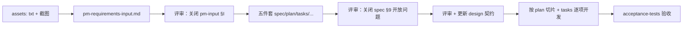

# 大屏 AI 协作提示词指南

> 本文件是大屏版 AI 协作提示词指南，基于 `docs/ai-prompts-guide.md` 针对大屏可视化场景特化。  
> **pm-input 阶段**沿用 `docs/ai-prompts-guide.md` §1（不变），本文件只覆盖**五件套生成**和**按 spec 开发**阶段。

---

## 0. 与原版指南的关系

| 阶段          | 用哪份指南                    | 说明                                              |
| ------------- | ----------------------------- | ------------------------------------------------- |
| 生成 pm-input | `docs/ai-prompts-guide.md` §1 | **不变**——PM 输入格式（A-K 章节）通用，大屏不特化 |
| 生成五件套    | **本文件 §1**                 | 大屏版提示词，使用大屏模板                        |
| 按 spec 开发  | **本文件 §2**                 | 大屏版开发提示词                                  |

**大屏模板位置**：`design/_large-screen-template/`（五件套模板 + pm-inputs 模板）  
**CRUD 模板位置**：`docs/specs/_template/`（原版，大屏不使用）

---

## 1. 生成大屏 spec 五件套（Agent 模式）

> **必须使用 Agent 模式**。

### 1.0 会话约定

- **一个大屏目录（`docs/specs/{编号}-{slug}/`）单独开一个会话**
- 分步生成（§1.2）的各轮可在同一会话内连续进行
- 不在同一会话里并行生成两个及以上大屏 spec

### 1.1 通用提示词（复制即用）

将 `{编号}-{slug}` 替换为目标大屏目录名。

```text
请以 @docs/specs/{编号}-{slug}/pm-inputs/pm-requirements-input.md
为**唯一需求主输入**，在同目录
@docs/specs/{编号}-{slug}/ 下生成与大屏模板对齐的五件套：

- spec.md
- plan.md
- tasks.md
- data-model-extensions.md
- acceptance-tests.md

大屏模板参考：design/_large-screen-template/

约束：
1. 五件套的业务范围、交互、验收标准**均从 pm-requirements-input.md 推导**；
   按大屏模板各文件的章节约定拆分，不要另起一套需求表述。
2. pm-input 中「需求来源」指向的 assets/ 文件仅作**原生需求核对引用**：
   在 spec.md 附录保留相对路径链接；
   若 assets 与 pm-input 表述不一致，**以 pm-input 为准**，差异写入 spec §开放问题。
3. 通读 design 四件套；技术事实以 design 为准（字段、API、路由/菜单等）。
   未知写 spec §开放问题与 plan 前置，不臆造。
4. 风格与结构对齐已完成的大屏姊妹 spec（如有）。
5. spec.md 顶部注明：产品输入 pm-inputs/pm-requirements-input.md、路由、菜单 key。
6. **主动识别共享能力**：生成 spec 时，主动识别可被多个大屏复用的公共组件/能力，
   在 spec §8「共享能力」中登记为"建议共享"。
   派生前必须检查 docs/specs/ 下是否已有同类共享 spec
   目录 + docs/skills/frontend/large-screen-shared/ 的 modules/ 是否已包含。已存在则直接引用，不重复派生。
   **人确认环节**：AI 标记"建议共享"后，需人 review 确认"确认派生"或"不派生"。
   只有"确认派生"的才进入 tasks 前置，"不派生"的留在本 spec 内。
   **强约束**：标记"确认派生"的，tasks.md 必须在「前置：共享能力」段列出对应 task，
   且必须先于业务任务完成，不能跳过。
7. **主动识别性能与数据架构风险**：生成 spec 时，评估各模块数据量级和查询复杂度，
   若可能需要预计算结果表/物化视图而非实时聚合，写入 spec §10 开放问题 + plan §4 风险。
8. 生成后更新 @docs/specs/index.md（若该编号尚未登记）。
9. 生成完成后，简要说明：pm-input 各章节 → 五件套的对应关系；assets 差异；共享能力识别结果；性能风险识别结果。

请先通读 pm-requirements-input.md、大屏模板、design 四件套，再生成文件。
```

### 1.2 分步生成（大模块推荐）

**第 1 轮 — 生成 spec + 数据扩展**

```text
仅基于 @docs/specs/{编号}-{slug}/pm-inputs/pm-requirements-input.md
生成 spec.md 与 data-model-extensions.md。
assets/ 仅在 spec 附录保留引用路径；正文需求一律来自 pm-input。
未知 API/字段/路由/业务规则写入 spec §9 开放问题，不臆造。
```

**第 1.5 轮 — 人工澄清（产品 + 研发，阻塞后续轮次）**

- 评审 `spec.md` §9 开放问题及 `data-model-extensions.md` §3 待合并项。
- **产品**：确认业务规则、边界、验收口径。
- **研发**：确认表/API 是否已在 design 登记。
- **未关闭的开放问题**不得进入第 2 轮。

可选提示词（澄清后刷新 spec）：

```text
根据以下结论更新 @docs/specs/{编号}-{slug}/spec.md §9 与相关章节，
并将已确认项从「待确认」改为「已确认」；仍待定项保留并注明阻塞方：

（粘贴产品/研发答复）
```

**第 2 轮 — 验收测试（依赖已澄清的 spec）**

```text
基于**已更新**的 @docs/specs/{编号}-{slug}/spec.md，
补充 acceptance-tests.md（场景来自 pm-input 验收/边界及 spec §9 已确认结论）。
勿为 §9 仍为「待确认」的项编写确定性 Then 步骤。
```

**第 3 轮 — 计划与任务**

```text
基于 spec.md + acceptance-tests.md，
生成 @docs/specs/{编号}-{slug}/plan.md 与 tasks.md。
里程碑与任务须可追溯到 pm-input 的功能章节；
plan 前置须覆盖 data-model-extensions.md §3 待合并 design 项。
```

### 1.3 提示词写作技巧

1. **用 `@` 引用路径**，减少 AI 找错目录。
2. **指定参考样例**：同类大屏参考已完成的大屏姊妹 spec。
3. **写清「不要做什么」**：如不臆造 design 已定事实、不重复 design 全文。
4. **要求先读再写**：`请先阅读 X，列出开放问题，再生成文件`。
5. **assets 只核对、不并列输入**：不要把 `assets/*.txt` 当成第二套需求去重写。

---

## 2. 按大屏 spec 开发（Agent 模式）

权威阅读顺序：先 `docs/design/`，再 `docs/specs/<大屏>/` 五件套，最后 `docs/skills/` 所选栈。

### 2.1 整特性开发（按 plan 切片）

```text
请严格依据以下文档实现 @docs/specs/{编号}-{slug}/：

必读：
- spec.md、plan.md、tasks.md、acceptance-tests.md、data-model-extensions.md
- docs/design/api-contracts.md、data-models.md
- docs/skills/backend/python/coding.md（按实际栈替换）
- docs/skills/frontend/react/coding.md
- docs/workflows/tdd-process.md

执行方式：
1. 按 plan.md 的里程碑顺序实现；每完成一个切片，在 tasks.md 勾选对应项。
2. 契约变更须先更新 design/api-contracts 与 OpenAPI，再写代码。
3. 不要引入 spec/契约中未定义的响应字段。
4. 实现 acceptance-tests.md 中 P0 场景；先写失败测试再实现（TDD）。
5. 完成后列出：改动文件、未完成的 tasks、开放问题。

本期只做 plan.md M1，不要动前端。
```

将最后一行中的 `M1` 与范围按 plan 实际切片替换。

### 2.2 单任务 / 单 MR

```text
实现 @docs/specs/{编号}-{slug}/tasks.md 中
「后端 → …」这一条（或指定具体勾选项）。

约束：
- 行为以 spec.md 对应章节和 api-contracts 为准
- 错误码与 acceptance-tests.md 相关场景一致
- 遵循 docs/skills/common/git-workflow.md
- 附带对应单元测试

完成后说明如何本地验证。
```

### 2.3 只补测试

```text
请根据 @docs/specs/{编号}-{slug}/acceptance-tests.md
中的 Gherkin，在现有测试框架下补充自动化测试；
遵循 docs/workflows/tdd-process.md 的分层约定。
优先覆盖 spec 中标注为 P0 的场景。
```

### 2.4 契约先行（SDD 推荐）

端点尚未写入 design 时，先冻结契约再写代码：

```text
{编号}-{slug} 的后端端点尚未写入 design。
请根据 spec.md §3 起草 api-contracts §7 增补与 OpenAPI 片段，
列出 Request/Response、错误码；
不要写实现代码，等我确认后再开发。
```

### 2.5 MR 文档同步

```text
若本次 MR 改变了对外 API 或持久化，
列出需要同步更新的 docs/design/ 与 docs/specs/ 文件清单。
```

---

## 3. 共享能力派生

大屏开发过程中，识别出可被多个大屏复用的公共组件/能力时，通过派生共享 spec 目录进行独立设计。

### 3.1 何时派生

当某个组件/能力**不只是当前大屏使用**，且尚未作为共享能力存在时，应派生共享 spec 目录。

### 3.2 派生前检查

派生前**必须检查**，已存在则直接引用，不重复派生：

1. `docs/specs/` 下是否已有同类共享 spec 目录（命名 `{父编号}-shared-{父slug}/`）
2. `docs/skills/frontend/large-screen-shared/` 的 `modules/` 是否已包含该组件

### 3.3 派生命名规则

| 元素     | 规则                                    | 示例                            |
| -------- | --------------------------------------- | ------------------------------- |
| 共享目录 | `{父编号}-shared-{父slug}/`             | `038-shared-personnel-display/` |
| 子目录   | `{NNN}-{组件名}/`                       | `001-ec-map/`                   |
| 三件套   | `spec.md` + `task.md` + `data-model.md` | —                               |

> 共享 spec 使用**三件套**（不是五件套），因为组件不是独立交付特性。

### 3.4 派生共享 spec（复制即用）

将 `{父编号}` 和 `{父slug}` 替换为源大屏的编号和 slug（如 `038` 和 `personnel-display`），`{组件名}` 替换为组件英文名（如 `ec-map`）。

```text
请基于 @docs/specs/{父编号}-{父slug}/spec.md §8「共享能力」中登记的组件，
在 docs/specs/{父编号}-shared-{父slug}/ 下派生共享 spec 目录。

【派生前检查】
1. 检查 docs/specs/ 下是否已有同类共享 spec 目录
2. 检查 docs/skills/frontend/large-screen-shared/ 的 modules/ 是否已包含该组件
若已存在则直接引用，不重复派生。

【输出】
在 docs/specs/{父编号}-shared-{父slug}/{NNN}-{组件名}/ 下生成三件套：
- spec.md：组件契约（props、行为、三态）
- task.md：开发任务
- data-model.md：组件数据结构（如有）

【约束】
1. 组件契约从父 spec 的需求推导，不要另起一套设计。
2. 三件套精简，不需要 plan 和 acceptance-tests。
3. 生成后在父 spec §8「共享能力」表中回填派生目录路径。
4. 生成后在父 spec tasks.md「前置：共享能力」段列出对应 task 引用。
```

### 3.5 蒸馏到 skill

共享 spec 的 task 完成后，调用 skill `oss-mtc-transition-ln-project-context`，将组件的使用方式（怎么用、props、注意事项）蒸馏到 `docs/skills/frontend/large-screen-shared/` 下的 `modules/` 目录。后续大屏通过引用该 skill 获取使用指南。

---

## 4. 推荐工作流



| 阶段          | Cursor 模式         | 会话                   | 提示词重点                                                        |
| ------------- | ------------------- | ---------------------- | ----------------------------------------------------------------- |
| 生成 pm-input | **Agent**           | 一 spec 一会话         | `docs/ai-prompts-guide.md` §1（不变）                             |
| 评审 pm-input | 人工（产品）        | 同 spec 会话或评审会议 | 关闭 pm-input §I                                                  |
| 生成五件套    | **Agent**           | 同上                   | §1.1：`@pm-input` + 大屏模板；assets **仅核对**                   |
| 澄清开放问题  | 人工（产品 + 研发） | 同 spec 会话或评审会议 | 关闭 spec §9                                                      |
| 写代码        | **Agent**           | 同 spec 会话           | `@spec` + `@plan/tasks` + `@design` + `@skills` + 明确「只做 Mx」 |

---

## 5. 相关文档

- [docs/ai-prompts-guide.md](../../../docs/ai-prompts-guide.md) — 原版 AI 协作提示词指南（pm-input 阶段沿用）
- [specs/index.md](../../../docs/specs/index.md) — 特性编号与目录索引
- [workflows/sdd-process.md](../../../docs/workflows/sdd-process.md) — 规格驱动开发流程
- [workflows/tdd-process.md](../../../docs/workflows/tdd-process.md) — 测试驱动开发流程
