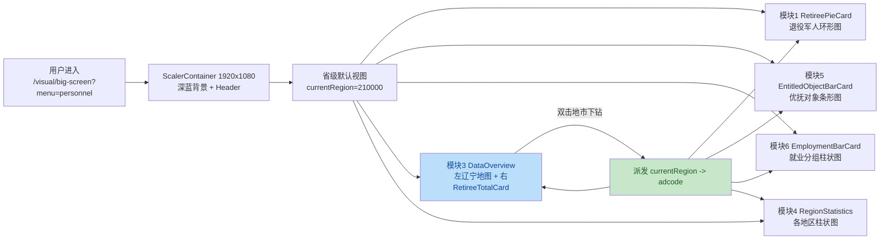
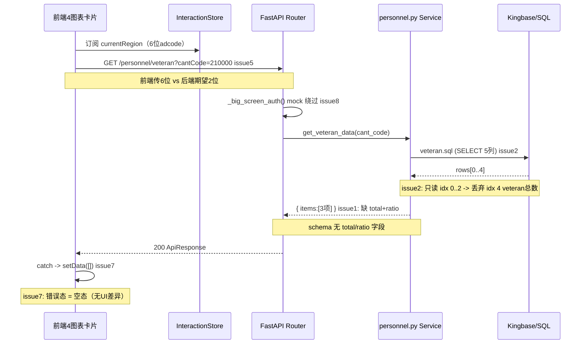

# Task 038 · 代码审查报告（Review · 2026-08-26）

> 关联 task：`task-2026-08-12-016-038-编码开发.md`（同目录）
> 审查依据：`docs/specs/038-bigdata-personnel-display/spec.md`、`tasks.md`、`acceptance-tests.md`、`data-model-extensions.md`
> 审查范围：后端（router / service / sql / schema / main 挂载）+ 前端（路由 / 页面 / API 封装 / 5 卡片组件 / store）
> 交叉验证：2 个独立子代理对全部 10 个候选问题做了逐一核验，最终高置信度收录 8 个（2 个排除）

---

## 0. 结论先看

| 维度 | 状态 | 备注 |
| --- | --- | --- |
| tasks M1–M4 代码落地率 | ~90% | 6 个后端端点 / 6 个 SQL / 5 前端卡片 / 地图下钻 / 指标下钻 / 联动 store 均有代码 |
| Spec 契约合规率 | 偏低 | 4 个 **Critical** + 2 个 **Major** 与 spec / data-model 契约直接冲突 |
| 前端三态（加载/空/错误） | 缺错误态 | catch → 仅清空 data =「暂无数据」，用户无法区分"接口挂了"和"表里真的 0 条" |
| M5 测试 / 合同测试 / 单测 | 0 项 | 尚未进入（task 属 M1–M4，符合预期）|

---

## 1. 作者意图 & 完成度概览

**推断的开发意图：** 按 `docs/specs/038-bigdata-personnel-display/` 五件套要求，交付 M1–M4 全量功能：
- 后端：7 个端点（veteran / total / total/detail / map / region / preferential / employment）+ 6 个 SQL + 沈抚合并 + 菜单鉴权
- 前端：ScalerContainer (1920×1080) 大屏壳 + 5 卡片（模块1/2/3/4/5/6）+ 辽宁地图省→市→区县双击下钻 + InteractionStore 跨模块联动 + 指标下钻子集返回

**tasks.md 对照完成度（按里程碑切片）：**

| 里程碑 | tasks.md 要求项 | 落地情况 | 备注 |
| --- | --- | --- | --- |
| **M1 后端竖切（7 项）** | veteran.sql / 公共 Service / router+挂载 / 鉴权 / veteran端点 / 单测 / 合同测试 | **6/7 代码落地** | ❌ 单测 & 合同测试未写； ❌ veteran 响应缺 total / ratio（见 #1/#2） |
| **M2 后端其余端点（10 项）** | 5 个 SQL + 各端点router/schema + 沈抚合并 + 合同测试 2 项 | **7/10 代码落地** | ❌ employment 用错表/枚举/筛选（#3）； ❌ `/region` 端点缺失（#6）； ❌ 合同测试未写 |
| **M3 前端大屏壳+模块1/3（9 项）** | 路由 / 大屏壳 / API 封装 / 模块1环形图 / 模块3地图 / geojson | **9/9 代码落地** | ⚠️ 模块1 veteran 数据结构错（由后端 #1 传导） |
| **M4 前端其余模块+联动（8 项）** | 模块2卡片 / 模块2下钻 / 模块4柱状图 / 模块5条形图 / 模块6柱状图 / 卡片结构 / 地图联动 / 三态 | **7/8 代码落地** | ❌ 错误态缺失（#7）； ❌ 模块4 复用 /map 而非 spec 的 /region（#6） |
| **M5 测试联调（6 项）** | PM 对数 / 401-403 / P0 自动化 / 沈抚边界 / 3s 性能 / 6 图表性能 | 0 项未启动 | 符合阶段（未到 M5） |

---

## 2. 业务 & 技术流 Mermaid 图

### 2.1 业务数据流

### 2.2 技术调用链（标注问题号）

---

## 3. 问题清单（8 项 · 2/2 子代理交叉验证通过）

按严重度降序：Critical > Major > Minor。

| No. | 严重度 | Issue Title | 修复建议 | 代码定位 |
| --- | --- | --- | --- | --- |
| **1** | 🔴 Critical | **模块1 `/veteran` 响应缺 total 顶层对象 + items 缺 ratio 占比**（spec §3.3 强制要求 `{total, items[]}` 结构 + ratio = value/total×100 HALF_UP 2位） | ① schema 新增 `BigScreenPersonnelVeteranResponse { total: Item, items: Item[] }`，Item 新增 `ratio: float\|None`； ② Service 新增 `_calc_ratio(total, value)`（HALF_UP 2 位，total=0→0.0）； ③ `get_veteran_data` 单独写不走通用 `_to_category_response`（因需返回 total + ratio） | schemas：`backend/app/schemas/visual.py` (L218–L235 区间)； Service：`backend/app/services/visual/big_screen/personnel.py` (L439–L470 区间) |
| **2** | 🔴 Critical | **veteran.sql SELECT 5 列但 Service 解包只读 3 列 → 总数列 veteran 被丢弃** | 方案 A：veteran.sql 改成 `SELECT OFFICER, SERGEANT, CONSCRIPTS, VETERAN`（4 列），Service 第 4 列 `db_row[3]` 单独拎出来做 total； 方案 B：给 veteran 单独写 `_fetch_veteran_row()` 不走通用 `_fetch_category` | SQL：`backend/app/repositories/sql/visual/big_screen/personnel/veteran.sql` (L6–L14)； Service：`backend/app/services/visual/big_screen/personnel.py` (L423–L436 区间) |
| **3** | 🔴 Critical | **模块6 `/employment` 表名 / 枚举 / 地市级筛选 全部错**：用了不存在的 `stats_jdlk_persion_employment`，RYLB/CBZT 用英值，不按 `安置地` 筛选 | 按 `data-model-extensions.md §2.6` 重写： ① `FROM dw_basic_lc.aa_jycy`； ② 省级：`GROUP BY rylb`，CASE `cbzt='已就业' / '未就业' / '失业'`； ③ 地市级：`WHERE "安置地" LIKE left(:cant_code, 4) \|\| '%'`（注意 Kingbase 中文字段双引号转义）； ④ Service 侧补 rylb 中文→type 中文名映射（4 类人员） | SQL：`backend/app/repositories/sql/visual/big_screen/personnel/employment.sql` 全文 L1–L23 |
| **4** | 🔴 Critical | **前后端 cantCode 编码位数不匹配**：前端 `adcode` 6 位（省 210000/市 210100/区县 210102），后端 SQL `WHERE PROVINCE_CODE=?` + 默认 `cantCode="21"`（2 位），`data-model-extensions.md §4.5` 省编码是 "21" | 在 **后端 Service 层统一归一化**（前端改动影响面过大）： 接收 `cant_code` 后： - len==6 且 startswith "21" → 省级截为 "21"； - len==6 且第 5-6 位=="00" → 市级截前 4 位（"210100"→"2101"）； - len==2/4/6 → 直接用； 补注释引用 `data-model-extensions.md §4.5` 做维护锚点； **附加：** veteran.sql L13 `OR CANT_TYPE=%(cant_code)s` 语义混乱——cant_code 是区划编码不是 CANT_TYPE（2/4/6），需删除这个 OR 条件，否则 4/6 位编码会误当 CANT_TYPE 查 | 前端：`frontend/src/pages/visual/big-screen/personnel/data-overview/index.tsx` (L103–L105)； 后端 total：`backend/app/services/visual/big_screen/personnel.py` (L160–L177)； SQL veteran：`backend/app/repositories/sql/visual/big_screen/personnel/veteran.sql` (L12–L14) |
| **5** | 🟡 Major | **模块5 `/preferential` 缺 total 项**：spec §3.3 要求 7 项（首项 total=优抚对象总数，取值 `lxgb`），当前 `_PREFERENTIAL_FIELDS` 只 6 项，SQL 也没 SELECT lxgb | ① `_PREFERENTIAL_FIELDS` 头插入 `("total", "优抚对象总数")`； ② preferential.sql SELECT 第一列追加 `NVL(SUM(lxgb),0) AS total`； ③ 务必保持 SQL 列顺序 ≡ Service fields 顺序（否则 _fetch_category 按 idx 取会错位） | Service：`backend/app/services/visual/big_screen/personnel.py` (L366–L373)； SQL：`backend/app/repositories/sql/visual/big_screen/personnel/preferential.sql` (L6–L15) |
| **6** | 🟡 Major | **模块4 `/region` 独立端点缺失**：spec §3.2 L98 明确 GET `/personnel/region`，当前 router 未注册；前端 RegionalPopulationBarCard 直接调 `/map` 复用 | 推荐 **方案 A（不改 spec）**： ① router 新增 `/region` 端点（operationId=`getBigScreenPersonnelRegion`），内部直接调 `get_map_data(cant_type)`（语义别名）； ② 前端 API 新增 `getBigScreenPersonnelRegion(cantType)` + RegionalPopulationBarCard 改调新端点； **方案 B**：走 L3 提案改 spec 说明 /region 与 /map 复用（耗时久不推荐） | router：`backend/app/api/visual/big_screen/personnel/router.py` (L33–L170 区间追加)； 前端柱状图：`frontend/src/components/large-screen/regional-population-bar-card/index.tsx` (L66–L90) |
| **7** | 🟢 Minor | **前端 4 图表组件 catch 只清空数据 → 错误态=空态**，接口 4xx/5xx 时用户以为是空数据 | 统一方案： ① 在 `.catch(() => {...})` 内加 `message.error('{组件名}加载失败，请稍后重试')`（antd message）； ② 或维护独立 `error` state，JSX 中渲染红色「加载失败 + 重试按钮」（区别于空态「暂无数据」灰字） 涉及 4 处：RetireePieCard / EntitledObjectBarCard / RegionalPopulationBarCard / EmploymentBarCard | `frontend/src/components/large-screen/retiree-pie-card/index.tsx` (L87–L104)； 其他 3 个同目录下组件对应 useEffect 的 catch |
| **8** | 🟢 Minor | **mock 模式绕过菜单鉴权**：`_big_screen_auth()` 在 `settings.db_mode=="mock"` 时只用 `get_current_user`，跳过 `require_menu_key("visual-big-screen-personnel")` | 代码行为本身是开发便利设计，**生产 real 模式符合 spec**，不强制改； 建议 2 选 1： ① 在这段 if 旁加注释 `# dev 豁免：验收 401/403 必须 DB_MODE=real 跑 M4 acceptance-tests`； ② 或在 task 文件 M5 清单里额外加一条「DB_MODE=real 跑 401/403 全端点」作验收门禁提示 | `backend/app/api/visual/big_screen/personnel/router.py` (L26–L31) |

---

## 4. 已排除项（交叉验证为误报 / 非缺陷，备案备查）

| 原候选 ID | 结论 | 原因 / 说明 |
| --- | --- | --- |
| threeDependents 聚合漏字段（yfbxsgjdqfxbgjrys） | ❌ 误报 | `yfbxsgjdqfxbgjrys`（不享受病故军人遗属）是 **catPreObject 子集（模块2下钻 officer-sergeant-conscripts-catPreObject 表格的第 7 行）** 的字段，不属于 threeDependents 的三属聚合；`preferential.sql` 当前 4 字段求和与 `data-model-extensions.md §2.5` 逐字段吻合。正确。 |
| total_detail 白名单 `issubset` 死代码 | ⚪ 非缺陷 / 防御性冗余 | `field_names = list(字典.keys())` + `allowed = set(同一字典.keys())`，两者同源 → issubset 恒 true。但这是业界「动态 SQL 列名拼接 + 白名单兜底」的标准防御性写法，作用是：**防止未来有人在两条语句之间插入外部输入赋值 → 改 field_names 时 issubset 能及时拦截注入**。无害，保留。 |

---

## 5. 修复优先级建议（如果修的话）

**第一波（必须先修，否则 P0 验收场景无法跑通）：**
- #1 + #2（同根因，模块1 结构错误）、#3（employment 数据源）、#4（编码匹配 veteran.sql OR 也要删）

**第二波（建议修，避免 L3 评审被打回）：**
- #5（preferential 缺 total）、#6（region 端点）

**第三波（有空就修，体验 & 流程门禁）：**
- #7（错误态 UI）、#8（验收门禁注释）

---

## 6. 审查元信息

| 项 | 值 |
| --- | --- |
| 审查人 | AI Agent（TRAE-code-review 流程 + 2 子代理交叉验证） |
| 审查日期 | 2026-08-26 |
| 审查模式 | 静态代码审查（未启动服务联调） |
| 交叉验证轮次 | 2 轮并行，共识度 8/10 收录 / 2/10 排除 |
| 关联 task 源文件 | `.trae/skills/oss-mtc-transition-ln-project-context/plans/task-2026-08-12-016-038-编码开发.md` |
| 下一步建议 | 等同事确认修复范围 → 按 §5 优先级分波落地 → 进入 M5 测试与联调 |
