**辽宁省军转厅**

**报表查询与报告生成**

**需求规格说明书**

编制单位：

xxxx年xx月

**更改记录**

|  |  |  |  |
| --- | --- | --- | --- |
| **日期** | **作者** | **版本** | **备注** |
| 2026.1.8 |  | V1.0 | 编制 |
|  |  |  |  |
|  |  |  |  |
|  |  |  |  |
|  |  |  |  |

**审核记录**

|  |  |  |  |
| --- | --- | --- | --- |
| **流程** | **角色** | **签字** | **日期** |
| 审阅 |  |  |  |
|  |  |  |
|  |  |  |
|  |  |  |
|  |  |  |  |

目录

[1. 引言 8](#_Toc230090252)

[1.1. 背景 8](#_Toc230090253)

[1.2. 目标 8](#_Toc230090254)

[2. 功能需求 8](#_Toc230090255)

[2.1. 系统登录 8](#_Toc230090256)

[2.2. 党建系统 9](#_Toc230090257)

[2.3. 可视化分析 9](#_Toc230090258)

[2.3.1. 大数据综合展示 9](#_Toc230090259)

[2.3.1.1. 人员信息 10](#_Toc230090260)

[2.3.1.2. 辽宁信访信息 15](#_Toc230090261)

[2.3.1.3. 进京信访信息 18](#_Toc230090262)

[2.3.1.4. 信访数据比对 21](#_Toc230090263)

[2.3.2. 统计分析 24](#_Toc230090264)

[2.3.2.1. 退役军人及其他优抚对象月报统计 24](#_Toc230090265)

[2.3.2.2. 退役军人月报统计 26](#_Toc230090266)

[2.3.2.3. 退役军官月报统计 28](#_Toc230090267)

[2.3.2.4. 退役士兵月报统计 30](#_Toc230090268)

[2.3.2.5. 军休人员月报统计 32](#_Toc230090269)

[2.3.2.6. 优抚对象月报统计 34](#_Toc230090270)

[2.3.2.7. 退役军人数据分析报告自动生成 36](#_Toc230090271)

[2.3.3. 灵活条件查询（待定） 37](#_Toc230090272)

[2.4. 比对分析 38](#_Toc230090273)

[2.4.1. 比对统计查询 38](#_Toc230090274)

[2.4.2. 人员存在信息查询 40](#_Toc230090275)

[2.4.2.1. 人员存在信息查询 40](#_Toc230090276)

[2.4.2.2. 比对信息 42](#_Toc230090277)

[2.4.3. 综合信息查询 47](#_Toc230090278)

[2.4.4. 人口信息比对 50](#_Toc230090279)

[2.4.5. 教育培训 52](#_Toc230090280)

[2.4.6. 犯罪信息比对 54](#_Toc230090281)

[2.4.7. 税收信息比对 56](#_Toc230090282)

[2.4.8. 贷款信息比对 59](#_Toc230090283)

[2.4.9. 社会救助信息比对 61](#_Toc230090284)

[2.4.10. 社保信息 64](#_Toc230090285)

[2.4.10.1. 城居养老保险比对信息 64](#_Toc230090286)

[2.4.10.2. 企业养老保险比对信息 66](#_Toc230090287)

[2.4.10.3. 就业登记形式 70](#_Toc230090288)

[2.4.11. 住房状况比对 72](#_Toc230090289)

[2.4.12. 医保信息比对 75](#_Toc230090290)

[2.4.13. 信访诉求比对 78](#_Toc230090291)

[2.5. 账号管理 81](#_Toc230090292)

[2.5.1. 行政区划管理 81](#_Toc230090293)

[2.5.1.1. 区划类型管理 81](#_Toc230090294)

[2.5.1.2. 区划管理 82](#_Toc230090295)

[2.5.1.3. 区划导入导出 83](#_Toc230090296)

[2.5.2. 组织机构管理 84](#_Toc230090297)

[2.5.2.1. 组织类型管理 84](#_Toc230090298)

[2.5.2.2. 组织视角管理 84](#_Toc230090299)

[2.5.2.3. 组织机构管理 85](#_Toc230090300)

[2.5.2.4. 组织机构导入导出 86](#_Toc230090301)

[2.5.3. 用户管理 87](#_Toc230090302)

[2.5.3.1. 用户导入导出 88](#_Toc230090303)

[2.5.3.2. 用户管理 89](#_Toc230090304)

[2.5.4. 安全管理 90](#_Toc230090305)

[2.5.4.1. 应用管理 90](#_Toc230090306)

[2.5.4.2. 授权管理 91](#_Toc230090307)

[2.5.5. 字典管理 92](#_Toc230090308)

[2.5.5.1. 字典管理 92](#_Toc230090309)

[2.5.5.2. 字典导入导出 93](#_Toc230090310)

[2.5.6. 系统管理 94](#_Toc230090311)

[2.5.6.1. 功能管理 94](#_Toc230090312)

[2.5.6.2. 菜单管理 95](#_Toc230090313)

[2.5.7. 审计管理 95](#_Toc230090314)

[2.5.7.1. 应用访问日志 96](#_Toc230090315)

[2.5.7.2. 访问日志 96](#_Toc230090316)

[2.5.7.3. 短信日志 97](#_Toc230090317)

[3. 非功能性需求 98](#_Toc230090318)

# 引言

## 背景

按照《关于支持党政机关深化安可替代国产芯片“国货国用”工作的通知》（国政网办字〔2024〕13号）和《辽宁省深化安可替代国产芯片“国货国用”工程工作方案》（辽电政内发〔2024〕3号），安可工作产品替代任务，采用全省统一立项，辽宁省退役军人事务厅应用系统所需服务器、操作系统和数据库，已经纳入2025年替代计划，由省数据中心统一完成招标采购工作。

根据2024年国家内网办、国家发展改革委联合印发《关于支持党政机关深化安可替代国产芯片“国货国用”工作的通知》（国政网办字〔2024〕13号）要求，按照我省工作安排，在2027年6月底前完成本单位辽宁省退役军人事务综合管理服务平台共1套系统的改造，改造方式为适配迁移，确保按期高质量完成全省深化安可替代国产芯片“国货国用”工作任务。

## 目标

1. 实现党建系统功能改造迁移
2. 实现可视化分析功能改造迁移
3. 实现比对分析功能改造迁移
4. 实现账号管理功能改造迁移
5. 完成国产数据库迁移
6. 完成存储过程国产化适配

# 功能需求

## 系统登录

提供账号、密码、验证码登录功能。账号可以是（账号或者手机号）验证码采用4位随机字母数字。只有umc\_users. Status=1的账号才能登录

登录时如果是第一次登录，需要强制用户修改密码，重置密码后第一次登录页需强制修改密码。

用户数据来源于：umc\_users表

参考截图

## 首页

登录后进入的页面，展示个人资料、展示图、日历、部级应用、省级应用、系统管理、我的代办。

其中部级应用数据来源“应用管理”中的部级应用。

## 党建系统（待调研）

需求待调研。

## 可视化分析

### 大数据综合展示

其中展示的地图是辽宁省行政区划地图，第一级展示的是各地市的地图，周围数据展示的是全省的数据，点击地图的任意地市可下钻到该地市的各区县地图，其他模块展示的数据也切换成该地市的数据；再点击任意区县的地图，不再下钻，但是其他模块展示的数据切换成该区县的数据。

涉及数据行政区域的编码如下：

注：其中编号2115的数据要合并到2104中，即沈抚新区的数据要合并到抚顺市。

#### 人员信息

提供退役军人人员信息大数据综合展示功能。

原图：

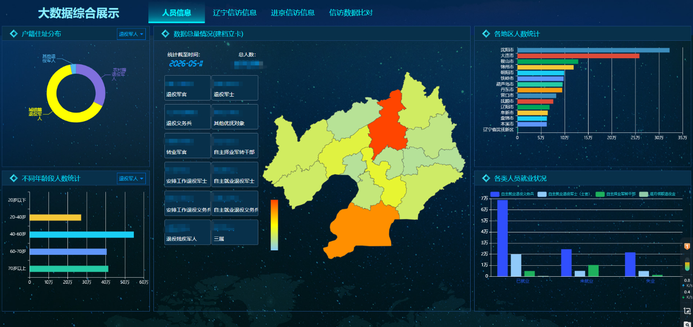

改造后的图（图上还要加上人员信息（当前选中）、辽宁信访信息、进京信访信息、信访数据比对大屏的导航切换按钮）：

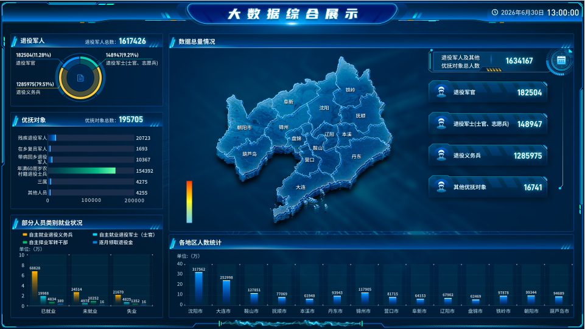

##### 展示模块1：退役军人统计

展示退役军人总数，以环形饼图展示三类退役军人人数和占比，包括：退役军官、退役军士（士官、志愿兵）、退役义务兵。

**指标算法表：**

|  |  |  |  |
| --- | --- | --- | --- |
| **展示指标** | **取值表** | **取值字段** | **取值算法** |
| 退役军人总数 | STATS\_JDLK\_PERSION\_INFOR\_CANT | VETERAN | select VETERAN from STATS\_JDLK\_PERSION\_INFOR\_CANT WHERE PROVINCE\_CODE = #{cantCode}  其中cantCode代表的是行政区域的编号，如省维度，则传入21，展示那个行政区域的数据就传入对应的行政区域编号 |
| 退役军官人数 | STATS\_JDLK\_PERSION\_INFOR\_CANT | OFFICER | 同上，取OFFICER字段 |
| 退役军官人数占比 | STATS\_JDLK\_PERSION\_INFOR\_CANT | OFFICER | 同上，取OFFICER/ VETERAN\*100%，保留2位小数 |
| 退役军士（士官、志愿兵）人数 | STATS\_JDLK\_PERSION\_INFOR\_CANT | SERGEANT | 同上，取SERGEANT字段 |
| 退役军士（士官、志愿兵）人数占比 | STATS\_JDLK\_PERSION\_INFOR\_CANT | SERGEANT | 同上，取SERGEANT/ VETERAN\*100%，保留2位小数 |
| 退役义务兵人数 | STATS\_JDLK\_PERSION\_INFOR\_CANT | CONSCRIPTS | 同上，取CONSCRIPTS字段 |
| 退役义务兵人数占比 | STATS\_JDLK\_PERSION\_INFOR\_CANT | CONSCRIPTS | 同上，取CONSCRIPTS/ VETERAN\*100%，保留2位小数 |

##### 展示模块2：退役军人及其他优抚对象总人数统计

展示内容有：

(1)退役军人及其他优抚对象总人数

(2)退役军官人数，可下钻查询子集人数（离休干部、退休军官（干部）、转业军官（计划分配军转干部）、自主择业军转干部、企业军转干部、自愿自行就业军转干部、复员军官（干部）、逐月领取退役金退役军官、现役干部转改文职人员、集体转业（转制）干部）

(3)退役军士（士官、志愿兵）人数，可下钻查询子集人数（退休军士（士官、志愿兵）、安排工作退役军士（士官）、转业士官（志愿兵）、自谋职业退役军士（士官、志愿兵）、灵活就业退役军士（士官）、自主就业退役军士（士官）、国家供养退役军士（士官）、逐月领取退役金退役军士、复员士官（志愿兵）、集体转业（转制）士官（志愿兵））

(4)退役义务兵人数，可下钻查询子集人数（安排工作退役义务兵、自谋职业退役义务兵、灵活就业退役义务兵、自主就业退役义务兵、国家供养退役义务兵、集体转业（转制）义务兵、回乡生产生活退役义务兵）

(5)其他优抚对象人数，可下钻查询子集人数（享受国家定期抚恤的烈士遗属、享受国家定期补助的烈士老年子女、不享受国家定期抚恤、补助的烈士遗属、享受国家定期抚恤的因公牺牲军人遗属、不享受国家定期抚恤的因公牺牲军人遗属、享受国家定期抚恤的病故军人遗属、不享受国家定期抚恤的病故军人遗属、伤残预备役人员民兵民工、伤残人民警察、因公伤残人员）

**指标算法表：**

|  |  |  |  |
| --- | --- | --- | --- |
| **展示指标** | **取值表** | **取值字段** | **取值SQL** |
| 退役军人及其他优抚对象总人数 | STATS\_JDLK\_PERSION\_INFOR\_CANT | VETERAN | select VETERAN from STATS\_JDLK\_PERSION\_INFOR\_CANT WHERE PROVINCE\_CODE = #{cantCode} 其中cantCode代表的是行政区域的编号，如省维度，则传入21，展示那个行政区域的数据就传入对应的行政区域编号 |
| 退役军官人数 | STATS\_JDLK\_PERSION\_INFOR\_CANT | OFFICER | 同上，取OFFICER字段 |
| 退役军士（士官、志愿兵）人数 | STATS\_JDLK\_PERSION\_INFOR\_CANT | SERGEANT | 同上，取SERGEANT字段 |
| 退役义务兵人数 | STATS\_JDLK\_PERSION\_INFOR\_CANT | CONSCRIPTS | 同上，取CONSCRIPTS字段 |
| 其他优抚对象人数 | STATS\_JDLK\_PERSION\_INFOR\_CANT | CAT\_PRE\_OBJECT | 同上，取CAT\_PRE\_OBJECT字段 |
| 离休干部 | abi\_zb\_tyjrjqyfdx | lxgb | select lxgb from abi\_zb\_tyjrjqyfdx WHERE cant\_code = #{cantCode} 其中cantCode代表的是行政区域的编号，如省维度，则传入21，展示那个行政区域的数据就传入对应的行政区域编号 |
| 退休军官（干部） | abi\_zb\_tyjrjqyfdx | txjg | 同上，取txjg字段 |
| 转业军官（计划分配军转干部） | abi\_zb\_tyjrjqyfdx | zyjg | 同上，取zyjg字段 |
| 自主择业军转干部 | abi\_zb\_tyjrjqyfdx | zzzyjzgb | 同上，取zzzyjzgb字段 |
| 企业军转干部 | abi\_zb\_tyjrjqyfdx | qyjzgb | 同上，取qyjzgb字段 |
| 自愿自行就业军转干部 | abi\_zb\_tyjrjqyfdx | zyzxjyjzgb | 同上，取zyzxjyjzgb字段 |
| 复员军官（干部） | abi\_zb\_tyjrjqyfdx | fyjg | 同上，取fyjg字段 |
| 逐月领取退役金退役军官 | abi\_zb\_tyjrjqyfdx | zylqtyjtyjg | 同上，取zylqtyjtyjg字段 |
| 现役干部转改文职人员 | abi\_zb\_tyjrjqyfdx | xygbzgwzry | 同上，取xygbzgwzry字段 |
| 集体转业（转制）干部 | abi\_zb\_tyjrjqyfdx | jtzygb | 同上，取jtzygb字段 |
| 退休军士（士官、志愿兵） | abi\_zb\_tyjrjqyfdx | tyjs | 同上，取tyjs字段 |
| 安排工作退役军士（士官） | abi\_zb\_tyjrjqyfdx | apgztyjs | 同上，取apgztyjs字段 |
| 转业士官（志愿兵） | abi\_zb\_tyjrjqyfdx | zysg | 同上，取zysg字段 |
| 自谋职业退役军士（士官、志愿兵） | abi\_zb\_tyjrjqyfdx | zmzytyjs | 同上，取zmzytyjs字段 |
| 灵活就业退役军士（士官） | abi\_zb\_tyjrjqyfdx | lhjytyjs | 同上，取lhjytyjs字段 |
| 自主就业退役军士（士官） | abi\_zb\_tyjrjqyfdx | zzjytyjs | 同上，取zzjytyjs字段 |
| 国家供养退役军士（士官） | abi\_zb\_tyjrjqyfdx | gjgytyjs | 同上，取gjgytyjs字段 |
| 逐月领取退役金退役军士 | abi\_zb\_tyjrjqyfdx | zylqtyjtyjs | 同上，取zylqtyjtyjs字段 |
| 复员士官（志愿兵） | abi\_zb\_tyjrjqyfdx | fysg | 同上，取fysg字段 |
| 集体转业（转制）士官（志愿兵） | abi\_zb\_tyjrjqyfdx | jtzysg | 同上，取jtzysg字段 |
| 安排工作退役义务兵 | abi\_zb\_tyjrjqyfdx | apgztyywb | 同上，取apgztyywb字段 |
| 自谋职业退役义务兵 | abi\_zb\_tyjrjqyfdx | zmzytyywb | 同上，取zmzytyywb字段 |
| 灵活就业退役义务兵 | abi\_zb\_tyjrjqyfdx | lhjytyywb | 同上，取lhjytyywb字段 |
| 自主就业退役义务兵 | abi\_zb\_tyjrjqyfdx | zzjytyywb | 同上，取zzjytyywb字段 |
| 国家供养退役义务兵 | abi\_zb\_tyjrjqyfdx | gjgytyywb | 同上，取gjgytyywb字段 |
| 集体转业（转制）义务兵 | abi\_zb\_tyjrjqyfdx | jtzyywb | 同上，取jtzyywb字段 |
| 回乡生产生活退役义务兵 | abi\_zb\_tyjrjqyfdx | hxscshtyywb | 同上，取hxscshtyywb字段 |
| 享受国家定期抚恤的烈士遗属 | abi\_zb\_tyjrjqyfdx | yfxsgjdqfxlsys | 同上，取yfxsgjdqfxlsys字段 |
| 享受国家定期补助的烈士老年子女 | abi\_zb\_tyjrjqyfdx | yfxsgjdqbzlslnzn | 同上，取yfxsgjdqbzlslnzn字段 |
| 不享受国家定期抚恤、补助的烈士遗属 | abi\_zb\_tyjrjqyfdx | yfbxsgjdqfxbzlsys | 同上，取yfbxsgjdqfxbzlsys字段 |
| 享受国家定期抚恤的因公牺牲军人遗属 | abi\_zb\_tyjrjqyfdx | yfxsgjdqfxygxsjrys | 同上，取yfxsgjdqfxygxsjrys字段 |
| 不享受国家定期抚恤的因公牺牲军人遗属 | abi\_zb\_tyjrjqyfdx | yfbxsgjdqfxygxsjrys | 同上，取yfbxsgjdqfxygxsjrys字段 |
| 享受国家定期抚恤的病故军人遗属 | abi\_zb\_tyjrjqyfdx | yfxsgjdqfxbgjrys | 同上，取yfxsgjdqfxbgjrys字段 |
| 不享受国家定期抚恤的病故军人遗属 | abi\_zb\_tyjrjqyfdx | yfbxsgjdqfxbgjrys | 同上，取yfbxsgjdqfxbgjrys字段 |
| 伤残预备役人员民兵民工 | abi\_zb\_tyjrjqyfdx | yfscybyrymbmg | 同上，取yfscybyrymbmg字段 |
| 伤残人民警察 | abi\_zb\_tyjrjqyfdx | yfscrmjc | 同上，取yfscrmjc字段 |
| 因公伤残人员 | abi\_zb\_tyjrjqyfdx | yfygscry | 同上，取yfygscry字段 |

##### 展示模块3：辽宁省区域地图

以辽宁省行政区划地图展示退役军人总数密度分布，颜色从浅蓝到红橙渐变。

**指标算法表：**

|  |  |  |  |
| --- | --- | --- | --- |
| **展示指标** | **取值表** | **取值字段** | **取值SQL** |
| 各行政区划退役军人总数 | STATS\_JDLK\_PERSION\_INFOR\_CANT | VETERAN | select STATS\_UNIT\_NAME, VETERANfrom STATS\_JDLK\_PERSION\_INFOR\_CANT WHERE CANT\_TYPE = #{cantType}  其中cantType代表的是行政区域的类型，在地图第一层级展示的是各地市退役军人总数，cantType=4，下钻后，展示的是各区县的人数，cantType=6 |

##### 展示模块4：各地区人数统计

统计图展示辽宁省各地区退役军人数量。

**指标算法表：**

|  |  |  |  |
| --- | --- | --- | --- |
| **展示指标** | **取值表** | **取值字段** | **取值SQL** |
| 各行政区划退役军人总数 | STATS\_JDLK\_PERSION\_INFOR\_CANT | VETERAN | select STATS\_UNIT\_NAME, VETERANfrom STATS\_JDLK\_PERSION\_INFOR\_CANT WHERE CANT\_TYPE = #{cantType}  其中cantType代表的是行政区域的类型，在第一层级展示的是各地市退役军人总数，cantType=4，点地图下钻后，展示的是各区县的人数，cantType=6 |

##### 展示模块5：优抚对象人数统计

展示优抚对象总数，以柱状图展示各类优抚对象人数，包括：退役残疾军人、在乡复员军人、带病回乡退役军人、年满60周岁农村籍退役士兵、三属、其他人员。

**指标算法表：**

|  |  |  |  |
| --- | --- | --- | --- |
| **展示指标** | **取值表** | **取值字段** | **取值SQL** |
| 优抚对象总数 | abi\_zb\_tyjrjqyfdx |  | select lxgb from abi\_zb\_tyjrjqyfdx WHERE cant\_code = #{cantCode}  其中cantCode代表的是行政区域的编号，如省维度，则传入21，展示那个行政区域的数据就传入对应的行政区域编号 |
| 退役残疾军人 | abi\_zb\_tyjrjqyfdx | yftycjjr | 同上，取yftycjjr字段 |
| 在乡复员军人 | abi\_zb\_tyjrjqyfdx | yfzxfyjr | 同上，取yfzxfyjr字段 |
| 带病回乡退役军人 | abi\_zb\_tyjrjqyfdx | yfdbhxtyjr | 同上，取yfdbhxtyjr字段 |
| 年满60周岁农村籍退役士兵 | abi\_zb\_tyjrjqyfdx | yfnmlszsncjtysb | 同上，取yfnmlszsncjtysb字段 |
| 三属 | abi\_zb\_tyjrjqyfdx | yfxsgjdqfxlsys+yfxsgjdqbzlslnzn+yfxsgjdqfxygxsjrys+yfxsgjdqfxbgjrys | 同上，取yfxsgjdqfxlsys+yfxsgjdqbzlslnzn+yfxsgjdqfxygxsjrys+yfxsgjdqfxbgjr字段的和 |
| 其他人员 | abi\_zb\_tyjrjqyfdx | yfscybyrymbmg+yfscrmjc+yfygscry | 同上，取yfscybyrymbmg+yfscrmjc+yfygscry字段的和 |

##### 展示模块6：部分人员类别就业状况

以统计图展示不同类型人员的已就业、未就业、失业状态的人数。

**指标算法表：**

|  |  |  |  |
| --- | --- | --- | --- |
| **展示指标** | **取值表** | **取值字段** | **取值SQL** |
| 各人员类别已就业人数 | aa\_jycy | EMPLOYMENT | SELECT rylb, SUM(CASE WHEN cbzt='已就业' THEN 1 ELSE 0 END) EMPLOYMENT FROM aa\_jycy GROUP BY rylb  省级查询全部人员的，地市级根据安置地匹配对应地市的人 |
| 各人员类别未就业人数 | aa\_jycy | UNEMPLOYMENT | 同上，CASE WHEN cbzt='未就业' |
| 各人员类别失业人数 | aa\_jycy | LOSE\_JOB | 同上，CASE WHEN cbzt='失业' |

#### 辽宁信访信息

提供辽宁范围信访信息大数据综合展示功能。

原图:

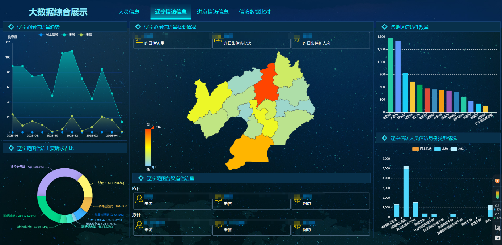

改造后的图：

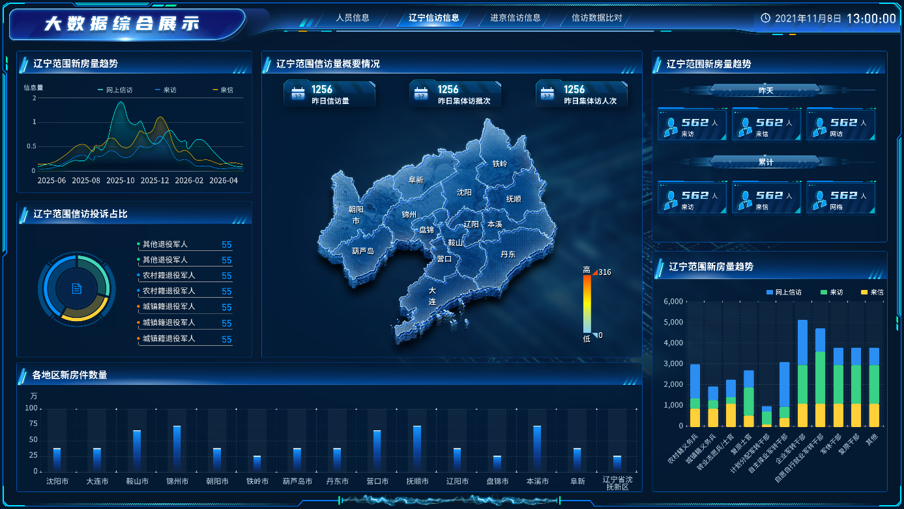

##### 展示模块1：辽宁范围信访量趋势

以折线图展示三类信访渠道（网上信访、来访、来信）的最近12个月信息量变化。

**指标算法表：**

|  |  |  |  |
| --- | --- | --- | --- |
| **展示指标** | **取值表** | **取值字段** | **取值SQL** |
| 网上信访12个月趋势 | LETTER\_SCREEN\_2 | NUM\_0~NUM\_11 | select SUM(NUM\_0),SUM(NUM\_1)...SUM(NUM\_11) from LETTER\_SCREEN\_2 WHERE REG\_AUTHORITY=2 and ACCEPT\_SOURCE =1 and ORGAN\_ID =#{ORGANID} GROUP BY ACCEPT\_SOURCE ORDER BY ACCEPT\_SOURCE  其中ACCEPT\_SOURCE代表信访形式：1代表网上信访，2代表来访，3代表来信，7代表特殊人员信访  REG\_AUTHORITY代表登记机构：1代表上京，2代表本地，0代表登记表未添加  其中ORGANID代表的是行政区域的编号，展示那个行政区域的数据就传入对应的行政区域编号 |
| 来访12个月趋势 | LETTER\_SCREEN\_2 | NUM\_0~NUM\_11 | 同上，ACCEPT\_SOURCE=2 |
| 来信12个月趋势 | LETTER\_SCREEN\_2 | NUM\_0~NUM\_11 | 同上，ACCEPT\_SOURCE=3 |

##### 展示模块2：辽宁范围信访主要诉求占比

以环形饼图展示各类信访诉求的数量及占比。

**指标算法表：**

|  |  |  |  |
| --- | --- | --- | --- |
| **展示指标** | **取值表** | **取值字段** | **取值SQL** |
| 各诉求分类数量 | LETTER\_SCREEN\_1 | ITEM\_NAME,REG\_MAIN\_APPEAL\_ONE,NUM | select ITEM\_NAME,REG\_MAIN\_APPEAL\_ONE,NUM from LETTER\_SCREEN\_1 WHERE REG\_AUTHORITY=2 and ORGAN\_ID =#{ORGANID}  REG\_AUTHORITY代表登记机构：1代表上京，2代表本地，0代表登记表未添加  其中ORGANID代表的是行政区域的编号，展示那个行政区域的数据就传入对应的行政区域编号 |

##### 展示模块3：辽宁范围信访量概要情况

顶部展示昨日信访量、昨日集体访批次、昨日集体访人次；下方展示各渠道信访量。

**指标算法表：**

|  |  |  |  |
| --- | --- | --- | --- |
| **展示指标** | **取值表** | **取值字段** | **取值SQL** |
| 昨日网上信访量 | LETTER\_SCREEN\_6 | JTWX | select JTWX,ZWX,JTLF,ZLF,JTJTFPC,JTJTFRC,ZLX,JTLX from LETTER\_SCREEN\_6 WHERE REG\_AUTHORITY=2 and ORGAN\_ID =#{ORGANID}  REG\_AUTHORITY代表登记机构：1代表上京，2代表本地，0代表登记表未添加  其中ORGANID代表的是行政区域的编号，展示那个行政区域的数据就传入对应的行政区域编号 |
| 累计网上信访量 | LETTER\_SCREEN\_6 | ZWX | 同上 |
| 昨日来访量 | LETTER\_SCREEN\_6 | JTLF | 同上 |
| 累计来访量 | LETTER\_SCREEN\_6 | ZLF | 同上 |
| 昨日集体访批次 | LETTER\_SCREEN\_6 | JTJTFPC | 同上 |
| 昨日集体访人次 | LETTER\_SCREEN\_6 | JTJTFRC | 同上 |
| 累计来信量 | LETTER\_SCREEN\_6 | ZLX | 同上 |
| 昨日来信量 | LETTER\_SCREEN\_6 | JTLX | 同上 |
| 昨日信访量 | LETTER\_SCREEN\_6 | JTWX+ JTLF+ JTLX | 同上 |

##### 展示模块4：各地区地图信访数据

以辽宁省区域地图展示各地区信访量密度分布，颜色从浅蓝到红橙渐变。

**指标算法表：**

|  |  |  |  |
| --- | --- | --- | --- |
| **展示指标** | **取值表** | **取值字段** | **取值SQL** |
| 各地区信访件数量（地图） | LETTER\_SCREEN\_4 | CANT\_NAME,CANT\_CODE,NUM | select CANT\_NAME,CANT\_CODE,NUM from LETTER\_SCREEN\_4 WHERE REG\_AUTHORITY=2 and ORGAN\_ID =#{ORGANID}  REG\_AUTHORITY代表登记机构：1代表上京，2代表本地，0代表登记表未添加  其中ORGANID代表的是行政区域的编号，展示哪个行政区域的数据就传入对应的行政区域编号，第一级是省级看板展示各地市的数据，ORGANID传入省的编码 |

##### 展示模块5：各地区信访件数量

以柱状图展示辽宁各地区信访件数量排名。

**指标算法表：**

|  |  |  |  |
| --- | --- | --- | --- |
| **展示指标** | **取值表** | **取值字段** | **取值SQL** |
| 各地区信访件数量排名 | LETTER\_SCREEN\_5 | CANT\_NAME,CANT\_CODE,NUM,MAX\_TIME | select CANT\_NAME,CANT\_CODE,NUM,MAX\_TIME from LETTER\_SCREEN\_5 WHERE REG\_AUTHORITY=2 and ORGAN\_ID =#{ORGANID} order by NUM desc  REG\_AUTHORITY代表登记机构：1代表上京，2代表本地，0代表登记表未添加  其中ORGANID代表的是行政区域的编号，展示哪个行政区域的数据就传入对应的行政区域编号，第一级是省级看板展示各地市的数据，ORGANID传入省的编码 |

##### 展示模块6：辽宁信访人员信访身份类型情况

以分组柱状图展示11种身份类型分渠道信访数据。

**指标算法表：**

|  |  |  |  |
| --- | --- | --- | --- |
| **展示指标** | **取值表** | **取值字段** | **取值SQL** |
| 11种身份类型分渠道信访数据 | LETTER\_SCREEN\_3 | SB\_NCYWB,SB\_CZYWB,SB\_ZYSG,SB\_FYSG,GB\_JHFP,GB\_ZZZY,GB\_QYJZGB,GB\_ZYJZGB,GB\_JXGB,GB\_FY,RY\_QT | select SB\_NCYWB,SB\_CZYWB,SB\_ZYSG,SB\_FYSG,GB\_JHFP,GB\_ZZZY,GB\_QYJZGB,GB\_ZYJZGB,GB\_JXGB,GB\_FY,RY\_QT,ACCEPT\_SOURCE from LETTER\_SCREEN\_3 WHERE REG\_AUTHORITY=2 and ORGAN\_ID =#{ORGANID} ORDER BY ACCEPT\_SOURCE  其中ORGANID代表的是行政区域的编号，展示哪个行政区域的数据就传入对应的行政区域编号  字段分别对应：农村籍义务兵、城镇籍义务兵、转业志愿兵/士官、复员士官、计划分配军转干部、自主择业军转干部、企业军转干部、自谋自择就业军转干部、军休干部、复员干部、其他 |

#### 进京信访信息

提供辽宁范围进京信访信息大数据综合展示功能。

原图：

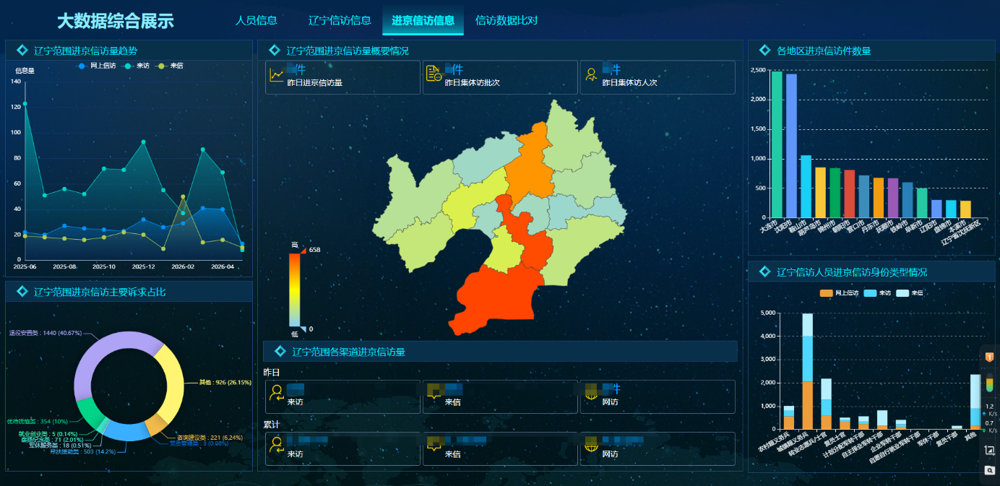

改造后的图：

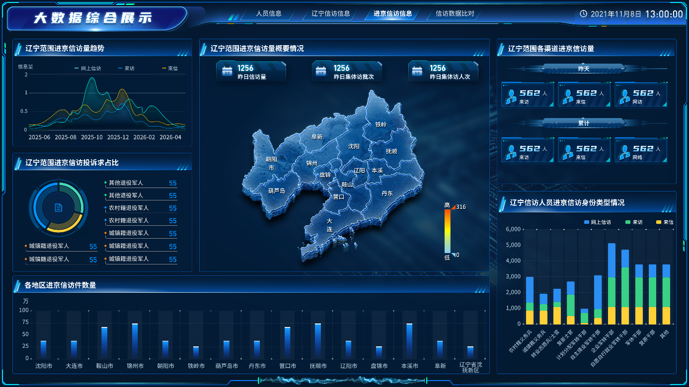

##### 展示模块1：进京信访量趋势

以折线图展示三类信访渠道（网上信访、来访、来信）的最近12个月信息量变化。

**指标算法表：**

|  |  |  |  |
| --- | --- | --- | --- |
| **展示指标** | **取值表** | **取值字段** | **取值SQL** |
| 网上信访12个月趋势 | LETTER\_SCREEN\_2 | NUM\_0~NUM\_11 | select SUM(NUM\_0),SUM(NUM\_1)...SUM(NUM\_11) from LETTER\_SCREEN\_2 WHERE REG\_AUTHORITY=1 and ACCEPT\_SOURCE =1 and ORGAN\_ID =#{ORGANID} GROUP BY ACCEPT\_SOURCE ORDER BY ACCEPT\_SOURCE  其中ACCEPT\_SOURCE代表信访形式：1代表网上信访，2代表来访，3代表来信，7代表特殊人员信访  REG\_AUTHORITY代表登记机构：1代表上京，2代表本地，0代表登记表未添加  其中ORGANID代表的是行政区域的编号，展示那个行政区域的数据就传入对应的行政区域编号 |
| 来访12个月趋势 | LETTER\_SCREEN\_2 | NUM\_0~NUM\_11 | 同上，ACCEPT\_SOURCE=2 |
| 来信12个月趋势 | LETTER\_SCREEN\_2 | NUM\_0~NUM\_11 | 同上，ACCEPT\_SOURCE=3 |

##### 展示模块2：进京信访主要诉求占比

以环形饼图展示各类信访诉求的数量及占比。

**指标算法表：**

|  |  |  |  |
| --- | --- | --- | --- |
| **展示指标** | **取值表** | **取值字段** | **取值SQL** |
| 各诉求分类数量 | LETTER\_SCREEN\_1 | ITEM\_NAME,REG\_MAIN\_APPEAL\_ONE,NUM | select ITEM\_NAME,REG\_MAIN\_APPEAL\_ONE,NUM from LETTER\_SCREEN\_1 WHERE REG\_AUTHORITY=1 and ORGAN\_ID =#{ORGANID}  REG\_AUTHORITY代表登记机构：1代表上京，2代表本地，0代表登记表未添加  其中ORGANID代表的是行政区域的编号，展示那个行政区域的数据就传入对应的行政区域编号 |

##### 展示模块3：进京信访量概要情况

顶部展示昨日信访量、昨日集体访批次、昨日集体访人次；下方展示各渠道信访量。

**指标算法表：**

|  |  |  |  |
| --- | --- | --- | --- |
| **展示指标** | **取值表** | **取值字段** | **取值SQL** |
| 昨日网上信访量 | LETTER\_SCREEN\_6 | JTWX | select JTWX,ZWX,JTLF,ZLF,JTJTFPC,JTJTFRC,ZLX,JTLX from LETTER\_SCREEN\_6 WHERE REG\_AUTHORITY=1 and ORGAN\_ID =#{ORGANID}  REG\_AUTHORITY代表登记机构：1代表上京，2代表本地，0代表登记表未添加  其中ORGANID代表的是行政区域的编号，展示那个行政区域的数据就传入对应的行政区域编号 |
| 累计网上信访量 | LETTER\_SCREEN\_6 | ZWX | 同上 |
| 昨日来访量 | LETTER\_SCREEN\_6 | JTLF | 同上 |
| 累计来访量 | LETTER\_SCREEN\_6 | ZLF | 同上 |
| 昨日集体访批次 | LETTER\_SCREEN\_6 | JTJTFPC | 同上 |
| 昨日集体访人次 | LETTER\_SCREEN\_6 | JTJTFRC | 同上 |
| 累计来信量 | LETTER\_SCREEN\_6 | ZLX | 同上 |
| 昨日来信量 | LETTER\_SCREEN\_6 | JTLX | 同上 |
| 昨日信访量 | LETTER\_SCREEN\_6 | JTWX+ JTLF+ JTLX | 同上 |

##### 展示模块4：各地区地图进京信访数据

以辽宁省区域地图展示各地区信访量密度分布，颜色从浅蓝到红橙渐变。

**指标算法表：**

|  |  |  |  |
| --- | --- | --- | --- |
| **展示指标** | **取值表** | **取值字段** | **取值SQL** |
| 各地区信访件数量（地图） | LETTER\_SCREEN\_4 | CANT\_NAME,CANT\_CODE,NUM | elect CANT\_NAME,CANT\_CODE,NUM from LETTER\_SCREEN\_4 WHERE REG\_AUTHORITY=1 and ORGAN\_ID =#{ORGANID}  REG\_AUTHORITY代表登记机构：1代表上京，2代表本地，0代表登记表未添加  其中ORGANID代表的是行政区域的编号，展示哪个行政区域的数据就传入对应的行政区域编号，第一级是省级看板展示各地市的数据，ORGANID传入省的编码 |

##### 展示模块5：各地区进京信访件数量

以柱状图展示辽宁各地区信访件数量排名。

**指标算法表：**

|  |  |  |  |
| --- | --- | --- | --- |
| **展示指标** | **取值表** | **取值字段** | **取值SQL** |
| 各地区信访件数量排名 | LETTER\_SCREEN\_5 | CANT\_NAME,CANT\_CODE,NUM,MAX\_TIME | sselect CANT\_NAME,CANT\_CODE,NUM,MAX\_TIME from LETTER\_SCREEN\_5 WHERE REG\_AUTHORITY=1 and ORGAN\_ID =#{ORGANID} order by NUM desc  REG\_AUTHORITY代表登记机构：1代表上京，2代表本地，0代表登记表未添加  其中ORGANID代表的是行政区域的编号，展示哪个行政区域的数据就传入对应的行政区域编号，第一级是省级看板展示各地市的数据，ORGANID传入省的编码 |

##### 展示模块6：进京信访身份类型情况

以分组柱状图展示11种身份类型分渠道信访数据。

**指标算法表：**

|  |  |  |  |
| --- | --- | --- | --- |
| **展示指标** | **取值表** | **取值字段** | **取值SQL** |
| 11种身份类型分渠道信访数据 | LETTER\_SCREEN\_3 | SB\_NCYWB,SB\_CZYWB,SB\_ZYSG,SB\_FYSG,GB\_JHFP,GB\_ZZZY,GB\_QYJZGB,GB\_ZYJZGB,GB\_JXGB,GB\_FY,RY\_QT | select SB\_NCYWB,SB\_CZYWB,SB\_ZYSG,SB\_FYSG,GB\_JHFP,GB\_ZZZY,GB\_QYJZGB,GB\_ZYJZGB,GB\_JXGB,GB\_FY,RY\_QT,ACCEPT\_SOURCE from LETTER\_SCREEN\_3 WHERE REG\_AUTHORITY=1 and ORGAN\_ID =#{ORGANID} ORDER BY ACCEPT\_SOURCE  其中ORGANID代表的是行政区域的编号，展示哪个行政区域的数据就传入对应的行政区域编号  字段分别对应：农村籍义务兵、城镇籍义务兵、转业志愿兵/士官、复员士官、计划分配军转干部、自主择业军转干部、企业军转干部、自谋自择就业军转干部、军休干部、复员干部、其他 |

#### 信访数据比对

提供辽宁范围信访数据比对大数据综合展示功能，将本地信访与进京信访数据进行对比展示。

原图：

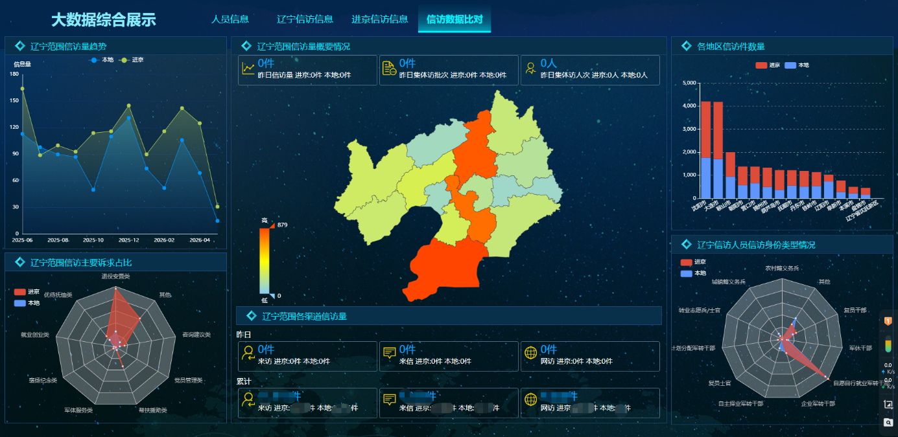

改造后的图：

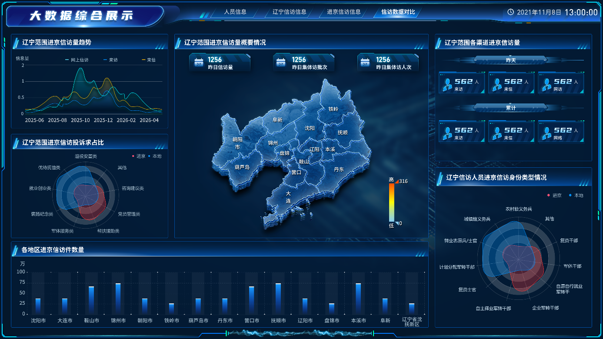

##### 展示模块1：信访量趋势对比

以折线图展示本地和进京的三类信访渠道（网上信访、来访、来信）的和的最近12个月信息量变化。

**指标算法表：**

|  |  |  |  |
| --- | --- | --- | --- |
| **展示指标** | **取值表** | **取值字段** | **取值SQL** |
| 本地信访12个月趋势 | LETTER\_SCREEN\_2 | NUM\_0~NUM\_11 | select SUM(NUM\_0),SUM(NUM\_1)...SUM(NUM\_11) from LETTER\_SCREEN\_2 WHERE REG\_AUTHORITY=2 and ORGAN\_ID =#{ORGANID} GROUP BY ACCEPT\_SOURCE ORDER BY ACCEPT\_SOURCE  REG\_AUTHORITY代表登记机构：1代表上京，2代表本地，0代表登记表未添加  其中ORGANID代表的是行政区域的编号，展示那个行政区域的数据就传入对应的行政区域编号 |
| 进京信访12个月趋势 | LETTER\_SCREEN\_2 | NUM\_0~NUM\_11 | 同上，REG\_AUTHORITY=1 |

##### 展示模块2：信访主要诉求占比对比

双雷达图展示本地和进京各类信访诉求的数量及占比

**指标算法表：**

|  |  |  |  |
| --- | --- | --- | --- |
| **展示指标** | **取值表** | **取值字段** | **取值SQL** |
| 本地各诉求分类数量 | LETTER\_SCREEN\_1 | ITEM\_NAME,REG\_MAIN\_APPEAL\_ONE,NUM | select ITEM\_NAME,REG\_MAIN\_APPEAL\_ONE,NUM from LETTER\_SCREEN\_1 WHERE REG\_AUTHORITY=2 and ORGAN\_ID =#{ORGANID}  REG\_AUTHORITY代表登记机构：1代表上京，2代表本地，0代表登记表未添加  其中ORGANID代表的是行政区域的编号，展示那个行政区域的数据就传入对应的行政区域编号 |
| 进京各诉求分类数量 | LETTER\_SCREEN\_1 | ITEM\_NAME,REG\_MAIN\_APPEAL\_ONE,NUM | 同上，REG\_AUTHORITY=1 |

##### 展示模块3：信访量概要情况对比

顶部展示昨日信访量、昨日集体访批次、昨日集体访人次；下方展示各渠道信访量。

**指标算法表：**

|  |  |  |  |
| --- | --- | --- | --- |
| **展示指标** | **取值表** | **取值字段** | **取值SQL** |
| 昨日网上信访量（合计/本地/进京） | LETTER\_SCREEN\_6 | JTWX | 本地：  select JTWX,ZWX,JTLF,ZLF,JTJTFPC,JTJTFRC,ZLX,JTLX from LETTER\_SCREEN\_6 WHERE REG\_AUTHORITY=2 and ORGAN\_ID =#{ORGANID}  进京：  select JTWX,ZWX,JTLF,ZLF,JTJTFPC,JTJTFRC,ZLX,JTLX from LETTER\_SCREEN\_6 WHERE REG\_AUTHORITY=1 and ORGAN\_ID =#{ORGANID}  合计：本地+进金  REG\_AUTHORITY代表登记机构：1代表上京，2代表本地，0代表登记表未添加  其中ORGANID代表的是行政区域的编号，展示那个行政区域的数据就传入对应的行政区域编号 |
| 累计网上信访量 | LETTER\_SCREEN\_6 | ZWX | 同上 |
| 昨日来访量 | LETTER\_SCREEN\_6 | JTLF | 同上 |
| 累计来访量 | LETTER\_SCREEN\_6 | ZLF | 同上 |
| 昨日集体访批次 | LETTER\_SCREEN\_6 | JTJTFPC | 同上 |
| 昨日集体访人次 | LETTER\_SCREEN\_6 | JTJTFRC | 同上 |
| 累计来信量 | LETTER\_SCREEN\_6 | ZLX | 同上 |
| 昨日来信量 | LETTER\_SCREEN\_6 | JTLX | 同上 |
| 昨日信访量 | LETTER\_SCREEN\_6 | JTWX+ JTLF+ JTLX | 同上 |

##### 展示模块4：区域信访热力地图

以辽宁省区域地图展示各地区本地和进京的信访量密度分布，颜色从浅蓝到红橙渐变。

**指标算法表：**

|  |  |  |  |
| --- | --- | --- | --- |
| **展示指标** | **取值表** | **取值字段** | **取值SQL** |
| 各地区本地和进京信访件数量（地图） | LETTER\_SCREEN\_4 | CANT\_NAME,CANT\_CODE,NUM | select CANT\_NAME,CANT\_CODE,sum(NUM) from LETTER\_SCREEN\_4 WHERE REG\_AUTHORITY=1和2的and ORGAN\_ID =#{ORGANID}  REG\_AUTHORITY代表登记机构：1代表上京，2代表本地，0代表登记表未添加  其中ORGANID代表的是行政区域的编号，展示那个行政区域的数据就传入对应的行政区域编号 |

##### 展示模块5：各地区信访件数量对比

以柱状图展示辽宁各地区本地和进京信访件数量排名。

**指标算法表：**

|  |  |  |  |
| --- | --- | --- | --- |
| **展示指标** | **取值表** | **取值字段** | **取值SQL** |
| 本地各地区信访件数量排名 | LETTER\_SCREEN\_5 | CANT\_NAME,CANT\_CODE,NUM,MAX\_TIME | sselect CANT\_NAME,CANT\_CODE,NUM,MAX\_TIME from LETTER\_SCREEN\_5 WHERE REG\_AUTHORITY=2 and ORGAN\_ID =#{ORGANID} order by NUM desc  REG\_AUTHORITY代表登记机构：1代表上京，2代表本地，0代表登记表未添加  其中ORGANID代表的是行政区域的编号，展示哪个行政区域的数据就传入对应的行政区域编号，第一级是省级看板展示各地市的数据，ORGANID传入省的编码 |
| 进京各地区信访件数量排名 | LETTER\_SCREEN\_5 | CANT\_NAME,CANT\_CODE,NUM,MAX\_TIME | 同上，REG\_AUTHORITY=1 |

##### 展示模块6：信访人员身份类型对比

以分组柱状图展示11种身份类型本地和进京信访数据。

**指标算法表：**

|  |  |  |  |
| --- | --- | --- | --- |
| **展示指标** | **取值表** | **取值字段** | **取值SQL** |
| 本地11种身份类型分渠道信访数据 | LETTER\_SCREEN\_3 | SB\_NCYWB,SB\_CZYWB,SB\_ZYSG,SB\_FYSG,GB\_JHFP,GB\_ZZZY,GB\_QYJZGB,GB\_ZYJZGB,GB\_JXGB,GB\_FY,RY\_QT | select SB\_NCYWB,SB\_CZYWB,SB\_ZYSG,SB\_FYSG,GB\_JHFP,GB\_ZZZY,GB\_QYJZGB,GB\_ZYJZGB,GB\_JXGB,GB\_FY,RY\_QT,ACCEPT\_SOURCE from LETTER\_SCREEN\_3 WHERE REG\_AUTHORITY=2 and ORGAN\_ID =#{ORGANID} ORDER BY ACCEPT\_SOURCE  REG\_AUTHORITY代表登记机构：1代表上京，2代表本地，0代表登记表未添加  其中ORGANID代表的是行政区域的编号，展示哪个行政区域的数据就传入对应的行政区域编号  字段分别对应：农村籍义务兵、城镇籍义务兵、转业志愿兵/士官、复员士官、计划分配军转干部、自主择业军转干部、企业军转干部、自谋自择就业军转干部、军休干部、复员干部、其他 |
| 进京11种身份类型分渠道信访数据 | LETTER\_SCREEN\_3 | SB\_NCYWB,SB\_CZYWB,SB\_ZYSG,SB\_FYSG,GB\_JHFP,GB\_ZZZY,GB\_QYJZGB,GB\_ZYJZGB,GB\_JXGB,GB\_FY,RY\_QT | 同上，REG\_AUTHORITY=1 |

### 统计分析

#### 退役军人及其他优抚对象月报统计

提供退役军人及其他优抚对象月报查询、导出功能。

查询条件：年月（时间选择控件、只需选择年月）

查询结果：如下图

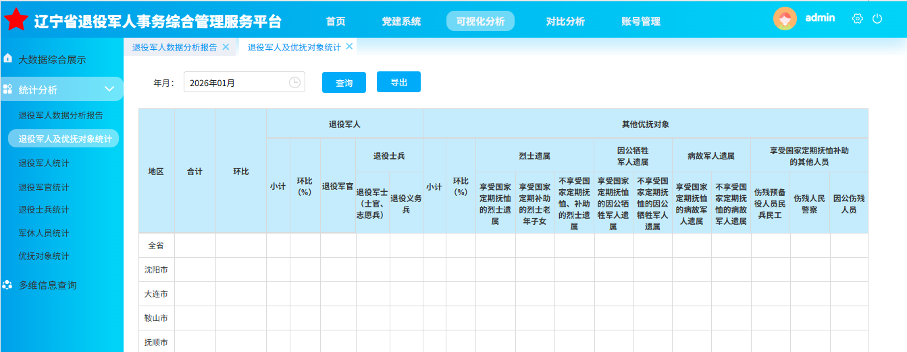

查询结果支持excel导出，导出的excel除了页面的字段还需要包含：数据标题、统计日期、单位信息，详见模板：

查询算法：

1）涉及的表：退役军人结果表（abi\_zb\_tyjrjqyfdx）

2）时间条件算法：取退役军人结果表（abi\_zb\_tyjrjqyfdx）的时间（TIME）等于所选“年月”的最后一天的数据（比如选择的是2025年9月，数据库有time是2025-9-15 08:00:00、2025-9-16 08:00:00、2025-9-30 08:00:00的数据，则取时间是2025-9-30 08:00:00的数据）

3）各字段查询取值算法如下：

|  |  |  |  |  |  |
| --- | --- | --- | --- | --- | --- |
| **查询结果** | | | **地市取值算法** | **合计取值算法** | |
| 地区 | | | abi\_zb\_tyjrjqyfdx.CANT\_NAME 只取沈阳市、大连市、鞍山市、抚顺市（抚顺市+辽宁省沈抚新区）、本溪市、丹东市、锦州市、营口市、阜新市、辽阳市、盘锦市、铁岭市、朝阳市、葫芦岛市的数据 | 固定值：全省 | |
| 合计 | | | abi\_zb\_tyjrjqyfdx.tyjrhj+abi\_zb\_tyjrjqyfdx.yfdydxhj | 各地市（abi\_zb\_tyjrjqyfdx.tyjrhj+abi\_zb\_tyjrjqyfdx.yfdydxhj）值的和 | |
| 环比% | | | （（abi\_zb\_tyjrjqyfdx.tyjrhj+abi\_zb\_tyjrjqyfdx.yfdydxhj）-（上月的最后一天的abi\_zb\_tyjrjqyfdx.tyjrhj+abi\_zb\_tyjrjqyfdx.yfdydxhj））/(上月最后一天的abi\_zb\_tyjrjqyfdx.tyjrhj+abi\_zb\_tyjrjqyfdx.yfdydxhj)\*100 | （各地市（abi\_zb\_tyjrjqyfdx.tyjrhj+abi\_zb\_tyjrjqyfdx.yfdydxhj）值的和-上月最后一天的各地市（abi\_zb\_tyjrjqyfdx.tyjrhj+abi\_zb\_tyjrjqyfdx.yfdydxhj）值的和）/上月最后一天各地市（abi\_zb\_tyjrjqyfdx.tyjrhj+abi\_zb\_tyjrjqyfdx.yfdydxhj）值的和\*100 | |
| 退役军人 | 小计 | | abi\_zb\_tyjrjqyfdx.tyjrhj | 各地市abi\_zb\_tyjrjqyfdx.tyjrhj值的和 | |
| 环比 | | （abi\_zb\_tyjrjqyfdx.tyjrhj-上月的最后一天的abi\_zb\_tyjrjqyfdx.tyjrhj）/上月最后一天的abi\_zb\_tyjrjqyfdx.tyjrhj\*100 | （各地市abi\_zb\_tyjrjqyfdx.tyjrhj值的和-上月最后一天的各地市abi\_zb\_tyjrjqyfdx.tyjrhj值的和）/上月最后一天各地市abi\_zb\_tyjrjqyfdx.tyjrhj值的和\*100 | |
| 退役军官 | | abi\_zb\_tyjrjqyfdx.tyjghj | 各地市abi\_zb\_tyjrjqyfdx.tyjghj值的和 | |
| 退役士兵 | 退役军士（士官、志愿兵） | abi\_zb\_tyjrjqyfdx.tyjshj | | 各地市abi\_zb\_tyjrjqyfdx.tyjshj值的和 | |
| 退役义务兵 | abi\_zb\_tyjrjqyfdx.tyywbhj | | 各地市abi\_zb\_tyjrjqyfdx.tyywbhj值的和 | |
| 其他优抚对象 | 小计 | | abi\_zb\_tyjrjqyfdx.yfdydxhj | 各地市abi\_zb\_tyjrjqyfdx.yfdydxhj值的和 | |
| 环比（%） | | （abi\_zb\_tyjrjqyfdx.yfdydxhj-上月的最后一天的abi\_zb\_tyjrjqyfdx.yfdydxhj）/上月最后一天的abi\_zb\_tyjrjqyfdx.yfdydxhj\*100 | （各地市abi\_zb\_tyjrjqyfdx.yfdydxhj值的和-上月最后一天的各地市abi\_zb\_tyjrjqyfdx.yfdydxhj值的和）/上月最后一天各地市abi\_zb\_tyjrjqyfdx.yfdydxhj值的和\*100 | |
| 烈士遗属 | 享受国家定期抚恤的烈士遗属 | abi\_zb\_tyjrjqyfdx.yfxsgjdqfxlsys | | 各地市abi\_zb\_tyjrjqyfdx.yfxsgjdqfxlsys值的和 | |
| 享受国家定期补助的烈士老年子女 | abi\_zb\_tyjrjqyfdx.yfxsgjdqbzlslnzn | | 各地市abi\_zb\_tyjrjqyfdx.yfxsgjdqbzlslnzn值的和 | |
| 不享受国家定期抚恤、补助的烈士遗属 | abi\_zb\_tyjrjqyfdx.yfbxsgjdqfxbzlsys | | 各地市abi\_zb\_tyjrjqyfdx.yfbxsgjdqfxbzlsys值的和 | |
| 因公牺牲军人遗属 | 享受国家定期抚恤的因公牺牲军人遗属 | abi\_zb\_tyjrjqyfdx.yfxsgjdqfxygxsjrys | | 各地市abi\_zb\_tyjrjqyfdx.yfxsgjdqfxygxsjrys值的和 | |
| 不享受国家定期抚恤的因公牺牲军人遗属 | abi\_zb\_tyjrjqyfdx.yfbxsgjdqfxygxsjrys | | 各地市abi\_zb\_tyjrjqyfdx.yfbxsgjdqfxygxsjrys值的和 | |
| 病故军人遗属 | 享受国家定期抚恤的病故军人遗属 | abi\_zb\_tyjrjqyfdx.yfxsgjdqfxbgjrys | | 各地市abi\_zb\_tyjrjqyfdx.yfxsgjdqfxbgjrys值的和 | |
| 不享受国家定期抚恤的病故军人遗属 | abi\_zb\_tyjrjqyfdx.yfbxsgjdqfxbgjrys | | 各地市abi\_zb\_tyjrjqyfdx.yfbxsgjdqfxbgjrys值的和 | |
| 享受国家定期抚恤补助的其他人员 | 伤残预备役人员民兵民工 | abi\_zb\_tyjrjqyfdx.yfscybyrymbmg | | 各地市abi\_zb\_tyjrjqyfdx.yfscybyrymbmg值的和 | |
| 伤残人民警察 | abi\_zb\_tyjrjqyfdx.yfscrmjc | | 各地市abi\_zb\_tyjrjqyfdx.yfscrmjc值的和 | |
| 因公伤残人员 | abi\_zb\_tyjrjqyfdx.yfygscry | | 各地市abi\_zb\_tyjrjqyfdx.yfygscry值的和 | |

#### 退役军人月报统计

提供退役军人月报查询、导出功能。

查询条件：年月（时间选择控件、只需选择年月）

查询结果：如下图

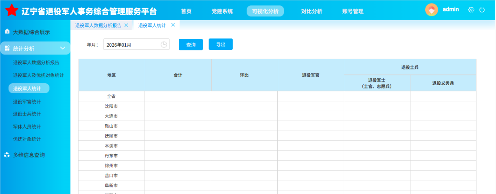

查询结果支持excel导出，导出的excel除了页面的字段还需要包含：数据标题、统计日期、单位信息，详见模板：

查询算法：

1）涉及的表：退役军人结果表（abi\_zb\_tyjrjqyfdx）

2）时间条件算法：取退役军人结果表（abi\_zb\_tyjrjqyfdx）的时间（TIME）等于所选“年月”的最后一天的数据（比如选择的是2025年9月，数据库有time是2025-9-15 08:00:00、2025-9-16 08:00:00、2025-9-30 08:00:00的数据，则取时间是2025-9-30 08:00:00的数据）

3）各字段查询取值算法如下：

|  |  |  |  |
| --- | --- | --- | --- |
| **查询结果** | | **地市取值算法** | **合计取值算法** |
| 地区 | | abi\_zb\_tyjrjqyfdx.CANT\_NAME 只取沈阳市、大连市、鞍山市、抚顺市（抚顺市+辽宁省沈抚新区）、本溪市、丹东市、锦州市、营口市、阜新市、辽阳市、盘锦市、铁岭市、朝阳市、葫芦岛市的数据 | 固定值：全省 |
| 合计 | | abi\_zb\_tyjrjqyfdx.tyjrhj | 各地市abi\_zb\_tyjrjqyfdx.tyjrhj值的和 |
| 环比（%） | | （abi\_zb\_tyjrjqyfdx.tyjrhj-上月的最后一天的abi\_zb\_tyjrjqyfdx.tyjrhj）/上月最后一天的abi\_zb\_tyjrjqyfdx.tyjrhj\*100 | （各地市abi\_zb\_tyjrjqyfdx.tyjrhj值的和-上月最后一天的各地市abi\_zb\_tyjrjqyfdx.tyjrhj值的和）/上月最后一天各地市abi\_zb\_tyjrjqyfdx.tyjrhj值的和\*100 |
| 退役军官 | | abi\_zb\_tyjrjqyfdx.tyjghj | 各地市abi\_zb\_tyjrjqyfdx.tyjghj值的和 |
| 退役士兵 | 退役军士  （士官、志愿兵） | abi\_zb\_tyjrjqyfdx.tyjshj | 各地市abi\_zb\_tyjrjqyfdx.tyjshj值的和 |
| 退役义务兵 | abi\_zb\_tyjrjqyfdx.tyywbhj | 各地市abi\_zb\_tyjrjqyfdx.tyywbhj值的和 |

#### 退役军官月报统计

提供退役军官月报查询、导出功能。

查询条件：年月（时间选择控件、只需选择年月）

查询结果：如下图

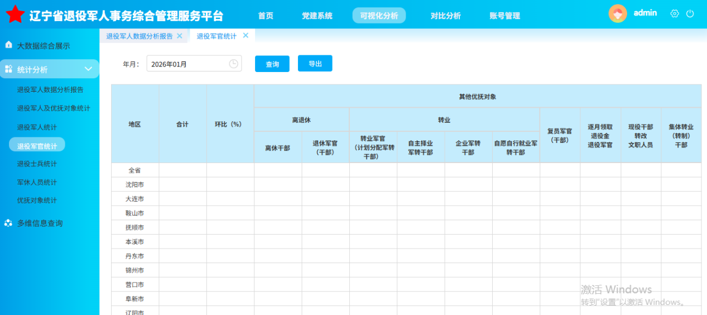

查询结果支持excel导出，导出的excel除了页面的字段还需要包含：数据标题、统计日期、单位信息，详见模板：

查询算法：

1）涉及的表：退役军人结果表（abi\_zb\_tyjrjqyfdx）

2）时间条件算法：取退役军人结果表（abi\_zb\_tyjrjqyfdx）的时间（TIME）等于所选“年月”的最后一天的数据（比如选择的是2025年9月，数据库有time是2025-9-15 08:00:00、2025-9-16 08:00:00、2025-9-30 08:00:00的数据，则取时间是2025-9-30 08:00:00的数据）

3）各字段查询取值算法如下：

|  |  |  |  |  |
| --- | --- | --- | --- | --- |
| **查询结果** | | | **地市取值算法** | **合计取值算法** |
| 地区 | | | abi\_zb\_tyjrjqyfdx.CANT\_NAME 只取沈阳市、大连市、鞍山市、抚顺市（抚顺市+辽宁省沈抚新区）、本溪市、丹东市、锦州市、营口市、阜新市、辽阳市、盘锦市、铁岭市、朝阳市、葫芦岛市的数据 | 固定值：全省 |
| 合计 | | | abi\_zb\_tyjrjqyfdx.tyjghj | 各地市abi\_zb\_tyjrjqyfdx.tyjghj值的和 |
| 环比（%） | | | （abi\_zb\_tyjrjqyfdx.tyjghj-上月的最后一天的abi\_zb\_tyjrjqyfdx.tyjghj）/上月最后一天的abi\_zb\_tyjrjqyfdx.tyjghj\*100 | （各地市abi\_zb\_tyjrjqyfdx.tyjghj值的和-上月最后一天的各地市abi\_zb\_tyjrjqyfdx.tyjghj值的和）/上月最后一天各地市abi\_zb\_tyjrjqyfdx.tyjghj值的和\*100 |
| 退役军官 | 离退休 | 离休干部 | abi\_zb\_tyjrjqyfdx.lxgb | 各地市abi\_zb\_tyjrjqyfdx.lxgb值的和 |
| 退休军官 （干部） | abi\_zb\_tyjrjqyfdx.txjg | 各地市abi\_zb\_tyjrjqyfdx.txjg值的和 |
| 转业 | 转业军官 （计划分配军转干部） | abi\_zb\_tyjrjqyfdx.zyjg | 各地市abi\_zb\_tyjrjqyfdx.zyjg值的和 |
| 自主择业 军转干部 | abi\_zb\_tyjrjqyfdx.zzzyjzgb | 各地市abi\_zb\_tyjrjqyfdx.zzzyjzgb值的和 |
| 企业军转 干部 | abi\_zb\_tyjrjqyfdx.qyjzgb | 各地市abi\_zb\_tyjrjqyfdx.qyjzgb值的和 |
| 自愿自行就业军转干部 | abi\_zb\_tyjrjqyfdx.zyzxjyjzgb | 各地市abi\_zb\_tyjrjqyfdx.zyzxjyjzgb值的和 |
| 复员军官 （干部） | | abi\_zb\_tyjrjqyfdx.fyjg | 各地市abi\_zb\_tyjrjqyfdx.fyjg值的和 |
| 逐月领取 退役金 退役军官 | | abi\_zb\_tyjrjqyfdx.zylqtyjtyjg | 各地市abi\_zb\_tyjrjqyfdx.zylqtyjtyjg值的和 |
| 现役干部 转改 文职人员 | | abi\_zb\_tyjrjqyfdx.xygbzgwzry | 各地市abi\_zb\_tyjrjqyfdx.xygbzgwzry值的和 |
| 集体转业 （转制） 干部 | | abi\_zb\_tyjrjqyfdx.jtzygb | 各地市abi\_zb\_tyjrjqyfdx.jtzygb值的和 |

#### 退役士兵月报统计

提供退役士兵月报查询、导出功能。

查询条件：年月（时间选择控件、只需选择年月）

查询结果：如下图

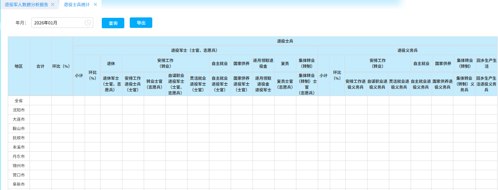

查询结果支持excel导出，导出的excel除了页面的字段还需要包含：数据标题、统计日期、单位信息，详见模板： 

查询算法：

1）涉及的表：退役军人结果表（abi\_zb\_tyjrjqyfdx）

2）时间条件算法：取退役军人结果表（abi\_zb\_tyjrjqyfdx）的时间（TIME）等于所选“年月”的最后一天的数据（比如选择的是2025年9月，数据库有time是2025-9-15 08:00:00、2025-9-16 08:00:00、2025-9-30 08:00:00的数据，则取时间是2025-9-30 08:00:00的数据）

3）各字段查询取值算法如下：

|  |  |  |  |  |  |
| --- | --- | --- | --- | --- | --- |
| **查询结果** | | | | **地市取值算法** | **合计取值算法** |
| 地区 | | | | abi\_zb\_tyjrjqyfdx.CANT\_NAME 只取沈阳市、大连市、鞍山市、抚顺市（抚顺市+辽宁省沈抚新区）、本溪市、丹东市、锦州市、营口市、阜新市、辽阳市、盘锦市、铁岭市、朝阳市、葫芦岛市的数据 | 固定值：全省 |
| 合计 | | | | abi\_zb\_tyjrjqyfdx.tyjshj+abi\_zb\_tyjrjqyfdx.tyywbhj | 各地市（abi\_zb\_tyjrjqyfdx.tyjshj+abi\_zb\_tyjrjqyfdx.tyywbhj）值的和 |
| 环比（%） | | | | （（abi\_zb\_tyjrjqyfdx.tyjshj+abi\_zb\_tyjrjqyfdx.tyywbhj）-（上月的最后一天的（abi\_zb\_tyjrjqyfdx.tyjshj+abi\_zb\_tyjrjqyfdx.tyywbhj））/(上月最后一天的（abi\_zb\_tyjrjqyfdx.tyjshj+abi\_zb\_tyjrjqyfdx.tyywbhj）\*100 | （各地市（abi\_zb\_tyjrjqyfdx.tyjshj+abi\_zb\_tyjrjqyfdx.tyywbhj）值的和-上月最后一天的各地市（abi\_zb\_tyjrjqyfdx.tyjshj+abi\_zb\_tyjrjqyfdx.tyywbhj）值的和）/上月最后一天各地市（abi\_zb\_tyjrjqyfdx.tyjshj+abi\_zb\_tyjrjqyfdx.tyywbhj）值的和\*100 |
| 退役士兵 | 退役军士（士官、志愿兵） | 小计 | | abi\_zb\_tyjrjqyfdx.tyjshj | 各地市abi\_zb\_tyjrjqyfdx.tyjshj值的和 |
| 环比（%） | | （abi\_zb\_tyjrjqyfdx.tyjshj-上月的最后一天的abi\_zb\_tyjrjqyfdx.tyjshj）/上月最后一天的abi\_zb\_tyjrjqyfdx.tyjshj\*100 | （各地市abi\_zb\_tyjrjqyfdx.tyjshj值的和-上月最后一天的各地市abi\_zb\_tyjrjqyfdx.tyjshj值的和）/上月最后一天各地市abi\_zb\_tyjrjqyfdx.tyjshj值的和\*100 |
| 退休 | 退休军士 （士官、 志愿兵） | abi\_zb\_tyjrjqyfdx.tyjs | 各地市abi\_zb\_tyjrjqyfdx.tyjs值的和 |
| 安排工作 （转业） | 安排工作 退役士兵 （士官） | abi\_zb\_tyjrjqyfdx.apgztyjs | 各地市abi\_zb\_tyjrjqyfdx.apgztyjs值的和 |
| 转业士官 （志愿兵） | abi\_zb\_tyjrjqyfdx.zysg | 各地市abi\_zb\_tyjrjqyfdx.zysg值的和 |
| 自谋职业 退役军士 （士官、 志愿兵） | abi\_zb\_tyjrjqyfdx.zmzytyjs | 各地市abi\_zb\_tyjrjqyfdx.zmzytyjs值的和 |
| 灵活就业 退役军士 （士官） | abi\_zb\_tyjrjqyfdx.lhjytyjs | 各地市abi\_zb\_tyjrjqyfdx.lhjytyjs值的和 |
| 自主就业 | 自主就业 退役军士 （士官） | abi\_zb\_tyjrjqyfdx.zzjytyjs | 各地市abi\_zb\_tyjrjqyfdx.zzjytyjs值的和 |
| 国家供养 | 国家供养 退役军士 （士官） | abi\_zb\_tyjrjqyfdx.gjgytyjs | 各地市abi\_zb\_tyjrjqyfdx.gjgytyjs值的和 |
| 逐月领取退役金 | 逐月领取 退役金 退役军士 | abi\_zb\_tyjrjqyfdx.zylqtyjtyjs | 各地市abi\_zb\_tyjrjqyfdx.zylqtyjtyjs值的和 |
| 复员 | 复员士官 （志愿兵） | abi\_zb\_tyjrjqyfdx.fysg | 各地市abi\_zb\_tyjrjqyfdx.fysg值的和 |
| 集体转业 （转制） | 集体转业 （转制）士官 （志愿兵） | abi\_zb\_tyjrjqyfdx.jtzysg | 各地市abi\_zb\_tyjrjqyfdx.jtzysg值的和 |
| 退役义务兵 | 小计 | | abi\_zb\_tyjrjqyfdx.tyywbhj | 各地市abi\_zb\_tyjrjqyfdx.tyywbhj值的和 |
| 环比（%） | | （abi\_zb\_tyjrjqyfdx.tyywbhj-上月的最后一天的abi\_zb\_tyjrjqyfdx.tyywbhj）/上月最后一天的abi\_zb\_tyjrjqyfdx.tyywbhj\*100 | （各地市abi\_zb\_tyjrjqyfdx.tyywbhj值的和-上月最后一天的各地市abi\_zb\_tyjrjqyfdx.tyywbhj值的和）/上月最后一天各地市abi\_zb\_tyjrjqyfdx.tyywbhj值的和\*100 |
| 安排工作 | 安排工作退役义务兵 | abi\_zb\_tyjrjqyfdx.apgztyywb | 各地市abi\_zb\_tyjrjqyfdx.apgztyywb值的和 |
| 自谋职业退役义务兵 | abi\_zb\_tyjrjqyfdx.zmzytyywb | 各地市abi\_zb\_tyjrjqyfdx.zmzytyywb值的和 |
| 灵活就业退役义务兵 | abi\_zb\_tyjrjqyfdx.lhjytyywb | 各地市abi\_zb\_tyjrjqyfdx.lhjytyywb值的和 |
| 自主就业 | 自主就业退役义务兵 | abi\_zb\_tyjrjqyfdx.zzjytyywb | 各地市abi\_zb\_tyjrjqyfdx.zzjytyywb值的和 |
| 国家供养 | 国家供养退役义务兵 | abi\_zb\_tyjrjqyfdx.gjgytyywb | 各地市abi\_zb\_tyjrjqyfdx.gjgytyywb值的和 |
| 集体转业（转制） | 集体转业（转制）义务兵 | abi\_zb\_tyjrjqyfdx.jtzyywb | 各地市abi\_zb\_tyjrjqyfdx.jtzyywb值的和 |
| 回乡生产生活 | 回乡生产生活退役义务兵 | abi\_zb\_tyjrjqyfdx.hxscshtyywb | 各地市abi\_zb\_tyjrjqyfdx.hxscshtyywb值的和 |

#### 军休人员月报统计

提供军休人员月报查询、导出功能。

查询条件：年月（时间选择控件、只需选择年月）

查询结果：如下图

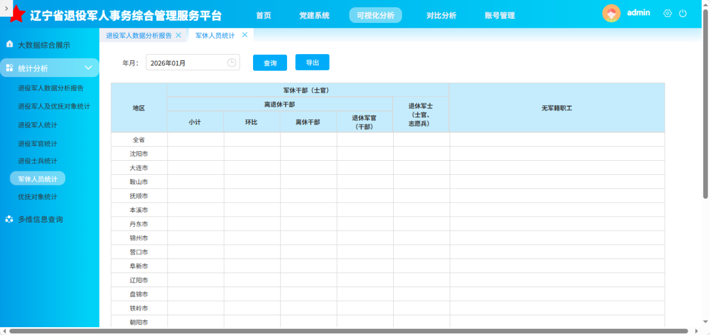

查询结果支持excel导出，导出的excel除了页面的字段还需要包含：数据标题、统计日期、单位信息，详见模板：

查询算法：

1）涉及的表：退役军人结果表（abi\_zb\_tyjrjqyfdx）、无军籍结果表（abi\_wjj）

2）时间条件算法：退役军人结果表（abi\_zb\_tyjrjqyfdx）取时间（TIME）等于所选“年月”的最后一天的数据（比如选择的是2025年9月，数据库有time是2025-9-15 08:00:00、2025-9-16 08:00:00、2025-9-30 08:00:00的数据，则取时间是2025-9-30 08:00:00的数据），无军籍结果表（abi\_wjj）取时间（DATE\_FORMAT）等于所选“年月”的最后一天的数据。

3）表关联算法：通过退役军人结果表（abi\_zb\_tyjrjqyfdx）的区划名称字段（CANT\_NAME）关联无军籍结果表（abi\_wjj）的区划名称字段（CANT\_NAME）

4）各字段查询取值算法如下：

|  |  |  |  |  |
| --- | --- | --- | --- | --- |
| **查询结果** | | | **地市取值算法** | **合计取值算法** |
| 地区 | | | abi\_zb\_tyjrjqyfdx.CANT\_NAME 只取沈阳市、大连市、鞍山市、抚顺市（抚顺市+辽宁省沈抚新区）、本溪市、丹东市、锦州市、营口市、阜新市、辽阳市、盘锦市、铁岭市、朝阳市、葫芦岛市的数据 | 固定值：全省 |
| 军休干部（士官） | 离退休干部 | 小计 | abi\_zb\_tyjrjqyfdx.lxgb+abi\_zb\_tyjrjqyfdx.txjg+abi\_zb\_tyjrjqyfdx.tyjs+abi\_wjj.zs | 各地市（abi\_zb\_tyjrjqyfdx.lxgb+abi\_zb\_tyjrjqyfdx.txjg+abi\_zb\_tyjrjqyfdx.tyjs+abi\_wjj.zs）值的和 |
| 环比（%） | （（abi\_zb\_tyjrjqyfdx.lxgb+abi\_zb\_tyjrjqyfdx.txjg+abi\_zb\_tyjrjqyfdx.tyjs+abi\_wjj.zs）-（上月的最后一天的（abi\_zb\_tyjrjqyfdx.lxgb+abi\_zb\_tyjrjqyfdx.txjg+abi\_zb\_tyjrjqyfdx.tyjs+abi\_wjj.zs））/(上月最后一天的（abi\_zb\_tyjrjqyfdx.lxgb+abi\_zb\_tyjrjqyfdx.txjg+abi\_zb\_tyjrjqyfdx.tyjs+abi\_wjj.zs）\*100 | （各地市（abi\_zb\_tyjrjqyfdx.lxgb+abi\_zb\_tyjrjqyfdx.txjg+abi\_zb\_tyjrjqyfdx.tyjs+abi\_wjj.zs）值的和-上月最后一天的各地市（abi\_zb\_tyjrjqyfdx.lxgb+abi\_zb\_tyjrjqyfdx.txjg+abi\_zb\_tyjrjqyfdx.tyjs+abi\_wjj.zs）值的和）/上月最后一天各地市（abi\_zb\_tyjrjqyfdx.lxgb+abi\_zb\_tyjrjqyfdx.txjg+abi\_zb\_tyjrjqyfdx.tyjs+abi\_wjj.zs）值的和\*100 |
| 离休干部 | abi\_zb\_tyjrjqyfdx.lxgb | 各地市abi\_zb\_tyjrjqyfdx.lxgb值的和 |
| 退休军官（干部） | abi\_zb\_tyjrjqyfdx.txjg | 各地市abi\_zb\_tyjrjqyfdx.txjg值的和 |
| 退休军士（士官、志愿兵） | | abi\_zb\_tyjrjqyfdx.tyjs | 各地市abi\_zb\_tyjrjqyfdx.tyjs值的和 |
| 无军籍职工 | | | abi\_wjj.zs | 各地市abi\_wjj.zs值的和 |

#### 优抚对象月报统计

提供优抚对象月报查询、导出功能。

查询条件：年月（时间选择控件、只需选择年月）

查询结果：如下图

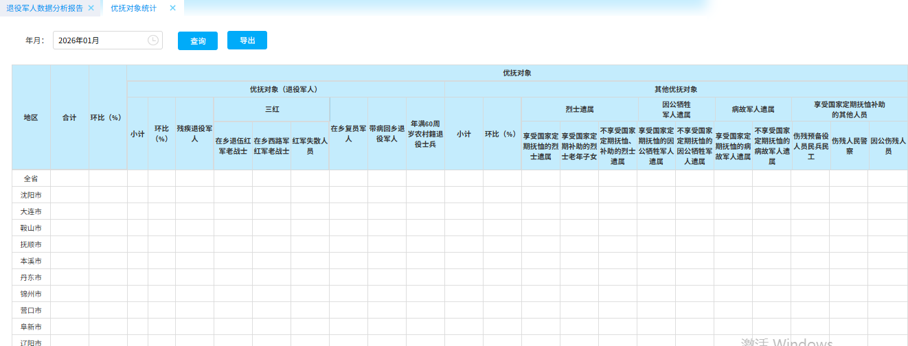

查询结果支持excel导出，导出的excel除了页面的字段还需要包含：数据标题、统计日期、单位信息，详见模板： 

查询算法：

1）涉及的表：退役军人结果表（abi\_zb\_tyjrjqyfdx）

2）时间条件算法：取退役军人结果表（abi\_zb\_tyjrjqyfdx）的时间（TIME）等于所选“年月”的最后一天的数据（比如选择的是2025年9月，数据库有time是2025-9-15 08:00:00、2025-9-16 08:00:00、2025-9-30 08:00:00的数据，则取时间是2025-9-30 08:00:00的数据）

3）各字段查询取值算法如下：

|  |  |  |  |  |  |
| --- | --- | --- | --- | --- | --- |
| **查询结果** | | | | **地市取值算法** | **合计取值算法** |
| 地区 | | | | abi\_zb\_tyjrjqyfdx.CANT\_NAME 只取沈阳市、大连市、鞍山市、抚顺市（抚顺市+辽宁省沈抚新区）、本溪市、丹东市、锦州市、营口市、阜新市、辽阳市、盘锦市、铁岭市、朝阳市、葫芦岛市的数据 | 固定值：全省 |
| 合计 | | | | (abi\_zb\_tyjrjqyfdx.tyjryfdxhj+abi\_zb\_tyjrjqyfdx.yfdydxhj) | 各地市(abi\_zb\_tyjrjqyfdx.tyjryfdxhj+abi\_zb\_tyjrjqyfdx.yfdydxhj)值的和 |
| 环比（%） | | | | （(abi\_zb\_tyjrjqyfdx.tyjryfdxhj+abi\_zb\_tyjrjqyfdx.yfdydxhj)-（上月的最后一天的(abi\_zb\_tyjrjqyfdx.tyjryfdxhj+abi\_zb\_tyjrjqyfdx.yfdydxhj)）/(上月最后一天的(abi\_zb\_tyjrjqyfdx.tyjryfdxhj+abi\_zb\_tyjrjqyfdx.yfdydxhj)\*100 | （各地市(abi\_zb\_tyjrjqyfdx.tyjryfdxhj+abi\_zb\_tyjrjqyfdx.yfdydxhj)值的和-上月最后一天的各地市(abi\_zb\_tyjrjqyfdx.tyjryfdxhj+abi\_zb\_tyjrjqyfdx.yfdydxhj)值的和）/上月最后一天各地市(abi\_zb\_tyjrjqyfdx.tyjryfdxhj+abi\_zb\_tyjrjqyfdx.yfdydxhj)值的和\*100 |
| 优抚对象 | 优抚对象（退役军人） | 小计 | | abi\_zb\_tyjrjqyfdx.tyjryfdxhj | 各地市abi\_zb\_tyjrjqyfdx.tyjryfdxhj值的和 |
| 环比（%） | | （abi\_zb\_tyjrjqyfdx.tyjryfdxhj-上月的最后一天的abi\_zb\_tyjrjqyfdx.tyjryfdxhj）/上月最后一天的abi\_zb\_tyjrjqyfdx.tyjryfdxhj\*100 | （各地市abi\_zb\_tyjrjqyfdx.tyjryfdxhj值的和-上月最后一天的各地市abi\_zb\_tyjrjqyfdx.tyjryfdxhj值的和）/上月最后一天各地市abi\_zb\_tyjrjqyfdx.tyjryfdxhj值的和\*100 |
| 残疾退役军人 | | abi\_zb\_tyjrjqyfdx.yftycjjr | 各地市abi\_zb\_tyjrjqyfdx.yftycjjr值的和 |
| 三红 | 在乡退伍红军老战士 | 固定值：0 | 固定值：0 |
| 在乡西路军红军老战士 | 固定值：0 | 固定值：0 |
| 红军失散人员 | 固定值：0 | 固定值：0 |
| 在乡复员军人 | | abi\_zb\_tyjrjqyfdx.yfzxfyjr | 各地市abi\_zb\_tyjrjqyfdx.yfzxfyjr值的和 |
| 带病回乡退役军人 | | abi\_zb\_tyjrjqyfdx.yfdbhxtyjr | 各地市abi\_zb\_tyjrjqyfdx.yfdbhxtyjr值的和 |
| 年满60周岁农村籍退役士兵 | | abi\_zb\_tyjrjqyfdx.yfnmlszsncjtysb | 各地市abi\_zb\_tyjrjqyfdx.yfnmlszsncjtysb值的和 |
| 其他优抚对象 | 小计 | | abi\_zb\_tyjrjqyfdx.yfdydxhj | 各地市abi\_zb\_tyjrjqyfdx.yfdydxhj值的和 |
| 环比（%） | | （abi\_zb\_tyjrjqyfdx.yfdydxhj-上月的最后一天的abi\_zb\_tyjrjqyfdx.yfdydxhj）/上月最后一天的abi\_zb\_tyjrjqyfdx.yfdydxhj\*100 | （各地市abi\_zb\_tyjrjqyfdx.yfdydxhj值的和-上月最后一天的各地市abi\_zb\_tyjrjqyfdx.yfdydxhj值的和）/上月最后一天各地市abi\_zb\_tyjrjqyfdx.yfdydxhj值的和\*100 |
| 烈士遗属 | 享受国家定期抚恤的烈士遗属 | abi\_zb\_tyjrjqyfdx.yfxsgjdqfxlsys | 各地市abi\_zb\_tyjrjqyfdx.yfxsgjdqfxlsys值的和 |
| 享受国家定期补助的烈士老年子女 | abi\_zb\_tyjrjqyfdx.yfxsgjdqbzlslnzn | 各地市abi\_zb\_tyjrjqyfdx.yfxsgjdqbzlslnzn值的和 |
| 不享受国家定期抚恤、补助的烈士遗属 | abi\_zb\_tyjrjqyfdx.yfbxsgjdqfxbzlsys | 各地市abi\_zb\_tyjrjqyfdx.yfbxsgjdqfxbzlsys值的和 |
| 因公牺牲军人遗属 | 享受国家定期抚恤的因公牺牲军人遗属 | abi\_zb\_tyjrjqyfdx.yfxsgjdqfxygxsjrys | 各地市abi\_zb\_tyjrjqyfdx.yfxsgjdqfxygxsjrys值的和 |
| 不享受国家定期抚恤的因公牺牲军人遗属 | abi\_zb\_tyjrjqyfdx.yfbxsgjdqfxygxsjrys | 各地市abi\_zb\_tyjrjqyfdx.yfbxsgjdqfxygxsjrys值的和 |
| 病故军人遗属 | 享受国家定期抚恤的病故军人遗属 | abi\_zb\_tyjrjqyfdx.yfxsgjdqfxbgjrys | 各地市abi\_zb\_tyjrjqyfdx.yfxsgjdqfxbgjrys值的和 |
| 不享受国家定期抚恤的病故军人遗属 | abi\_zb\_tyjrjqyfdx.yfbxsgjdqfxbgjrys | 各地市abi\_zb\_tyjrjqyfdx.yfbxsgjdqfxbgjrys值的和 |
| 享受国家定期抚恤补助 的其他人员 | 伤残预备役人员民兵民工 | abi\_zb\_tyjrjqyfdx.yfscybyrymbmg | 各地市abi\_zb\_tyjrjqyfdx.yfscybyrymbmg值的和 |
| 伤残人民警察 | abi\_zb\_tyjrjqyfdx.yfscrmjc | 各地市abi\_zb\_tyjrjqyfdx.yfscrmjc值的和 |
| 因公伤残人员 | abi\_zb\_tyjrjqyfdx.yfygscry | 各地市abi\_zb\_tyjrjqyfdx.yfygscry值的和 |

#### 退役军人数据分析报告自动生成

提供退役军人数据分析报告自动生成功能。

页面提供“生成今日报告”按钮，点击后自动按word模板的内容生成今日的退役军人数据分析报告word，自动记录报告生成记录，至少包含：报告日期、报告文件名称、报告生成时间、操作人等信息，生成的报告需要在列表中进行展示，并支持通过报告日期时间条件查询和下载及删除。

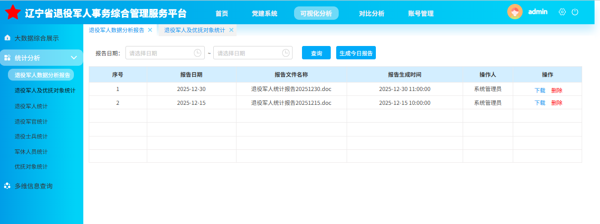

模板和算法详见附件

### 综合查询

**功能描述：**

提供多条件组合的退役军人信息查询，支持详情查看和数据导出功能。

页面分为左右结构，左边展示档案管理单位的树形结构，默认选中顶级节点“辽宁省退役军人事务厅”。右边分上中下结构，右上展示选择的档案管理单位的退役军人和其他优抚对象统计信息；右中展示查询条件；右下展示查询结果信息。

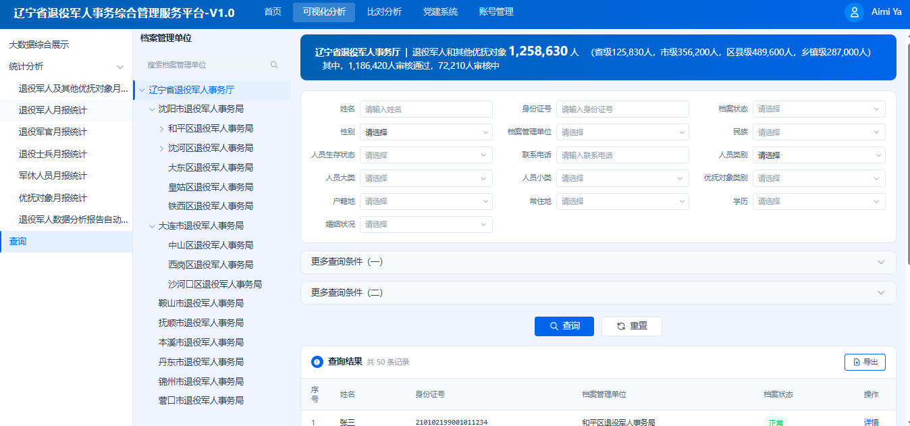

**档案管理单位区域：**

提供档案管理单位的树形结构展示，支持对各级节点展开和收拢，提供档案管理单位的搜索功能。

档案管理单位数据来源于quickdf\_organ表，页面展示档案管理单位名称是quickdf\_organ. ORGAN\_NAME

**档案管理单位的退役军人和其他优抚对象统计信息区域：**

根据选择的档案管理单位统计对应档案管理单位的退役军人和其他优抚对象信息，并按如下文字进行展示：

省级展示：【选择的档案管理单位名称的行政区域（可提取“退役军人”之前的内容）】退役军人和其他优抚对象XX人 ( 省级管理XX人， 市级管理XX人， 区县级管理XX人， 乡镇级管理XX人 ) 。其中， XX人审核通过， XX人审核中。

市级展示：【选择的档案管理单位名称的行政区域（可提取“退役军人”之前的内容）】退役军人和其他优抚对象XX人 (市级管理XX人， 区县级管理XX人， 乡镇级管理XX人 ) 。其中， XX人审核通过， XX人审核中。

区县级展示：【选择的档案管理单位名称的行政区域（可提取“退役军人”之前的内容）】退役军人和其他优抚对象XX人 (区县级管理XX人， 乡镇级管理XX人 ) 。其中， XX人审核通过， XX人审核中。

乡镇级展示：【选择的档案管理单位名称的行政区域（可提取“退役军人”之前的内容）】退役军人和其他优抚对象XX人。其中， XX人审核通过， XX人审核中。

|  |  |  |
| --- | --- | --- |
| **统计数据名称** | **数据来源表** | **数据算法** |
| 退役军人和其他优抚对象人数 | archive\_infor | 根据左侧选择的档案管理单位的quickdf\_organ.ORGAN\_CODE匹配archive\_infor.cant\_code，查询该档案管理单位及其下级节点的生存状态是“01”，并且档案状态是“1”“2”“8”“10”的退役军人的数量和其他优抚对象的数量的和  退役军人通过archive\_infor. PER\_CATE\_TWO\_LEV等于11110、11120、11210、11220、11230、11240、11310、11410、11510、11610、12111、12121、12122、12123、12124、12131、12141、12151、12161、12181、12211、12212、12213、12221、12231、12241、12251筛选  其他优抚对象通过archive\_infor. CAT\_PRE\_OBJECT等于31100、31200、31300、32100、32200、33100、33200、35200、35300、35400筛选 |
| 省级管理人数 | archive\_infor | 按上面的规则只筛选archive\_infor.cant\_code的第3、4位等于00的人数  archive\_infor.cant\_code是12位的数字，例如：210804001000  1、2位：代表省级，固定是21  3、4位：代表市级编码，从01开始，00就代表数据不是市级的是省级的  5、6位：代表区县级编码，从01开始，00就代表数据是市级的  7、8、9位：代表乡镇级编码：从0001开始，000就代表数据是区县级的 |
| 市级管理人数 | archive\_infor | 按上面的规则只筛选archive\_infor.cant\_code的第3、4位不等于00，且5、6位等于00的人数 |
| 区县级管理人数 | archive\_infor | 按上面的规则只筛选archive\_infor.cant\_code的第5、6位不等于00，且7、8、9位等于000的人数 |
| 乡镇级管理人数 | archive\_infor | 按上面的规则只筛选archive\_infor.cant\_code的第7、8、9位不等于000的人数 |
| 审核通过人数 | archive\_infor | 按上面的规则筛选档案状态是 “2” “10”的人数 |
| 审核中人数 | archive\_infor | 按上面的规则筛选档案状态是 “1” “8”的人数 |

**查询条件区域：**

查询条件区域包含默认展示查询条件、更多查询条件（一）、更多查询条件（二）、查询操作按钮、查询条件重置按钮（点击重置按钮后，查询条件恢复到初始状态）。更多查询条件（一）（二）默认收起，可点击展开和收拢。

数据查询涉及众多字典，需新建一张字典表（T\_JDLK\_DICT），并将字典数据进行初始化。

具体字典、查询条件算法及详情展示要求和样式详见附件《功能需求\_查询模块\_要求及算法.xlsx》：

查询结果区域：

展示：序号、姓名、身份证号、档案管理单位、档案状态、操作

|  |  |  |
| --- | --- | --- |
| **字段名称** | **数据来源表** | **数据来源字段** |
| 序号 |  | 自增长 |
| 姓名 | archive\_infor | archive\_infor.NAME |
| 身份证号 | archive\_infor | archive\_infor.ID\_CARD\_NUM |
| 档案管理单位 | archive\_infor | 根据archive\_infor.cant\_code关联quickdf\_organ.ORGAN\_CODE取quickdf\_organ. ORGAN\_NAME的值 |
| 档案状态 | archive\_infor | 根据archive\_infor.INFOR\_STATUS关联T\_JDLK\_DICT.dict\_value=’档案状态’的T\_JDLK\_DICT.item\_code取T\_JDLK\_DICT.item\_value的值 |
| 操作 |  | “详情”按钮，点击可弹窗查看档案详情页。 |

**档案详情弹窗区域：**

点击查询结果操作栏中的“详情”按钮，可打开档案详情弹窗。

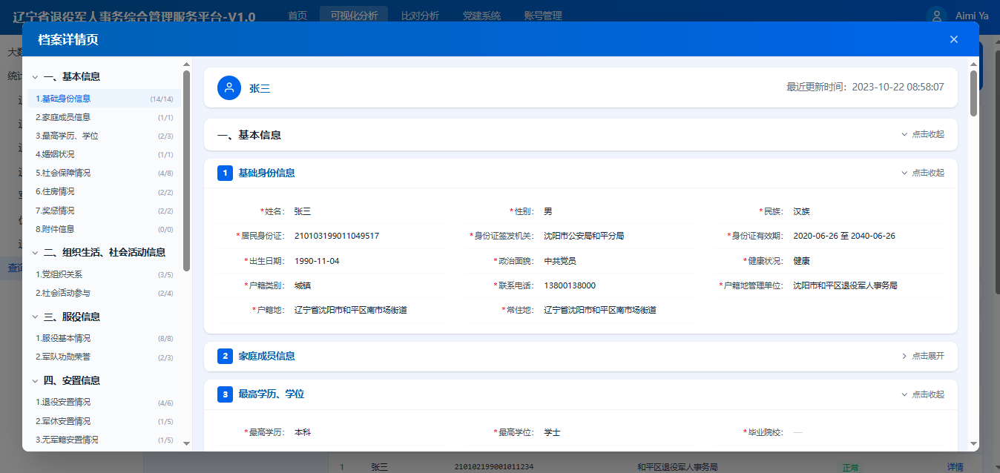

档案详情弹窗要很大，因为里面涉及要展示的内容很多。弹窗的左边是详情的导航，导航一共包含9大项，每项里面包含若干小项，右边展示每个小项对应的查询字段和查询结果信息。

左边导航的每个大项都可以展开和收拢，每个小项后面要标注要查询的字段的个数和查询到信息的字段的个数,点击大项或者小项右边可跳转到对应的位置，

右边的展示的各个大项下小项的信息可以展开和收起。

具体大项、小项、展示字段及说明详见附件《功能需求\_查询模块\_要求及算法.xlsx》的查询页面对应字段sheet。

**导出字段选择弹窗区域：**

在查询界面点击 “导出”按钮，可打开导出字段选择弹窗。

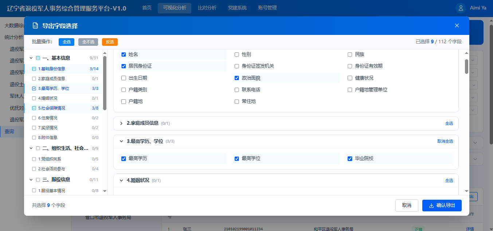

导出字段选择弹出框的内容参考详情弹窗的，只是不进行详情结果展示，要能按大项或者小项进行全选、反选、清除选择，也能按单个字段选择。左边的类型导航栏，点击后能进行右边显示的信息的定位，且要显示每个小项的字段数量和选中的字段数量，有选中的小项的要能和未选中的小项区分。右边的要导出的字段的选择也要能按大项、小项展开和收拢。

因为部分数据本身是列表方式展示的，导出时不能和人员综合信息在一个sheet表格中，所以对于展示的是列表的数据选择要导出后，需要在导出的文件中的单独的sheet中导出，且要补充上对应的姓名、居民身份证号字段，列表展示的数据在详情excel中“导出时是否放单独sheet”字段标记为是的信息。

小项“附件信息”不可选择，在导出选择页面中要删除。

还需展示共选择了多少个字段信息。

全量导出的模板如下，实际导出时，根据选择的字段生成表头：

## 比对分析

### 比对统计查询

**功能描述：**

提供比对统计查询功能，查看各类型数据的比对情况。

**查询条件：**

日期：开始月份至结束月份，默认近三年的月份（如当前是26年5月，开始月份默认23年5月，结束月份默认26年5月），非必填，未填写时查询数据库中所有的数据。

**查询结果：**

年月、人口信息、犯罪信息、税收信息、贷款信息、社会救助信息、社保信息（城居养老保险、企业养老保险、就业登记形式）、住房状况、医保信息、信访诉求。

查询结果按年月降序排列。

**查询算法：**

以比对结果表（comparison）为主进行数据统计查询，查询条件日期关联比对结果表的比对时间（comparison.date），分月进行统计。如果统计月份同一个人同一个类型有多条数据，需要踢重，以此人统计月时间最新的数据为准。

**呈现字段：**

|  |  |  |
| --- | --- | --- |
| **字段名称** | **数据来源表** | **数据算法** |
| 年月 |  | 查询条件上选择的月份，选择了几个月，就呈现几条数据 |
| 人口信息 | comparison | 获取统计月份comparison. changeContentType=1的数据条数（统计条数时按comparison. idNum踢重，踢重规则保留comparison.date当月最新的记录，后面每个统计都要踢重） |
| 犯罪信息 | comparison | 获取统计月份comparison. changeContentType=2的数据条数 |
| 税收信息 | comparison | 获取统计月份comparison. changeContentType=3的数据条数 |
| 贷款信息 | comparison | 获取统计月份comparison. changeContentType=4的数据条数 |
| 社会救助信息 | comparison | 获取统计月份comparison. changeContentType=5的数据条数 |
| 社保信息-城居养老保险 | comparison | 获取统计月份comparison. changeContentType=16的数据条数 |
| 社保信息-企业养老保险 | comparison | 获取统计月份comparison. changeContentType=13的数据条数 |
| 社保信息-就业登记形式 | comparison | 获取统计月份comparison. changeContentType=17的数据条数 |
| 住房状况 | comparison | 获取统计月份comparison. changeContentType=7的数据条数 |
| 医保信息 | comparison | 获取统计月份comparison. changeContentType=8的数据条数 |
| 信访诉求 | comparison | 获取统计月份comparison. changeContentType=9的数据条数 |

**操作说明：**

支持查询、查询条件重置、导出操作，导出内容于查询结果内容一致，导出为excel文件。

### 人员存在信息查询

#### 人员存在信息查询

**功能描述：**

提供人员存在信息查询功能，实现人员存在信息核验。

导入要比对的人员信息，后台自动查询这些导入人员存在情况，并在页面上进行展示。

**下载模板：**

提供要比对的人员信息的模板下载功能，模板如下：

**导入：**

提供要比对的人员信息导入功能，导入字段包含姓名、身份证号。

导入的数据作为查询的条件数据和展示数据。

匹配关系：姓名与人员档案信息表（archive\_infor）人员姓名（archive\_infor.name）匹配，身份证号与人员档案信息表（archive\_infor）的身份证号（archive\_infor. ID\_CARD\_NUM）匹配。

**查询结果：**

展示：序号、姓名、身份证号、存在状态

**呈现字段算法：**

|  |  |  |
| --- | --- | --- |
| **字段名称** | **数据来源表** | **数据来源字段** |
| 序号 |  | 自增长 |
| 姓名 |  | 取导入文件中的姓名 |
| 身份证号 |  | 取导入文件中的身份证号 |
| 存在状态 |  | 取archive\_infor.RYSCZT的值 |

**全部导出：**

查询结果支持全部导出功能，导出内容与查询结果内容一致，导出为excel文件。

#### 比对信息

**功能描述：**

提供多维度信息比对功能，实现退役军人数据的全面核验。

选择查询类别，再导入要比对的人员信息，后台自动查询这些导入人员的选择的查询类别的比对结果，并在页面上进行展示。如果未选择查询类别，则只展示导入人员的存在状态。如果选择了查询类别，则动态扩展查询结果展示列，显示要查询的类别。如果选择的类别含有子类别，则要动态扩展成复合表头，如下图：

**选择查询类别：**

页面提供“选择查询类别”按钮，点击后，弹出“比对类别”弹窗，弹窗内展示比对类别字典，并可对字典进行选择或者取消选择。

比对类别字典数据来源于比对类型表（comparison\_type）的父比对类型（comparison\_type. parent\_type\_id）=0的数据的比对类（comparison\_type. parent\_type\_id）

**下载模板：**

提供要比对的人员信息的模板下载功能，模板如下：

**导入：**

提供要比对的人员信息导入功能，导入字段包含姓名、身份证号。

导入的数据作为查询的条件数据和展示数据。

匹配关系1：姓名与比对结果表（comparison）的人员姓名（comparison.name）匹配，身份证号与比对结果表（comparison）的身份证号（comparison. idNum）匹配。

匹配关系2：姓名与人员档案信息表（archive\_infor）人员姓名（archive\_infor.name）匹配，身份证号与人员档案信息表（archive\_infor）的身份证号（archive\_infor. ID\_CARD\_NUM）匹配。

**查询结果：**

初始化时只展示：序号、姓名、身份证号、存在状态

选择查询类别后，根据选择的查询类别动态扩展查询结果展示字段，如果全部类别都选择后，查询结果展示：序号、姓名、身份证号、存在状态、人口信息、犯罪信息、税收信息、贷款信息、社会救助信息、社保信息（企业养老保险（人员缴费状态比对信息、人员类别比对信息、离退休类别比对信息）、城居养老保险（缴费状态比对信息、待遇发放状态比对信息）、就业登记形式（就业单位性质比对信息））、住房状况、医保信息、信访诉求。

**呈现字段算法：**

|  |  |  |
| --- | --- | --- |
| **字段名称** | **数据来源表** | **数据来源字段** |
| 序号 |  | 自增长 |
| 姓名 |  | 取导入文件中的姓名 |
| 身份证号 |  | 取导入文件中的身份证号 |
| 存在状态 |  | 取archive\_infor.RYSCZT的值 |
| 人口信息 | comparison | 取comparison. changeContentType=1且comparison. Date时间最新的comparison. currentValue的值 |
| 犯罪信息 | comparison | 取comparison. changeContentType=2且comparison. Date时间最新的comparison. currentValue的值 |
| 税收信息 | comparison | 取comparison. changeContentType=3且comparison. Date时间最新的comparison. currentValue的值 |
| 贷款信息 | comparison | 取comparison. changeContentType=4且comparison. Date时间最新的comparison. currentValue的值 |
| 社会救助信息 | comparison | 取comparison. changeContentType=5且comparison. Date时间最新的comparison. currentValue的值 |
| 社保信息-企业养老保险-人员缴费状态比对信息 | comparison | 取comparison. changeContentType=13且comparison. Date时间最新的comparison. currentValue的值 |
| 社保信息-企业养老保险-人员类别比对信息 | comparison | 取comparison. changeContentType=14且comparison. Date时间最新的comparison. currentValue的值 |
| 社保信息-企业养老保险-离退休类别比对信息 | comparison | 取comparison. changeContentType=15且comparison. Date时间最新的comparison. currentValue的值 |
| 社保信息-城居养老保险-缴费状态比对信息 | comparison | 取comparison. changeContentType=16且comparison. Date时间最新的comparison. currentValue的值 |
| 社保信息-城居养老保险-待遇发放状态比对信息 | comparison | 取comparison. changeContentType=18且comparison. Date时间最新的comparison. currentValue的值 |
| 社保信息-就业登记形式-就业单位性质比对信息 | comparison | 取comparison. changeContentType=17且comparison. Date时间最新的comparison. currentValue的值 |
| 住房状况 | comparison | 取comparison. changeContentType=7且comparison. Date时间最新的comparison. currentValue的值 |
| 医保信息 | comparison | 取comparison. changeContentType=8且comparison. Date时间最新的comparison. currentValue的值 |
| 信访诉求 | comparison | 取comparison. changeContentType=9且comparison. Date时间最新的comparison. currentValue的值 |

**全部导出：**

查询结果支持全部导出功能，导出内容与查询结果内容一致，导出为excel文件。

### 综合信息查询

**功能描述：**

提供综合信息查询功能，整合展示退役军人的各类比对结果。

**查询条件：**

姓名：文本输入框，非必填，查询时关联比对结果表（comparison）的人员姓名（comparison.name），模糊匹配

身份证号：文本输入框，非必填，查询时关联比对结果表（comparison）的身份证号（comparison. idNum），模糊匹配

比对类型：下拉选择，字典数据来源于比对类型表（comparison\_type）的比对类型（comparison\_type. comparison\_type），非必填，未选择时，查询全部类型，支持多选，查询时用选择的比对类型（comparison\_type. comparison\_type）的比对类型ID（comparison\_type.type\_id）关联比对结果表（comparison）的比对类型（comparison. changeContentType），获取比对结果表数据

日期：开始月份至结束月份，非必填，查询时关联比对结果表（comparison）的比对时间（comparison. date）

查询条件支持重置。

**查询结果：**

序号、姓名、身份证号、比对类型、比对日期、来源、操作。

**呈现字段算法：**

|  |  |  |
| --- | --- | --- |
| **字段名称** | **数据来源表** | **数据来源字段** |
| 序号 |  | 自增长 |
| 姓名 | comparison | comparison .name |
| 身份证号 | comparison | comparison.idNum |
| 比对类型 | comparison、comparison\_type | comparison . changeContentType匹配comparison\_type.type\_id获取comparison\_type. comparison\_type |
| 比对日期 | comparison | comparison .date |
| 来源 | comparison | Comparison.source匹配comparison\_source.code获取comparison\_source.Value |
| 操作 |  | “查看”按钮，点击可弹窗查看比对信息详细。 |

**查看详情：**

点击每行数据后的“查看”按钮，可弹窗展示比对信息详细，比对详细展示字段包含：姓名、身份证号、比对类型、原值、当前值、比对时间、来源。

****

**弹窗字段算法：**

|  |  |  |
| --- | --- | --- |
| **字段名称** | **数据来源表** | **数据来源字段** |
| 姓名 | comparison | comparison .name |
| 身份证号 | comparison | comparison.idNum |
| 比对类型 | comparison、comparison\_type | comparison . changeContentType匹配comparison\_type.type\_id获取comparison\_type. comparison\_type |
| 原值 | comparison | comparison previousValue |
| 当前值 | comparison | comparison. currentValue |
| 比对时间 | comparison | comparison .date |
| 来源 | comparison | Comparison.source匹配comparison\_source.code获取comparison\_source.Value |

**导出：**

页面提供数据导出功能，导出为excel文件，字段包含：姓名、身份证号、变化类型、变化内容、原值、新值、来源、比对时间。

算法说明：其中“变化类型”对应“比对类型”，“变化内容”取comparison . changeContent，“新值”对应“当前值”，其他与弹窗的取值一致。

### 人口信息比对

**功能描述：**

提供与人口信息的比对功能，核验退役军人信息。

**查询条件：**

姓名：文本输入框，非必填，查询时关联比对结果表（comparison）的人员姓名（comparison.name），模糊匹配

身份证号：文本输入框，非必填，查询时关联比对结果表（comparison）的身份证号（comparison. idNum），模糊匹配

日期：开始月份至结束月份，非必填，查询时关联比对结果表（comparison）的比对时间（comparison. date）

查询条件支持重置。

**查询结果：**

序号、姓名、身份证号、不一致类型、比对日期、人口信息原值、人口信息当前值、来源、操作。

只查询比对结果表（comparison）的比对类型（comparison. changeContentType）=1且满足查询条件的数据。

**呈现字段算法：**

|  |  |  |
| --- | --- | --- |
| **字段名称** | **数据来源表** | **数据来源字段** |
| 序号 |  | 自增长 |
| 姓名 | comparison | comparison .name |
| 身份证号 | comparison | comparison.idNum |
| 不一致类型 | comparison、comparison\_type | comparison . changeContentType匹配comparison\_type.type\_id获取comparison\_type. comparison\_type |
| 比对日期 | comparison | comparison .date |
| 人口信息原值 | comparison | comparison previousValue |
| 人口信息当前值 | comparison | comparison. currentValue |
| 来源 | Comparison  comparison\_source | Comparison.source匹配comparison\_source.code获取comparison\_source.Value |
| 操作 |  | “查看”按钮，点击可弹窗查看比对信息详细。 |

**查看详情：**

点击每行数据后的“查看”按钮，可弹窗展示比对信息详细，比对详细展示字段包含：姓名、身份证号、比对类型、原值、当前值、比对时间、来源。

字段取值算法与查询结果字段算法一致。

****

**导出：**

页面提供数据导出功能，导出为excel文件，字段包含：姓名、身份证号、变化类型、变化内容、原值、新值、来源、比对时间。

算法说明：其中“变化类型”对应“不一致类型”，“变化内容”取comparison . changeContent，“原值”对应“人口信息原值”，“新值”对应“人口信息当前值”，其他与查询结果取值一致。

### 教育培训

**功能描述：**

提供教育培训信息查询功能，核验退役军人的教育培训记录。

**下载模板：**

提供教育培训记录信息的模板下载功能，模板如下：

**导入：**

提供教育培训记录信息导入功能，导入字段包含：序号、姓名、身份证号、退役时间、联系电话、教育培训类别、所学专业、常住地。

导入的数据作为查询的条件数据和展示数据。

导入数据还需入库到教育培训记录表（train），除导入字段外，还需自动写入如下字段的值：

ID：自增长

是否已存在：教育培训记录表（train）中如果已经存在该姓名、身份证号的记录，则写入“存在”；如该姓名、身份证号的记录不存在，则写入“不存在”。

入库时间：系统当前时间

年度的值：系统当前年

数据导入规则：采用更新入库的规则，根据姓名、身份证号比对更新入库。

**查询条件：**

姓名：文本输入框，非必填，查询时模糊匹配教育培训记录表（train）的人员姓名（train.name）

身份证号：文本输入框，非必填，查询时模糊匹配教育培训记录表（train）的身份证号（train. id\_card\_num）

查询结果支持重置。

当页面执行了导入操作时，需查询出本次导入的数据的结果。

**查询结果：**

序号、姓名、身份证号、退役时间、联系电话、教育培训类别、所学专业、常住地、是否存在。

**呈现字段算法：**

|  |  |  |
| --- | --- | --- |
| **字段名称** | **数据来源表** | **数据来源字段** |
| 序号 |  | 自增长 |
| 姓名 | train | train.name |
| 身份证号 | train | train.id\_card\_num |
| 退役时间 | train | train.time\_lev\_arm |
| 联系电话 | train | train.phone |
| 教育培训类别 | train | train.edu\_type |
| 所学专业 | train | train.major |
| 常住地 | train | train.cant |
| 是否存在 | train | train.status |

**导出：**

页面提供数据导出功能，导出为excel文件，字段包含：序号、姓名、身份证号、退役时间、联系电话、教育培训类别、所学专业、常住地、是否存在。

数据取值算法与查询结果展示字段取值算法一致。

### 犯罪信息比对

**功能描述：**

提供与公安部门犯罪记录数据的比对功能，核验退役军人的犯罪记录信息。

**查询条件：**

姓名：文本输入框，非必填，查询时关联比对结果表（comparison）的人员姓名（comparison.name），模糊匹配

身份证号：文本输入框，非必填，查询时关联比对结果表（comparison）的身份证号（comparison. idNum），模糊匹配

日期：开始月份至结束月份，非必填，查询时关联比对结果表（comparison）的比对时间（comparison. date）

查询条件支持重置。

**查询结果：**

序号、姓名、身份证号、不一致类型、比对日期、来源、操作。

只查询比对结果表（comparison）的比对类型（comparison. changeContentType）=2且满足查询条件的数据。

**呈现字段算法：**

|  |  |  |
| --- | --- | --- |
| **字段名称** | **数据来源表** | **数据来源字段** |
| 序号 |  | 自增长 |
| 姓名 | comparison | comparison .name |
| 身份证号 | comparison | comparison.idNum |
| 不一致类型 | comparison、comparison\_type | comparison . changeContentType匹配comparison\_type.type\_id获取comparison\_type. comparison\_type |
| 比对日期 | comparison | comparison .date |
| 来源 | Comparison  comparison\_source | Comparison.source匹配comparison\_source.code获取comparison\_source.Value |
| 操作 |  | “查看”按钮，点击可弹窗查看比对信息详细。 |

**查看详细：**

点击每行数据后的“查看”按钮，可弹窗展示比对信息详细，比对详细展示字段包含：姓名、身份证号、比对类型、原值、当前值、比对时间、来源。

**弹窗字段算法：**

|  |  |  |
| --- | --- | --- |
| **字段名称** | **数据来源表** | **数据来源字段** |
| 姓名 | comparison | comparison .name |
| 身份证号 | comparison | comparison.idNum |
| 比对类型 | comparison、comparison\_type | comparison . changeContentType匹配comparison\_type.type\_id获取comparison\_type. comparison\_type |
| 原值 | comparison | comparison previousValue |
| 当前值 | comparison | comparison. currentValue |
| 比对时间 | comparison | comparison .date |
| 来源 | comparison | Comparison.source匹配comparison\_source.code获取comparison\_source.Value |

**导出：**

页面提供数据导出功能，导出为excel文件，字段包含：姓名、身份证号、变化类型、变化内容、原值、新值、来源、比对时间。

算法说明：其中“变化类型”对应“比对类型”，“变化内容”取comparison . changeContent，“新值”对应“当前值”，其他与弹窗的取值一致。

### 税收信息比对

**功能描述：**

提供与税务部门税收数据的比对功能，核验退役军人的税务登记信息。

**查询条件：**

姓名：文本输入框，非必填，查询时关联比对结果表（comparison）的人员姓名（comparison.name），模糊匹配

身份证号：文本输入框，非必填，查询时关联比对结果表（comparison）的身份证号（comparison. idNum），模糊匹配

日期：开始月份至结束月份，非必填，查询时关联比对结果表（comparison）的比对时间（comparison. date）

查询条件支持重置。

**查询结果：**

序号、姓名、身份证号、不一致类型、比对日期、来源、操作。

只查询比对结果表（comparison）的比对类型（comparison. changeContentType）=3且满足查询条件的数据。

**呈现字段算法：**

|  |  |  |
| --- | --- | --- |
| **字段名称** | **数据来源表** | **数据来源字段** |
| 序号 |  | 自增长 |
| 姓名 | comparison | comparison .name |
| 身份证号 | comparison | comparison.idNum |
| 不一致类型 | comparison、comparison\_type | comparison . changeContentType匹配comparison\_type.type\_id获取comparison\_type. comparison\_type |
| 比对日期 | comparison | comparison .date |
| 来源 | Comparison  comparison\_source | Comparison.source匹配comparison\_source.code获取comparison\_source.Value |
| 操作 |  | “查看”按钮，点击可弹窗查看比对信息详细。 |

**查看详细：**

点击每行数据后的“查看”按钮，可弹窗展示比对信息详细，比对详细展示字段包含：姓名、身份证号、比对类型、原值、当前值、比对时间、来源。

**弹窗字段算法：**

|  |  |  |
| --- | --- | --- |
| **字段名称** | **数据来源表** | **数据来源字段** |
| 姓名 | comparison | comparison .name |
| 身份证号 | comparison | comparison.idNum |
| 比对类型 | comparison、comparison\_type | comparison . changeContentType匹配comparison\_type.type\_id获取comparison\_type. comparison\_type |
| 原值 | comparison | comparison previousValue |
| 当前值 | comparison | comparison. currentValue |
| 比对时间 | comparison | comparison .date |
| 来源 | comparison | Comparison.source匹配comparison\_source.code获取comparison\_source.Value |

**导出：**

页面提供数据导出功能，导出为excel文件，字段包含：姓名、身份证号、变化类型、变化内容、原值、新值、来源、比对时间。

算法说明：其中“变化类型”对应“比对类型”，“变化内容”取comparison . changeContent，“新值”对应“当前值”，其他与弹窗的取值一致。

### 贷款信息比对

**功能描述：**

提供与金融部门贷款数据的比对功能，核验退役军人的贷款信息。

**查询条件：**

姓名：文本输入框，非必填，查询时关联比对结果表（comparison）的人员姓名（comparison.name），模糊匹配

身份证号：文本输入框，非必填，查询时关联比对结果表（comparison）的身份证号（comparison. idNum），模糊匹配

日期：开始月份至结束月份，非必填，查询时关联比对结果表（comparison）的比对时间（comparison. date）

查询条件支持重置。

**查询结果：**

序号、姓名、身份证号、不一致类型、比对日期、来源、操作。

只查询比对结果表（comparison）的比对类型（comparison. changeContentType）=4且满足查询条件的数据。

**呈现字段算法：**

|  |  |  |
| --- | --- | --- |
| **字段名称** | **数据来源表** | **数据来源字段** |
| 序号 |  | 自增长 |
| 姓名 | comparison | comparison .name |
| 身份证号 | comparison | comparison.idNum |
| 不一致类型 | comparison、comparison\_type | comparison . changeContentType匹配comparison\_type.type\_id获取comparison\_type. comparison\_type |
| 比对日期 | comparison | comparison .date |
| 来源 | Comparison  comparison\_source | Comparison.source匹配comparison\_source.code获取comparison\_source.Value |
| 操作 |  | “查看”按钮，点击可弹窗查看比对信息详细。 |

**查看详细：**

点击每行数据后的“查看”按钮，可弹窗展示比对信息详细，比对详细展示字段包含：姓名、身份证号、比对类型、原值、当前值、比对时间、来源。

**弹窗字段算法：**

|  |  |  |
| --- | --- | --- |
| **字段名称** | **数据来源表** | **数据来源字段** |
| 姓名 | comparison | comparison .name |
| 身份证号 | comparison | comparison.idNum |
| 比对类型 | comparison、comparison\_type | comparison . changeContentType匹配comparison\_type.type\_id获取comparison\_type. comparison\_type |
| 原值 | comparison | comparison previousValue |
| 当前值 | comparison | comparison. currentValue |
| 比对时间 | comparison | comparison .date |
| 来源 | comparison | Comparison.source匹配comparison\_source.code获取comparison\_source.Value |

**导出：**

页面提供数据导出功能，导出为excel文件，字段包含：姓名、身份证号、变化类型、变化内容、原值、新值、来源、比对时间。

算法说明：其中“变化类型”对应“比对类型”，“变化内容”取comparison . changeContent，“新值”对应“当前值”，其他与弹窗的取值一致。

### 社会救助信息比对

**功能描述：**

提供与民政部门社会救助数据的比对功能，核验退役军人的社会救助信息。

**查询条件：**

姓名：文本输入框，非必填，查询时关联比对结果表（comparison）的人员姓名（comparison.name），模糊匹配

身份证号：文本输入框，非必填，查询时关联比对结果表（comparison）的身份证号（comparison. idNum），模糊匹配

日期：开始月份至结束月份，非必填，查询时关联比对结果表（comparison）的比对时间（comparison. date）

查询条件支持重置。

**查询结果：**

序号、姓名、身份证号、不一致类型、比对日期、来源、操作。

只查询比对结果表（comparison）的比对类型（comparison. changeContentType）=5且满足查询条件的数据。

**呈现字段算法：**

|  |  |  |
| --- | --- | --- |
| **字段名称** | **数据来源表** | **数据来源字段** |
| 序号 |  | 自增长 |
| 姓名 | comparison | comparison .name |
| 身份证号 | comparison | comparison.idNum |
| 不一致类型 | comparison、comparison\_type | comparison . changeContentType匹配comparison\_type.type\_id获取comparison\_type. comparison\_type |
| 比对日期 | comparison | comparison .date |
| 来源 | Comparison  comparison\_source | Comparison.source匹配comparison\_source.code获取comparison\_source.Value |
| 操作 |  | “查看”按钮，点击可弹窗查看比对信息详细。 |

**查看详细：**

点击每行数据后的“查看”按钮，可弹窗展示比对信息详细，比对详细展示字段包含：姓名、身份证号、比对类型、原值、当前值、比对时间、来源。

**弹窗字段算法：**

|  |  |  |
| --- | --- | --- |
| **字段名称** | **数据来源表** | **数据来源字段** |
| 姓名 | comparison | comparison .name |
| 身份证号 | comparison | comparison.idNum |
| 比对类型 | comparison、comparison\_type | comparison . changeContentType匹配comparison\_type.type\_id获取comparison\_type. comparison\_type |
| 原值 | comparison | comparison previousValue |
| 当前值 | comparison | comparison. currentValue |
| 比对时间 | comparison | comparison .date |
| 来源 | comparison | Comparison.source匹配comparison\_source.code获取comparison\_source.Value |

**导出：**

页面提供数据导出功能，导出为excel文件，字段包含：姓名、身份证号、变化类型、变化内容、原值、新值、来源、比对时间。

算法说明：其中“变化类型”对应“比对类型”，“变化内容”取comparison . changeContent，“新值”对应“当前值”，其他与弹窗的取值一致。

### 社保信息

#### 城居养老保险比对信息

**功能描述：**

提供与社保部门城居养老保险数据的比对功能，核验退役军人的城乡居民养老保险参保和待遇发放信息。

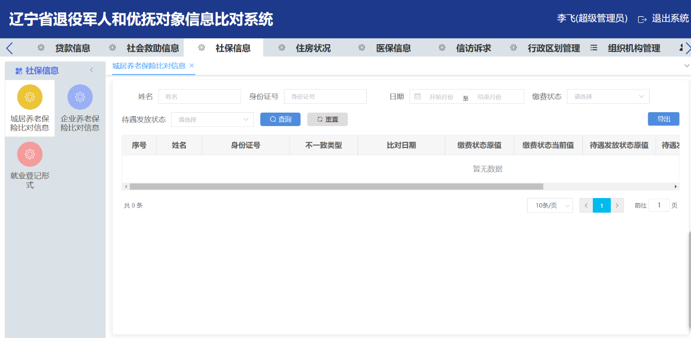

**查询条件：**

姓名：文本输入框，非必填，查询时关联比对结果表（comparison）的人员姓名（comparison.name），模糊匹配

身份证号：文本输入框，非必填，查询时关联比对结果表（comparison）的身份证号（comparison. idNum），模糊匹配

日期：开始月份至结束月份，非必填，查询时关联比对结果表（comparison）的比对时间（comparison. date）

缴费状态：下拉选择，单选，非必填，未填时查询全部，下拉选项包含：中断缴费、参保缴费、暂停缴费，查询时匹配比对结果表（comparison）的新值（comparison.currentValue）

待遇发放状态：下拉选择，单选，非必填，未填时查询全部，下拉选项包含：暂停发放、正常发放、等待复审、终止发放、其他，查询时匹配比对结果表（comparison）的新值（comparison.currentValue）

 

查询条件支持重置。

**查询结果：**

序号、姓名、身份证号、不一致类型、比对日期、缴费状态原值、缴费状态当前值、待遇发放状态原值、待遇发放状态当前值、来源、操作

查询比对结果表（comparison）的比对类型（comparison. changeContentType）=16、18且满足查询条件的数据，其中16代表缴费状态信息，18代表待遇发放状态信息。

**呈现字段：**

|  |  |  |
| --- | --- | --- |
| **字段名称** | **数据来源表** | **数据来源字段** |
| 序号 |  | 自增长 |
| 姓名 | comparison | comparison .name |
| 身份证号 | comparison | comparison.idNum |
| 不一致类型 |  | 固定值：城居养老保险信息 |
| 比对日期 | comparison | comparison.date |
| 缴费状态原值 | comparison | comparison.changeContentType=16的comparison.previousValue |
| 缴费状态当前值 | comparison | comparison.changeContentType=16的comparison.currentValue |
| 待遇发放状态原值 | comparison | comparison.changeContentType=18的comparison.previousValue |
| 待遇发放状态当前值 | comparison | comparison.changeContentType=18的comparison.currentValue |
| 来源 | Comparison  comparison\_source | Comparison.source匹配comparison\_source.code获取comparison\_source.Value |
| 操作 |  | “查看”按钮，点击可弹窗查看比对信息详细。 |

**查看详细：**

点击每行数据后的“查看”按钮，可弹窗展示比对信息详细，比对详细展示字段包含：姓名、身份证号，再分别展示：缴费状态比对信息、待遇发放状态比对信息的比对类型、原值、当前值、比对时间、来源。

**弹窗字段算法与列表的取值算法一致。**

**导出：**

页面提供数据导出功能，导出为excel文件，字段包含：姓名、身份证号、不一致类型、比对日期、缴费状态变化内容、缴费状态原值、缴费状态当前值、待遇发放状态变化内容、待遇发放状态原值、待遇发放状态当前值、来源。

算法说明：其中“变化类型”对应“比对类型”，“变化内容”取comparison . changeContent。

#### 企业养老保险比对信息

**功能描述：**

提供与社保部门企业养老保险数据的比对功能，核验退役军人的企业养老保险参保和人员类别信息。

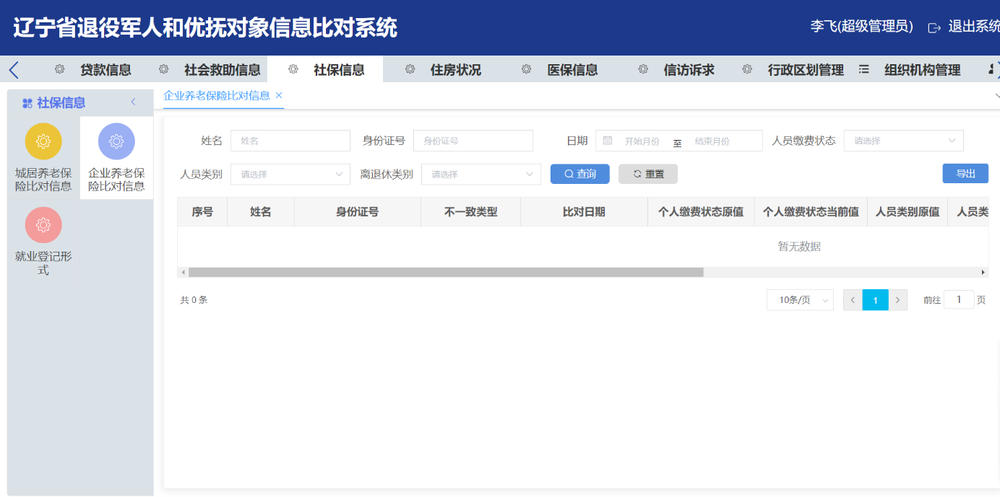

**查询条件：**

姓名：文本输入框，非必填，查询时关联比对结果表（comparison）的人员姓名（comparison.name），模糊匹配

身份证号：文本输入框，非必填，查询时关联比对结果表（comparison）的身份证号（comparison. idNum），模糊匹配

日期：开始月份至结束月份，非必填，查询时关联比对结果表（comparison）的比对时间（comparison. date）

人员缴费状态：下拉选择，单选，非必填，未填时查询全部，下拉选项包含：暂停参保、正常参保、终止参保，查询时匹配比对结果表（comparison）的新值（comparison.currentValue）

人员类别：下拉选择，单选，非必填，未填时查询全部，下拉选项包含：在职、退休，查询时匹配比对结果表（comparison）的新值（comparison.currentValue）

离退休类别：下拉选择，单选，非必填，未填时查询全部，下拉选项包含：事业转企业退休、军转干部提前退休、工伤1-4级退休、建国前老工人、机关事业提前退休、正常退休、煤炭老家属工、特殊工种提前退休、破产提前退休、离休、退职、非因工致残或因病提前退休、(军转)建国前参军退休、其他，查询时匹配比对结果表（comparison）的新值（comparison.currentValue）

  

查询条件支持重置。

**查询结果：**

序号、姓名、身份证号、不一致类型、比对日期、个人缴费状态原值、个人缴费状态当前值、人员类别原值、人员类别当前值、离退休类别原值、离退休类别当前值、来源、操作

查询比对结果表（comparison）的比对类型（comparison. changeContentType）=13、14、15且满足查询条件的数据，其中13代表人员缴费状态比对信息，14代表人员类别比对信息，15代表离退休类别比对信息。

**呈现字段算法：**

|  |  |  |
| --- | --- | --- |
| **字段名称** | **数据来源表** | **数据来源字段** |
| 序号 |  | 自增长 |
| 姓名 | comparison | comparison .name |
| 身份证号 | comparison | comparison.idNum |
| 不一致类型 |  | 固定值：企业养老保险信息 |
| 比对日期 | comparison | comparison.date |
| 个人缴费状态原值 | comparison | comparison.changeContentType=13的comparison.previousValue |
| 个人缴费状态当前值 | comparison | comparison.changeContentType=13的comparison.currentValue |
| 人员类别原值 | comparison | comparison.changeContentType=14的comparison.previousValue |
| 人员类别当前值 | comparison | comparison.changeContentType=14的comparison.currentValue |
| 离退休类别原值 | comparison | comparison.changeContentType=15的comparison.previousValue |
| 离退休类别当前值 | comparison | comparison.changeContentType=15的comparison.currentValue |
| 来源 | Comparison  comparison\_source | Comparison.source匹配comparison\_source.code获取comparison\_source.Value |
| 操作 |  | “查看”按钮，点击可弹窗查看比对信息详细。 |

**查看详细：**

点击每行数据后的“查看”按钮，可弹窗展示比对信息详细，比对详细展示字段包含：姓名、身份证号，再分别展示：人员缴费状态比对信息、人员类别比对信息、离退休类别比对信息的比对类型、原值、当前值、比对时间、来源。

**弹窗字段算法与列表的取值算法一致。**

**导出：**

页面提供数据导出功能，导出为excel文件，字段包含：姓名、身份证号、变化类型、比对日期、个人缴费状态变化内容、个人缴费状态原值、个人缴费状态当前值、人员类别变化内容、人员类别原值、人员类别当前值、离退休类别变化内容、离退休类别原值、离退休类别当前值、来源。

算法说明：其中“变化类型”对应“不一致类型”，“变化内容”取comparison . changeContent。

#### 就业登记形式

**功能描述：**

提供与社保部门就业登记数据的比对功能，核验退役军人的就业登记信息。

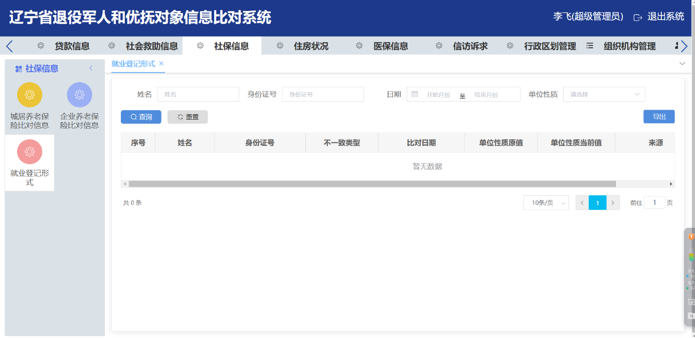

**查询条件：**

姓名：文本输入框，非必填，查询时关联比对结果表（comparison）的人员姓名（comparison.name），模糊匹配

身份证号：文本输入框，非必填，查询时关联比对结果表（comparison）的身份证号（comparison. idNum），模糊匹配

日期：开始月份至结束月份，非必填，查询时关联比对结果表（comparison）的比对时间（comparison. date）

单位性质：下拉选择，单选，非必填，未填时查询全部，下拉选项包含：个体经营、公益性岗位、单位就业、灵活就业、其他，查询时匹配比对结果表（comparison）的新值（comparison.currentValue）

查询条件支持重置。

**查询结果：**

序号、姓名、身份证号、不一致类型、比对日期、单位性质原值、单位性质当前值、来源、操作。

查询比对结果表（comparison）的比对类型（comparison. changeContentType）=17且满足查询条件的数据。

**呈现字段：**

|  |  |  |
| --- | --- | --- |
| **字段名称** | **数据来源表** | **数据来源字段** |
| 序号 |  | 自增长 |
| 姓名 | comparison | comparison .name |
| 身份证号 | comparison | comparison.idNum |
| 不一致类型 |  | 固定值：就业登记形式 |
| 比对日期 | comparison | comparison.date |
| 单位性质原值 | comparison | comparison.changeContentType=17的comparison.previousValue |
| 单位性质当前值 | comparison | comparison.changeContentType=17的comparison.currentValue |
| 来源 | Comparison  comparison\_source | Comparison.source匹配comparison\_source.code获取comparison\_source.Value |
| 操作 |  | “查看”按钮，点击可弹窗查看比对信息详细。 |

**查看详细：**

点击每行数据后的“查看”按钮，可弹窗展示比对信息详细，比对详细展示字段包含：姓名、身份证号，再展示：就业单位性质比对信息的比对类型、原值、当前值、比对时间、来源。

弹窗字段算法与列表的取值算法一致。

**导出：**

页面提供数据导出功能，导出为excel文件，字段包含：姓名、身份证号、变化类型、比对日期、单位性质变化内容、单位性质原值、单位性质当前值、来源。

算法说明：其中“变化类型”对应“不一致类型”，“变化内容”取comparison . changeContent。

### 住房状况比对

**功能描述：**

提供与住建部门住房状况数据的比对功能，核验退役军人的住房信息。

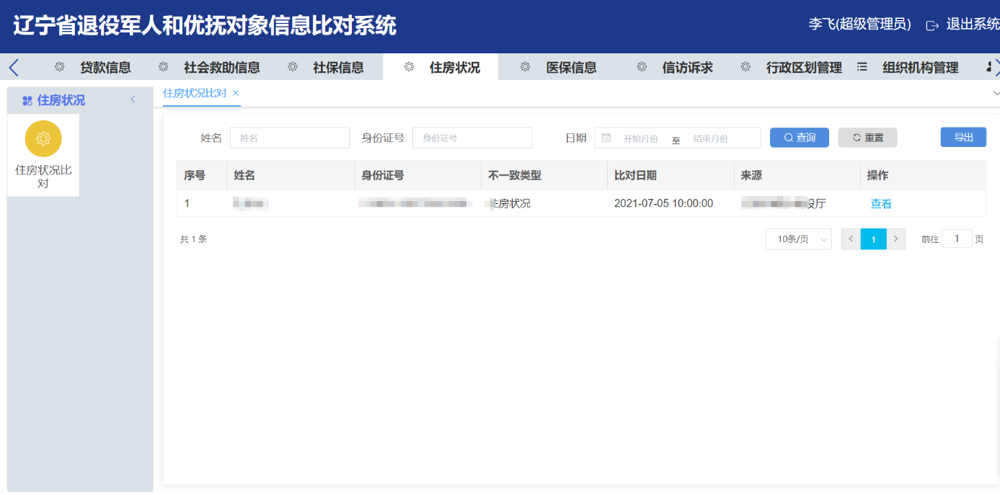

**查询条件：**

姓名：文本输入框，非必填，查询时关联比对结果表（comparison）的人员姓名（comparison.name），模糊匹配

身份证号：文本输入框，非必填，查询时关联比对结果表（comparison）的身份证号（comparison. idNum），模糊匹配

日期：开始月份至结束月份，非必填，查询时关联比对结果表（comparison）的比对时间（comparison. date）

查询条件支持重置。

**查询结果：**

序号、姓名、身份证号、不一致类型、比对日期、来源、操作。

只查询比对结果表（comparison）的比对类型（comparison. changeContentType）=7且满足查询条件的数据。

**呈现字段算法：**

|  |  |  |
| --- | --- | --- |
| **字段名称** | **数据来源表** | **数据来源字段** |
| 序号 |  | 自增长 |
| 姓名 | comparison | comparison .name |
| 身份证号 | comparison | comparison.idNum |
| 不一致类型 | comparison、comparison\_type | comparison . changeContentType匹配comparison\_type.type\_id获取comparison\_type. comparison\_type |
| 比对日期 | comparison | comparison .date |
| 来源 | Comparison  comparison\_source | Comparison.source匹配comparison\_source.code获取comparison\_source.Value |
| 操作 |  | “查看”按钮，点击可弹窗查看比对信息详细。 |

**查看详细：**

点击每行数据后的“查看”按钮，可弹窗展示比对信息详细，比对详细展示字段包含：姓名、身份证号、比对类型、原值、当前值、比对时间、来源。

**弹窗字段算法：**

|  |  |  |
| --- | --- | --- |
| **字段名称** | **数据来源表** | **数据来源字段** |
| 姓名 | comparison | comparison .name |
| 身份证号 | comparison | comparison.idNum |
| 比对类型 | comparison、comparison\_type | comparison . changeContentType匹配comparison\_type.type\_id获取comparison\_type. comparison\_type |
| 原值 | comparison | comparison previousValue |
| 当前值 | comparison | comparison. currentValue |
| 比对时间 | comparison | comparison .date |
| 来源 | comparison | Comparison.source匹配comparison\_source.code获取comparison\_source.Value |

**导出：**

页面提供数据导出功能，导出为excel文件，字段包含：姓名、身份证号、变化类型、变化内容、原值、新值、来源、比对时间。

算法说明：其中“变化类型”对应“比对类型”，“变化内容”取comparison . changeContent，“新值”对应“当前值”，其他与弹窗的取值一致。

### 医保信息比对

**功能描述：**

提供与医保部门数据的比对功能，核验退役军人的医保参保信息。

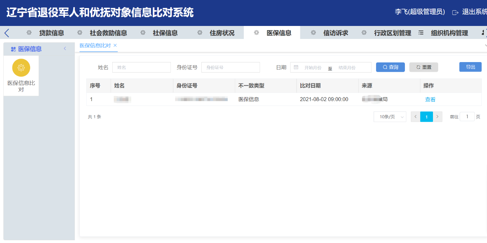

**查询条件：**

姓名：文本输入框，非必填，查询时关联比对结果表（comparison）的人员姓名（comparison.name），模糊匹配

身份证号：文本输入框，非必填，查询时关联比对结果表（comparison）的身份证号（comparison. idNum），模糊匹配

日期：开始月份至结束月份，非必填，查询时关联比对结果表（comparison）的比对时间（comparison. date）

查询条件支持重置。

**查询结果：**

序号、姓名、身份证号、不一致类型、比对日期、来源、操作。

只查询比对结果表（comparison）的比对类型（comparison. changeContentType）=8且满足查询条件的数据。

**呈现字段算法：**

|  |  |  |
| --- | --- | --- |
| **字段名称** | **数据来源表** | **数据来源字段** |
| 序号 |  | 自增长 |
| 姓名 | comparison | comparison .name |
| 身份证号 | comparison | comparison.idNum |
| 不一致类型 | comparison、comparison\_type | comparison . changeContentType匹配comparison\_type.type\_id获取comparison\_type. comparison\_type |
| 比对日期 | comparison | comparison .date |
| 来源 | Comparison  comparison\_source | Comparison.source匹配comparison\_source.code获取comparison\_source.Value |
| 操作 |  | “查看”按钮，点击可弹窗查看比对信息详细。 |

**查看详细：**

点击每行数据后的“查看”按钮，可弹窗展示比对信息详细，比对详细展示字段包含：姓名、身份证号、比对类型、原值、当前值、比对时间、来源。

**弹窗字段算法：**

|  |  |  |
| --- | --- | --- |
| **字段名称** | **数据来源表** | **数据来源字段** |
| 姓名 | comparison | comparison .name |
| 身份证号 | comparison | comparison.idNum |
| 比对类型 | comparison、comparison\_type | comparison . changeContentType匹配comparison\_type.type\_id获取comparison\_type. comparison\_type |
| 原值 | comparison | comparison previousValue |
| 当前值 | comparison | comparison. currentValue |
| 比对时间 | comparison | comparison .date |
| 来源 | comparison | Comparison.source匹配comparison\_source.code获取comparison\_source.Value |

**导出：**

页面提供数据导出功能，导出为excel文件，字段包含：姓名、身份证号、变化类型、变化内容、原值、新值、来源、比对时间。

算法说明：其中“变化类型”对应“比对类型”，“变化内容”取comparison . changeContent，“新值”对应“当前值”，其他与弹窗的取值一致。

### 信访诉求比对

**功能描述：**

提供与信访部门数据的比对功能，核验退役军人的信访诉求信息。

**查询条件：**

姓名：文本输入框，非必填，查询时关联比对结果表（comparison）的人员姓名（comparison.name），模糊匹配

身份证号：文本输入框，非必填，查询时关联比对结果表（comparison）的身份证号（comparison. idNum），模糊匹配

日期：开始月份至结束月份，非必填，查询时关联比对结果表（comparison）的比对时间（comparison. date）

查询条件支持重置。

**查询结果：**

序号、姓名、身份证号、不一致类型、比对日期、来源、操作。

只查询比对结果表（comparison）的比对类型（comparison. changeContentType）=9且满足查询条件的数据。

**呈现字段算法：**

|  |  |  |
| --- | --- | --- |
| **字段名称** | **数据来源表** | **数据来源字段** |
| 序号 |  | 自增长 |
| 姓名 | comparison | comparison .name |
| 身份证号 | comparison | comparison.idNum |
| 不一致类型 | comparison、comparison\_type | comparison . changeContentType匹配comparison\_type.type\_id获取comparison\_type. comparison\_type |
| 比对日期 | comparison | comparison .date |
| 来源 | Comparison  comparison\_source | Comparison.source匹配comparison\_source.code获取comparison\_source.Value |
| 操作 |  | “查看”按钮，点击可弹窗查看比对信息详细。 |

**查看详细：**

点击每行数据后的“查看”按钮，可弹窗展示比对信息详细，比对详细展示字段包含：姓名、身份证号、比对类型、原值、当前值、比对时间、来源。

**弹窗字段算法：**

|  |  |  |
| --- | --- | --- |
| **字段名称** | **数据来源表** | **数据来源字段** |
| 姓名 | comparison | comparison .name |
| 身份证号 | comparison | comparison.idNum |
| 比对类型 | comparison、comparison\_type | comparison . changeContentType匹配comparison\_type.type\_id获取comparison\_type. comparison\_type |
| 原值 | comparison | comparison previousValue |
| 当前值 | comparison | comparison. currentValue |
| 比对时间 | comparison | comparison .date |
| 来源 | comparison | Comparison.source匹配comparison\_source.code获取comparison\_source.Value |

**导出：**

页面提供数据导出功能，导出为excel文件，字段包含：姓名、身份证号、变化类型、变化内容、原值、新值、来源、比对时间。

算法说明：其中“变化类型”对应“比对类型”，“变化内容”取comparison . changeContent，“新值”对应“当前值”，其他与弹窗的取值一致。

## 账号管理

### 行政区划管理

#### 区划类型管理

提供行政区划类型的增删改查管理功能。

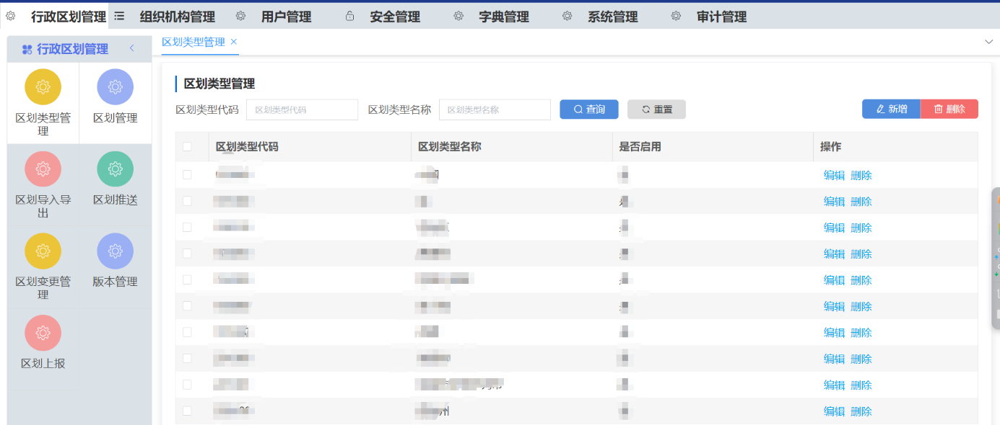

**查询条件：**

区划类型代码：模糊匹配umc\_cant\_type. cant\_type

区划类型名称: 模糊匹配umc\_cant\_type. type\_name

查询条件支持重置。

**查询结果：**选择框、区划类型代码、区划类型名称、是否启用、操作（编辑、删除）。

**呈现字段算法：**

|  |  |  |
| --- | --- | --- |
| **字段名称** | **数据来源表** | **数据来源字段** |
| 选择框 |  | 选择框组件 |
| 区划类型代码 | umc\_cant\_type | umc\_cant\_type. cant\_type |
| 区划类型名称 | umc\_cant\_type | umc\_cant\_type. type\_name |
| 是否启用 | umc\_cant\_type | umc\_cant\_type. in\_use |
| 操作 |  | “编辑”“删除”按钮 |

**新增**

点击新增按钮，可弹窗进行区划类型新增，新增时需填写：区划类型代码、区划类型名称、是否启用。

**编辑**

支持通过点击每条数据后操作栏中的编辑按钮，弹窗进行区划类型修改，可修改字段包含：区划类型名称、是否启用，区划类型代码只展示不能修改。

**删除**

支持单条删除和勾选后批量删除功能。

#### 区划管理

提供行政区划数据的树形层级管理功能，包括查询、新增、编辑、删除、模板下载、导入、导出。

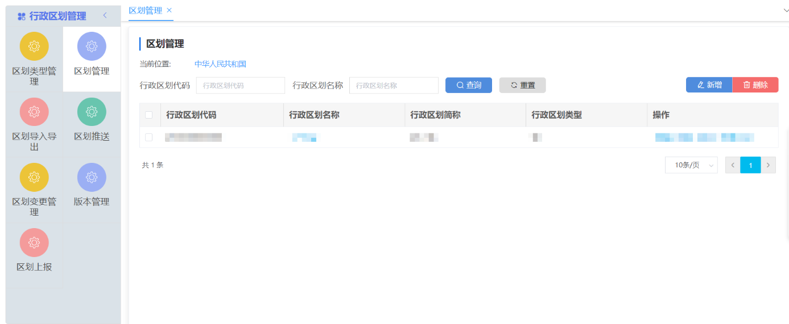

**进入后的页面展示：**当前位置、查询条件、查询结果

**当前位置默认展示顶级节点：**中华人民共和国

**查询条件：**

行政区划代码：完全匹配umc\_cant表的umc\_cant. cant\_code

行政区划名称：模糊匹配umc\_cant表的umc\_cant. cant\_name

查询条件支持重置。

**查询结果：**选择框、行政区划代码、行政区划名称、行政区划简称、行政区划类型、操作

只查询umc\_cant. cant\_code是21开头的数据

**呈现字段算法：**

|  |  |  |
| --- | --- | --- |
| **字段名称** | **数据来源表** | **数据来源字段** |
| 选择框 |  | 选择框组件 |
| 行政区划代码 | umc\_cant | umc\_cant. cant\_code |
| 行政区划名称 |  | umc\_cant. cant\_name |
| 行政区划简称 | umc\_cant | umc\_cant. short\_name |
| 行政区划类型 | umc\_cant  umc\_cant\_type | umc\_cant. cant\_type匹配umc\_cant\_type. cant\_type取umc\_cant\_type.cant\_name的值 |
| 操作 |  | 编辑、删除按钮 |

**组织区划下钻**

点击行政区划名称可以进行下钻到下级行政区划，当前位置根据下钻的层级进行动态更新。

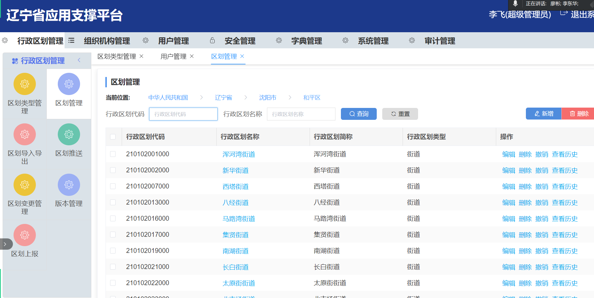

**新增**

点击新增按钮，可弹窗进行区划新增，新增时默认展示：上级行政区划、上级区划代码，需要选择和填写：

行政区划类型：必填，下拉选择，取umc\_cant\_type.cant\_name的数据

行政区划代码：必填，文本框

行政区划名称：必填，文本框

行政区划简称：非必填，文本框

是否批复：必填，下拉选择，取umc\_dict\_item的umc\_dict\_item.dict\_code= APPROVAL的umc\_dict\_item.item\_value的值作为下拉选项

是否自建：必填，下拉选择，取umc\_dict\_item的umc\_dict\_item.dict\_code= UNIT\_CREATE的umc\_dict\_item.item\_value的值作为下拉选项

来源：非必填，文本框

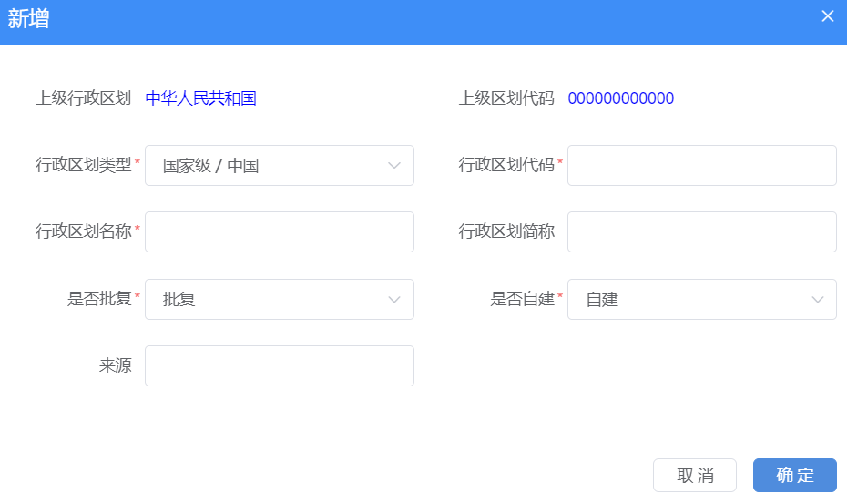

新增时需要向umc\_cant表写入新增数据。

|  |  |  |
| --- | --- | --- |
| **字段名称** | **写入数据表** | **数据来源** |
| cant\_id | umc\_cant | 弹窗填写的行政区划代码 |
| cant\_code | umc\_cant | 弹窗填写的行政区划代码 |
| cant\_name | umc\_cant | 弹窗填写的行政区划名称 |
| short\_name | umc\_cant | 弹窗填写的行政区划简称 |
| cant\_type | umc\_cant | 弹窗选择的行政区划类型与umc\_cant\_type.cant\_name匹配的umc\_cant\_type.cant\_type的值 |
| super\_id | umc\_cant | 弹窗展示的上级行政区划代码 |
| country\_code | umc\_cant | 固定值：CN |
| in\_use | umc\_cant | 固定值：1 |
| unit\_create | umc\_cant | 弹窗选择的是否自建与umc\_dict\_item的umc\_dict\_item.dict\_code= UNIT\_CREATE的umc\_dict\_item.item\_value匹配取umc\_dict\_item. item\_code的值 |
| approval | umc\_cant | 弹窗选择的是否自建与umc\_dict\_item的umc\_dict\_item.dict\_code= approval的umc\_dict\_item.item\_value匹配取umc\_dict\_item. item\_code的值 |
| cant\_path | umc\_cant | 弹窗展示的上级行政区划代码匹配umc\_cant. cant\_code取umc\_cant. cant\_path的值再拼接#弹窗填写的行政区划代码 |

**编辑**

支持通过点击每条数据后操作栏中的编辑按钮，弹窗进行区划修改，修改弹窗与新增弹窗字段一致，只是行政区划代码不能修改。

**删除**

支持单条删除和勾选后批量删除功能。

**下载模板：**

提供区划导入模板下载功能，模板字段包含：上级区划代码、行政区划类型、行政区划代码、行政区划名称、行政区划简称、是否批复、是否自建、来源字段。

**导入：**

提供区划信息导入功能，导入字段包含：上级区划代码、行政区划类型、行政区划代码、行政区划名称、行政区划简称、是否批复、是否自建、来源字段。

导入时进行更新入库，通过行政区划代码判断是新增还是更新。

**导出：**

提供行政区划的导出功能，导出结果与页面展示内容保持一致。

### 组织机构管理

#### 组织类型管理

提供组织机构类型的增删改查管理功能。

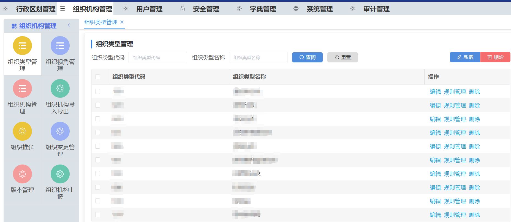

**查询条件：**

组织类型代码: 模糊匹配umc\_organ\_type.organ\_type

组织类型名称: 模糊匹配umc\_organ\_type.type\_name

查询条件支持重置。

**查询结果：**组织类型代码、组织类型名称、操作（编辑、删除）。

**呈现字段算法：**

|  |  |  |
| --- | --- | --- |
| **字段名称** | **数据来源表** | **数据来源字段** |
| 组织类型代码 | umc\_organ\_type | umc\_organ\_type.organ\_type |
| 组织类型名称 | umc\_organ\_type | umc\_organ\_type.type\_name |
| 操作 |  | 编辑、删除按钮 |

**新增**

点击新增按钮，可弹窗进行组织类型新增，新增时需填写：组织类型代码、组织类型名称。

**编辑**

支持通过点击每条数据后操作栏中的编辑按钮，弹窗进行组织类型修改，可修改字段包含：组织类型名称，组织类型代码不能修改。

**删除**

支持单条删除和勾选后批量删除功能。

#### 组织视角管理

提供组织视角的增删改查管理功能。

**查询条件：：**

视角名称:模糊匹配umc\_organ\_strutype.type\_name

**查询结果：**

视角名称、根节点、创建人、创建时间、最后修改人、操作(编辑、删除)。

**呈现字段算法：**

|  |  |  |
| --- | --- | --- |
| **字段名称** | **数据来源表** | **数据来源字段** |
| 视角名称 | umc\_organ\_strutype | umc\_organ\_strutype.type\_name |
| 根节点 | umc\_organ\_strutype | umc\_organ\_strutype.root\_id |
| 创建人 | umc\_organ\_strutype | umc\_organ\_strutype.cman |
| 创建时间 | umc\_organ\_strutype | umc\_organ\_strutype.ctime |
| 最后修改人 | umc\_organ\_strutype | umc\_organ\_strutype.uman |
| 操作 |  | “编辑”“删除”按钮 |

**新增**

点击新增按钮，可弹窗进行组织视觉新增，新增时需填写：视觉编码、视觉名称、根节点，都是必填。新增后自动写入创建人、创建视觉、修改人、修改时间等信息。

**编辑**

支持通过点击每条数据后操作栏中的编辑按钮，弹窗进行组织视觉修改，可修改字段包含：视觉名称，视觉编码、根节点不能修改。

**删除**

支持单条删除和勾选后批量删除功能。

#### 组织机构管理

提供组织机构数据的树形层级管理功能，包括查询、新增、编辑、删除、详情查看、模板下载、导入、导出。

**进入后的页面展示：**当前位置、查询条件、查询结果

**当前位置默认展示顶级节点：**中华人民共和国

**查询条件：**

组织代码：完全匹配umc\_organ表的umc\_organ.organ\_code

组织名称：模糊匹配umc\_organ表的umc\_organ.organ\_name

组织类型：下拉选择，非必填，未选择时查询全部，下拉选项取值于umc\_organ\_type.type\_name，匹配时用umc\_organ\_type. organ\_type关联umc\_organ.organ\_type

查询条件支持重置。

**查询结果：**组织代码、组织名称、组织简称、组织类型、机构来源、变更时间、状态、操作（编辑、删除、撤销、详情）

只查询umc\_organ.organ\_code是21开头的数据

**呈现字段算法：**

|  |  |  |
| --- | --- | --- |
| **字段名称** | **数据来源表** | **数据来源字段** |
| 组织代码 | umc\_organ | umc\_organ.organ\_code |
| 组织名称 | umc\_organ | umc\_organ.organ\_name |
| 组织简称 | umc\_organ | umc\_organ.organ\_short |
| 组织类型 | umc\_organ | umc\_organ.organ\_type关联umc\_organ\_type.organ\_type取umc\_organ\_type.type\_name的值 |
| 机构来源 | umc\_organ | umc\_organ.data\_form |
| 变更时间 | umc\_organ | umc\_organ.utime |
| 状态 | umc\_organ | umc\_organ.in\_use  0:撤销,1:在用,2:删除 |
| 操作 |  | 编辑、删除、撤销、详情按钮 |

**组织机构下钻**

点击组织名称可以进行下钻到下级组织机构，当前位置根据下钻的层级进行动态更新。

**新增**

点击新增按钮，可弹窗进行下级组织机构新增，需要选择和填写如下信息：

组织代码：必填，文本框

组织名称：必填，文本框

组织简称：必填，文本框

组织类型：必填，下拉选择，取umc\_organ\_type.type\_name的数据

排序号：必填，数字框，可点击加减号进行排序的加减

叶子节点：非必填 ，单选，默认否

对应区划：下拉选择，取umc\_cant.cant\_code是21开头的数据的umc\_cant. short\_name的数据，进行三级树形展示：省、地市、区县

来源：非必填，文本框

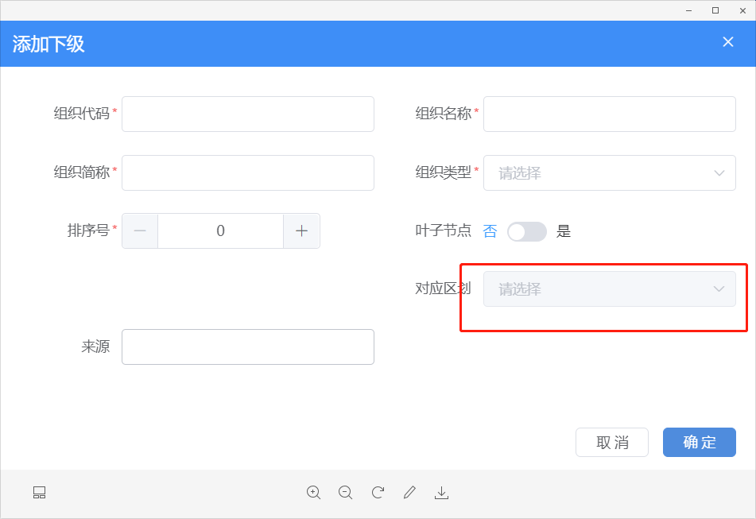

新增时需要向umc\_organ、umc\_organ\_cant表写入新增数据。

|  |  |  |
| --- | --- | --- |
| **字段名称** | **写入数据表** | **数据来源** |
| organ\_id | umc\_organ | 弹窗填写的组织代码 |
| organ\_code | umc\_organ | 弹窗填写的组织代码 |
| organ\_name | umc\_organ | 弹窗填写的组织名称 |
| organ\_short | umc\_organ | 弹窗填写的组织简称 |
| organ\_type | umc\_organ | 弹窗选择的组织类型与umc\_organ\_type.type\_name匹配的umc\_organ\_type.organ\_type的值 |
| ctime | umc\_organ | 当前时间 |
| cman | umc\_organ | 当前用户名 |
| uman | umc\_organ | 当前用户名 |
| utime | umc\_organ | 当前时间 |
| in\_use | umc\_organ | 固定值：1 |
| data\_form | umc\_organ | 弹窗填写的来源 |
| pid | umc\_organ\_cant | 自增长 |
| organ\_id | umc\_organ\_cant | 弹窗填写的组织代码 |
| cant\_id | umc\_organ\_cant | 弹窗选择的对应区划的umc\_cant. cant\_code |
| ctime | umc\_organ\_cant | 当前时间 |
| cman | umc\_organ\_cant | 当前用户名 |
| uman | umc\_organ\_cant | 当前用户名 |
| utime | umc\_organ\_cant | 当前时间 |

**编辑**

支持通过点击每条数据后操作栏中的编辑按钮，弹窗进行组织机构修改，修改弹窗除了新增弹窗字段外，增加了上级组织的展示和修改，组织代码不能修改。

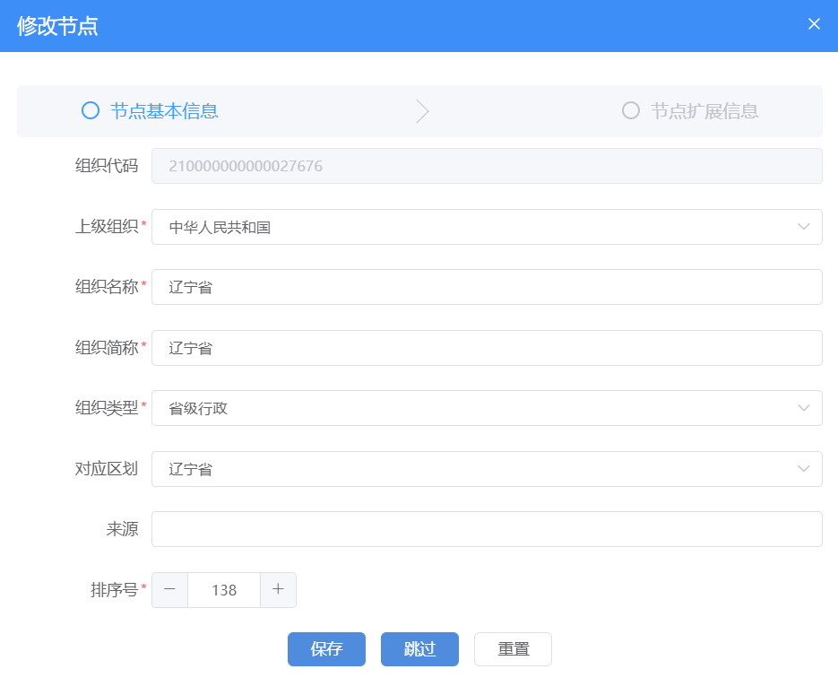

**撤销**

支持通过点击每条数据后操作栏中的撤销按钮，弹窗进行组织机构撤销确认，确认撤销后将组织机构状态umc\_organ. in\_use的值更新成0。

**删除**

支持单条删除和勾选后批量删除功能。

**下载模板：**

提供组织机构导入模板下载功能，模板字段包含：组织代码、组织名称、组织简称、组织类型、排序号、对应区划、来源。

**导入：**

提供组织机构信息导入功能，导入字段包含：组织代码、组织名称、组织简称、组织类型、排序号、对应区划、来源。

导入时进行更新入库，通过组织代码判断是新增还是更新。

**导出：**

提供查询的组织机构的导出功能，导出结果与页面展示内容保持一致。

### 用户管理

#### 用户管理

提供系统用户的查询、新增、编辑、启用、停用、重置密码、组织变更、模板下载、导入、导出功能。

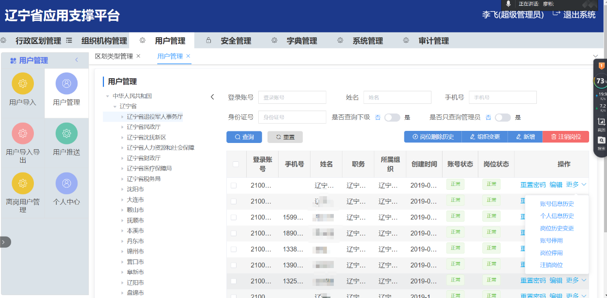

左边树图展示组织机构信息，点击树的任意节点可切换右边展示的用户信息。

**用户信息查询条件：**

登录账号：完全匹配umc\_users. user\_id

姓名：模糊匹配umc\_users. nick\_name

手机号：完全匹配umc\_users. login\_phone

是否查询下级：单选，默认否，否时只查询本组织机构的用户，是时查询本组织机构及下级组织机构的所有用户

是否只查询管理员：单选，默认否，否时查询全部角色用户，是时只查询角色是管理员的用户。

**查询结果：**选择框、登录账号、手机号、姓名、所属组织、创建时间、账号状态、操作(重置密码、编辑、账号停用/启用)。

**呈现字段算法：**

|  |  |  |
| --- | --- | --- |
| **字段名称** | **数据来源表** | **数据来源字段** |
| 选择框 |  |  |
| 登录账号 | umc\_users | umc\_users. user\_id |
| 手机号 | umc\_users | umc\_users. login\_phone |
| 姓名 | umc\_users | umc\_users. nick\_name |
| 所属组织 |  |  |
| 创建时间 | umc\_users | umc\_users. ctime |
| 账号状态 | umc\_users | umc\_users. Status  0:未激活,1:正常,2:锁定,3:删除 |
| 操作 |  | 重置密码、编辑、账号停用/启用 |

**新增**

点击新增按钮，可弹窗进行该组织下的用户新增，默认展示所属机构，需要选择和填写如下信息：

姓名：必填，文本框

手机号码：必填，文本框

身份证号：必填，文本框

单位座机：非必填，文本框

用户类型：下拉选择，必填，来源于角色，可多选

职务：必填，手动输入

密码：必填，文本框

确认密码：必填，文本框

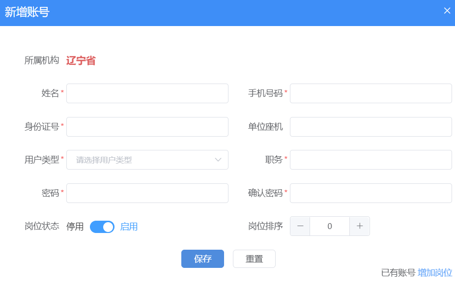

新增时需要向umc\_users表写入新增数据，其中user\_id需要自动编号。

**编辑**

支持通过点击每条数据后操作栏中的编辑按钮，弹窗进行用户信息修改，修改弹窗字段与新增弹窗字段一致。

**账号停用/启用**

支持通过点击每条数据后操作栏中的账号停用/启用按钮，弹窗进行账号停用/启用确认，启用操作后将用户状态umc\_users. Status的值更新成1，停用操作后将用户状态umc\_users. Status的值更新成0。

**重置密码**

支持通过点击每条数据后操作栏中的重置密码按钮。弹窗进行重置密码确认，密码重置时，自动生新的随机8位密码，同时需要向短信表（uum\_sms\_log）中写入一条记录。

|  |  |  |
| --- | --- | --- |
| **字段名称** | **写入数据表** | **数据来源** |
| pid | uum\_sms\_log | 自增长 |
| phone | uum\_sms\_log | 该用户的电话 |
| sms\_type | uum\_sms\_log |  |
| content | uum\_sms\_log | 重置后的密码 |
| create\_time | uum\_sms\_log | 系统时间 |
| send\_time | uum\_sms\_log | 系统时间 |
| sms\_status | uum\_sms\_log | 固定值：10 |
| sms\_comment | uum\_sms\_log | 重置后的密码 |

**变更组织机构：**

支持勾选用户后批量变更用户的组织机构

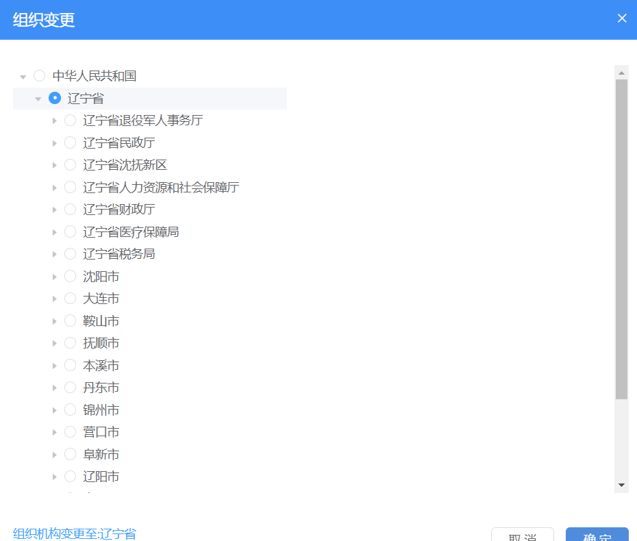

**下载模板：**

提供用户导入模板下载功能，模板字段包含：姓名、手机号码、身份证号：、单位座机、用户类型、职务、密码、确认密码

**导入：**

提供用户信息导入功能，导入字段包含：姓名、手机号码、身份证号：、单位座机、用户类型、职务、密码、确认密码。

导入时进行更新入库，通过姓名、手机号判断是新增还是更新。

**导出：**

提供查询的用户的导出功能，导出结果与页面展示内容保持一致。

### 安全管理

#### 应用管理

提供系统接入应用的管理功能。

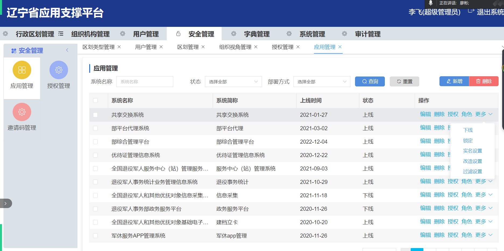

**查询条件：**

系统名称：模糊匹配uum\_system.sys\_name

状态:下拉选择，未选择时查询全部，取umc\_dict\_item.dict\_code= TYYH\_SYS\_STATUS的umc\_dict\_item.item\_value 的值,匹配时用umc\_dict\_item. item\_code与uum\_system.sys\_status关联

部署方式：下拉选择，未选择时查询全部，取umc\_dict\_item.dict\_code= TYYH\_DEPLOY\_TYPE的umc\_dict\_item.item\_value 的值,匹配时用umc\_dict\_item. item\_code与uum\_system. deploy\_type关联

查询条件支持重置。

**查询结果：**选择框、系统名称、系统简称、上线时间、状态、操作。

|  |  |  |
| --- | --- | --- |
| **字段名称** | **数据来源表** | **数据来源字段** |
| 选择框 |  |  |
| 系统名称 | uum\_system | uum\_system.sys\_name |
| 系统简称 | uum\_system | uum\_system.sys\_short\_name |
| 上线时间 | uum\_system | uum\_system. online\_time |
| 状态 | uum\_system | uum\_system.sys\_status匹配umc\_dict\_item. item\_code取umc\_dict\_item.item\_value的值 |
| 操作 |  | 编辑、删除、授权、下线/上线按钮 |

**新增：**

点击新增按钮，可弹窗进行应用新增，需要选择和填写如下信息：

系统编码：必填，文本框

系统名称：必填，文本框

系统简称：必填，文本框

访问地址：必填，文本框

同步参数：必填，文本框

上线时间：时间控件选择，必填

部署方式：下拉选择，必填，取umc\_dict\_item.dict\_code= TYYH\_DEPLOY\_TYPE的umc\_dict\_item.item\_value 的值

应用等级：下拉选择，必填，取umc\_dict\_item.dict\_code= TYYH\_SYS\_ORGAN的umc\_dict\_item.item\_value 的值

是否显示：下拉选择，必填，是/否，默认是

开发厂商：必填，文本框

支撑平台：必填，单选，是/否，默认否

代办地址：非必填，文本框

登录地址：非必填，文本框

角色地址：非必填，文本框

排序号：必填，数字输入框，可通过加减号控制数字

填写后需要将数据入库至uum\_system表。

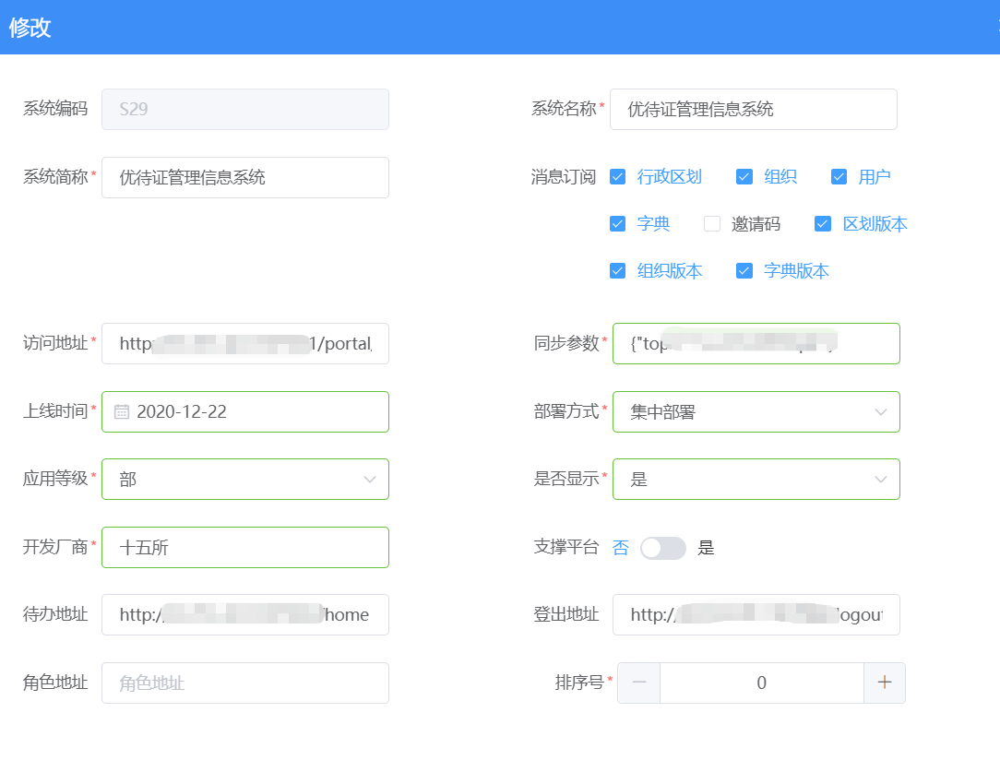

**编辑**

支持通过点击每条数据后操作栏中的编辑按钮，弹窗进行应用信息修改，修改弹窗字段与新增弹窗字段一致，只是系统编码不能修改。

**删除**

支持单条删除和勾选后批量删除功能。

**下线/上线**

支持通过点击每条数据后操作栏中的上线/下线按钮，弹窗进行应用上线/下线确认，上线操作后将状态uum\_system.sys\_status的值更新成11，下线操作后将状态uum\_system.sys\_status的值更新成10。

**授权**

支持通过点击每条数据后操作栏中的授权按钮，进行授权操作。

授权时，左边列出组织机构树形，右边展示系统信息和用户列表。

系统信息展示：系统名称、系统访问地址、部署方式、应用等级、上线时间

用户列表展示：查询条件（登录账号、用户名称、授权状态）、查询结果（序号、登录账号、用户名称、职务、所属组织、授权时间、操作（授权/取消授权））

支持对已授权的用户进行单条或批量取消授权，支持对未授权用户进行授权。

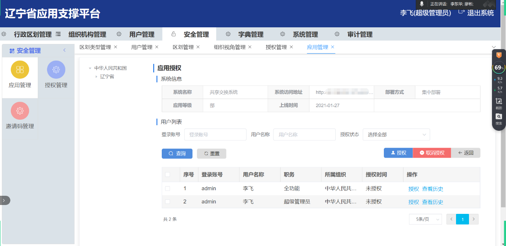

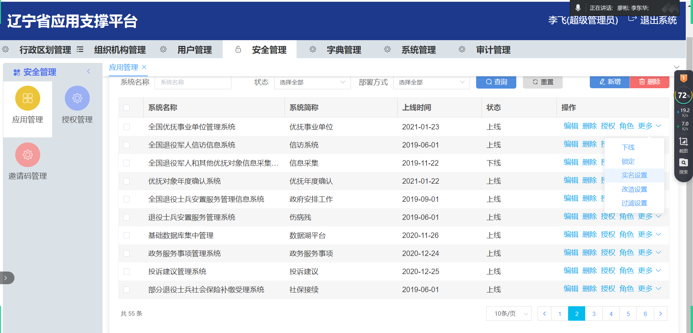

#### 授权管理

提供对系统用户的应用授权管理功能。

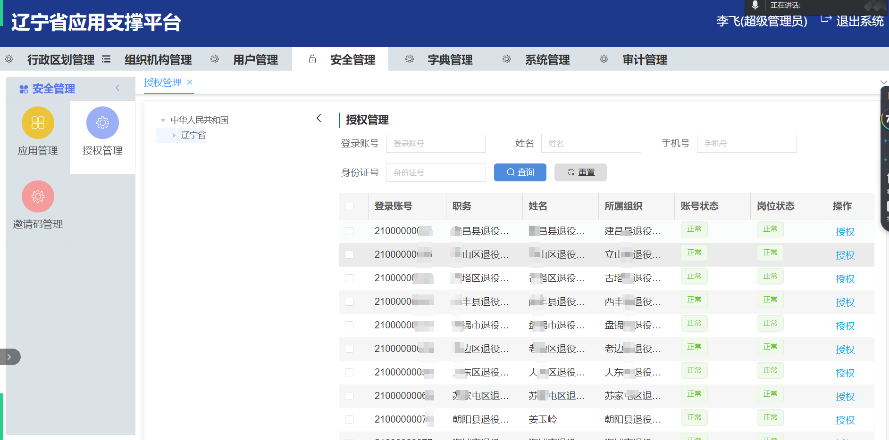

左边树图展示组织机构信息，点击树的任意节点可切换右边展示的用户信息。

右边展示授权管理的用户信息的查询条件和查询结果。

**查询条件：**登录账号、姓名、手机号

**查询结果：**选择框、登录账号、职务、姓名、所属组织、账号状态、岗位状态、操作。

点击操作栏中的“授权”按钮可进行应用授权操作。

授权管理提供应用查询条件和查询结果及授权和取消授权操作。

查询条件包含：系统名称、状态、部署方式、授权状态

查询结果：系统名称、系统简称、上线时间、授权时间、状态、操作

操作中包含授权/取消授权，支持对未授权的应用进行授权，支持对已授权的应用执行取消授权。

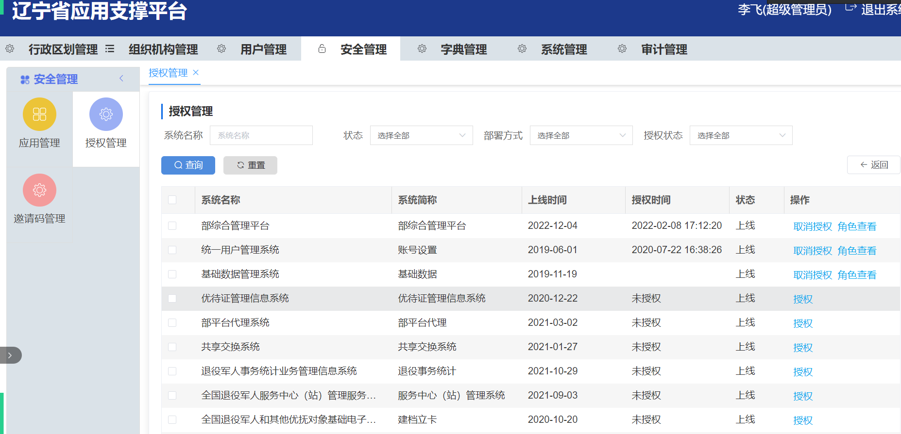

### 字典管理

#### 字典管理

提供系统数据字典的增删改查管理功能。

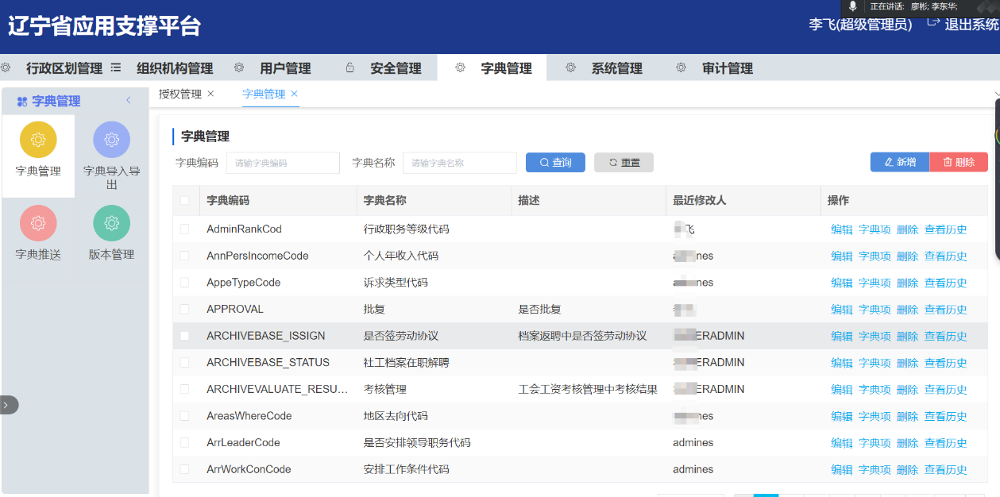

**查询条件：**

字典编码：模糊匹配umc\_dict. dict\_code

字典名称：模糊匹配umc\_dict. dict\_name

查询条件支持重置。

**查询结果**：字典编码、字典名称、描述、最近修改人、操作（编辑、字典项、删除）

**呈现字段算法：**

|  |  |  |
| --- | --- | --- |
| **字段名称** | **数据来源表** | **数据来源字段** |
| 字典编码 | umc\_dict | umc\_dict.dict\_code |
| 字典名称 | umc\_dict | umc\_dict.dict\_name |
| 描述 | umc\_dict | umc\_dict. note |
| 最近修改人 | umc\_dict | umc\_dict. set\_man |
| 操作 |  | 编辑、字典项、删除按钮 |

**新增：**

点击新增按钮，可弹窗进行字典，需要选择如下信息：

字典编码：必填，文本框

字典名称：必填，文本框

描述：非必填，文本框

新增时将数据入库到umc\_dict表。

**编辑**

支持通过点击每条数据后操作栏中的编辑按钮，弹窗进行字典信息修改，修改弹窗字段与新增弹窗字段一致，只是字典编码不能修改。

**删除**

支持单条删除和勾选后批量删除功能。

**字典项**

支持通过点击每条数据后操作栏中的字典项按钮，对每个字典的字典项进行管理。支持字典项的查询、新增、编辑、删除（含批量删除）功能。

展示字段:编号、名称、序号、描述、操作

数据来源于umc\_dict\_item的umc\_dict\_item. item\_code、umc\_dict\_item. item\_value、umc\_dict\_item. sort\_num 、umc\_dict\_item. note

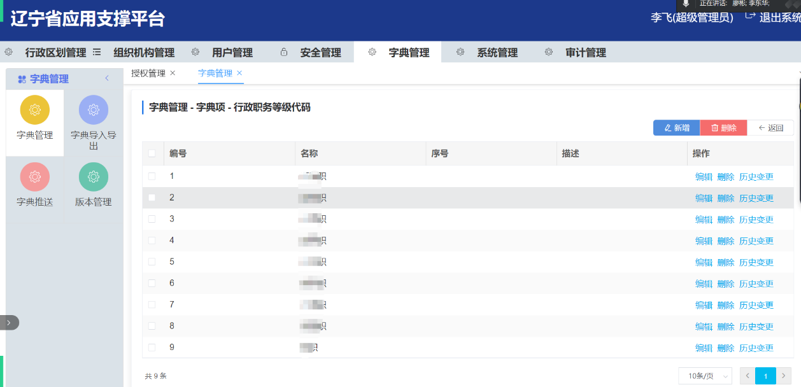

### 系统管理

#### 功能管理

提供系统功能管理功能。

以树形结构展示系统功能模块层级，选中模块后右侧展示配置表单：应用名称（必填）、应用上下文（非必填）、排序号（必填），并且可同时进行编辑、删除。

可点击添加模块按钮，进行模块的新增，新增时入到umc\_app表

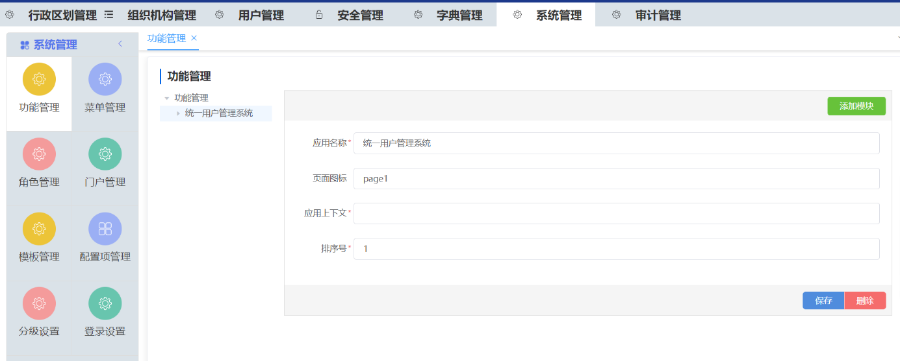

**呈现字段说明：**

|  |  |  |
| --- | --- | --- |
| **字段名称** | **数据来源表** | **数据来源字段** |
| 应用名称 | umc\_app | umc\_app. app\_name |
| 应用上下文 | umc\_app | umc\_app. app\_context |
| 排序号 | umc\_app | umc\_app. seq |

#### 菜单管理

提供系统菜单的增删改查管理功能。

以树形结构展示菜单层级。点击树形中的任意节点，可呈现该节点下的菜单信息（菜单名称、请求路径、顺序号），支持菜单的编辑、删除（含批量删除）、新增操作。数据来源表：umc\_menu

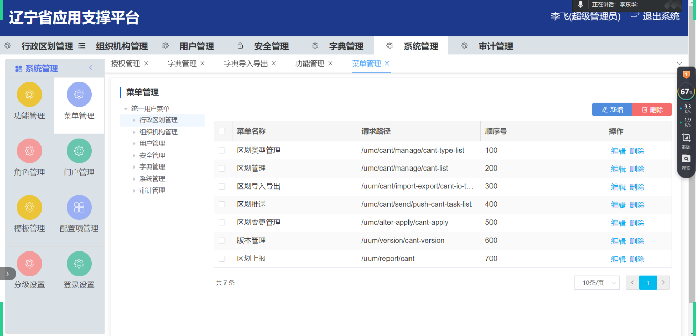

#### 角色管理

提供角色的增删改查管理功能和角色授权功能。

数据来源表：umc\_role

查询条件：角色名称

查询结果：角色名称、角色说明、父角色名称、操作（编辑、删除、角色授权）

**呈现字段说明：**

|  |  |  |
| --- | --- | --- |
| **字段名称** | **数据来源表** | **数据来源字段** |
| 角色名称 | umc\_role | umc\_role. name |
| 角色说明 | umc\_role | umc\_role. note |
| 父角色名称 | umc\_role | umc\_role. parent\_role关联umc\_role. role\_id获取umc\_role. name |

**角色授权**

支持对每个角色进行授权操作。点击后列出功能列表，进行勾选。

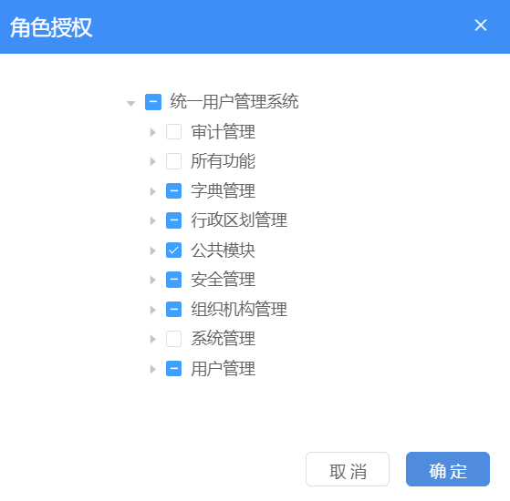

### 审计管理

#### 应用访问日志

提供系统应用访问日志的查询功能。

应用访问日志数据来源于用户登录系统后，在首页点击部级应用按钮，产生的应用访问日志（author\_sys\_login）

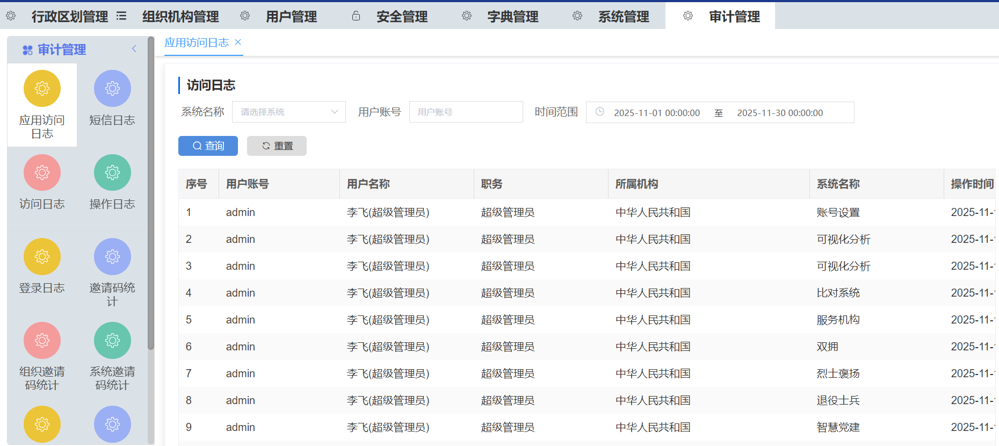

**查询条件：**系统名称、用户账号、时间范围。

**查询结果：**序号、用户账号、用户名称、职务、所属机构、系统名称、操作时间。

查询条件支持重置。

#### 访问日志

提供系统操作日志的查询功能。系统操作日志来源于用户在本系统中的操作记录的日志（umc\_audit\_log）。

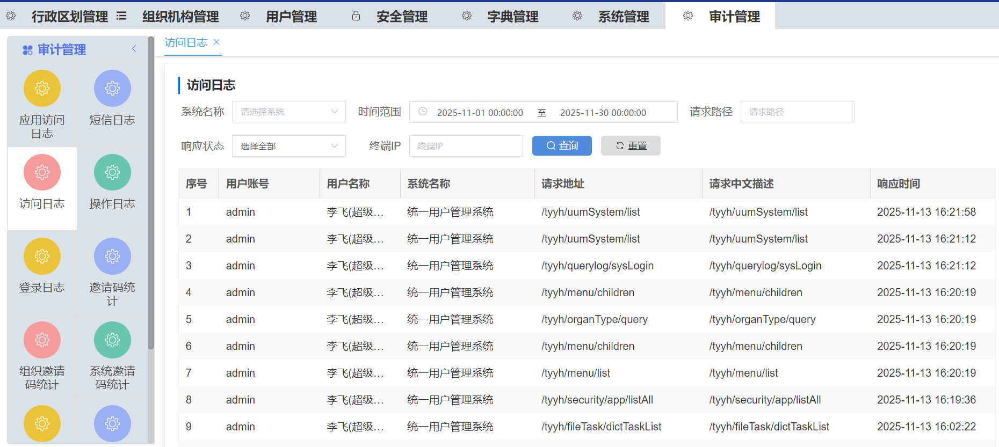

**查询条件：**系统名称、时间范围、请求路径、响应状态、终端IP。

**查询结果：**序号、用户账号、用户名称、系统名称、请求地址、请求中文描述、响应时间。

#### 短信日志

提供系统短信发送日志的查询功能。

数据来源于表：uum\_sms\_log

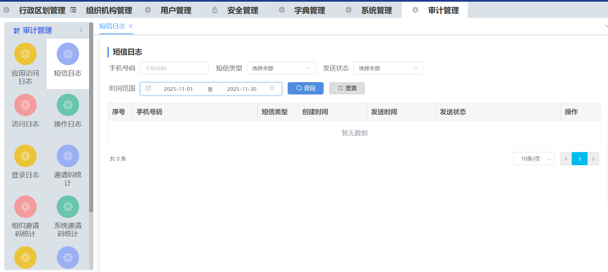

**查询条件：**手机号码、短信类型、发送状态、时间范围。

**查询结果：**序号、手机号码、短信类型、创建时间、发送时间、发送状态、操作（详情）。

点击操作中的详情可展示短信详情：手机号码、短信类型、短信内容、创建时间、发送时间、发送状态。

# 非功能性需求

**1.性能要求：**

简单查询响应时间≤3秒，复杂查询≤30秒。支持多用户并发。

**2.安全性要求：**

数据传输加密（HTTPS/SSL），敏感数据脱敏显示。防SQL注入、越权访问等安全机制。

**3.易用性要求：**

界面简洁，提供操作引导和帮助文档。

**4.兼容性要求：**

支持主流浏览器（Chrome、Edge、国产浏览器等）。